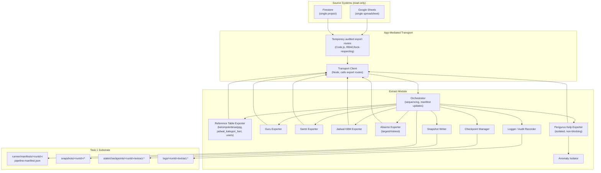
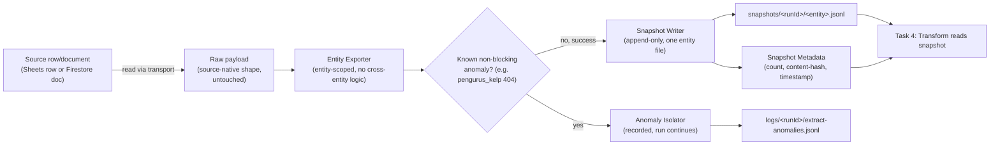
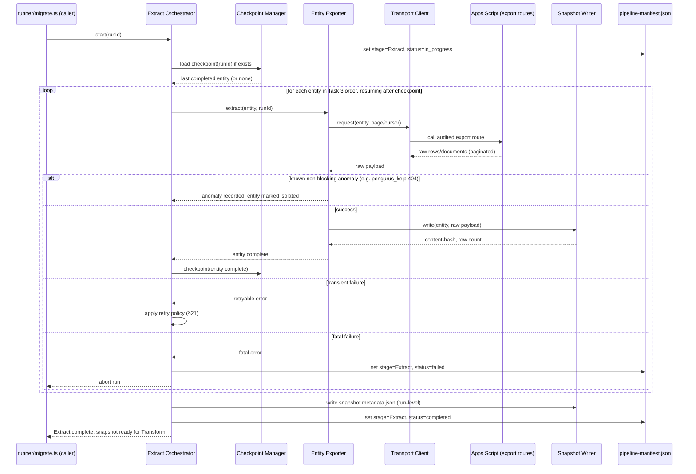
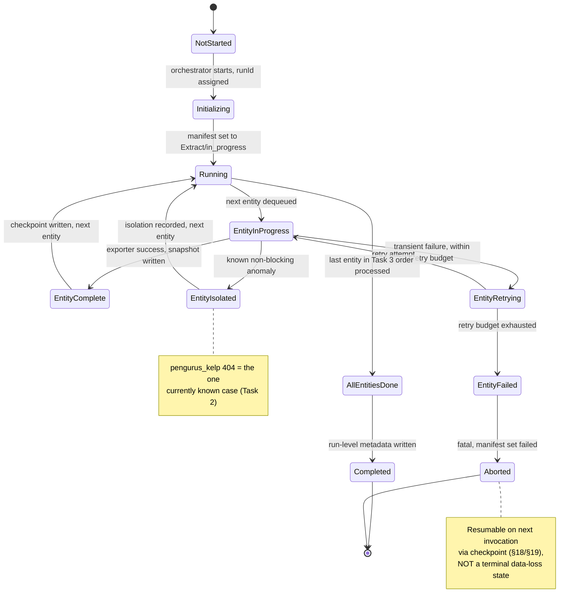

# Sprint 2 — Task 1: Migration Engine — Extract Module
## Product Requirements Document (Design Only)

> **Status**: DRAFT — design only, no implementation, no SQL.
> **Scope**: RUANG NGAJI Migration to Supabase, Sprint 2, first module of the Migration Engine.
> **Governing document**: [Migration 004 Master Architecture Specification (MAS)](../MAS.md) is
> the Single Source of Truth. This PRD does not alter any decision made in
> [Task 1](../Task01_Architecture.md), [Task 2](../Task02_ExecutionFlow.md), or
> [Task 3](../Task03_Extraction.md) — it elaborates Task 3's approved extraction *strategy* into
> an implementable *module design* for the Extract stage (Stage 1 of the 9-stage flow, MAS §3/§4).
> Where this document and Task 3/MAS disagree, Task 3/MAS wins and this document is wrong.
> **Non-goals**: this document contains no TypeScript/JavaScript, no SQL, no pseudocode framed as
> "the implementation" — Mermaid diagrams and prose only, per the assignment's explicit
> constraint.

---

## Table of Contents

1. [Purpose](#1-purpose)
2. [Responsibilities](#2-responsibilities)
3. [Non Responsibilities](#3-non-responsibilities)
4. [Architecture Overview](#4-architecture-overview)
5. [Component Diagram](#5-component-diagram)
6. [Data Flow Diagram](#6-data-flow-diagram)
7. [Sequence Diagram](#7-sequence-diagram)
8. [State Machine](#8-state-machine)
9. [Lifecycle](#9-lifecycle)
10. [Input](#10-input)
11. [Output](#11-output)
12. [Snapshot Specification](#12-snapshot-specification)
13. [Snapshot Metadata](#13-snapshot-metadata)
14. [Supported Data Sources](#14-supported-data-sources)
15. [File Structure](#15-file-structure)
16. [Directory Layout](#16-directory-layout)
17. [Naming Convention](#17-naming-convention)
18. [Checkpoint Strategy](#18-checkpoint-strategy)
19. [Recovery Strategy](#19-recovery-strategy)
20. [Failure Scenarios](#20-failure-scenarios)
21. [Retry Policy](#21-retry-policy)
22. [Logging Specification](#22-logging-specification)
23. [Audit Trail](#23-audit-trail)
24. [Performance Requirements](#24-performance-requirements)
25. [Security Requirements](#25-security-requirements)
26. [Scalability Requirements](#26-scalability-requirements)
27. [Configuration Parameters](#27-configuration-parameters)
28. [Acceptance Criteria](#28-acceptance-criteria)
29. [Future Extension](#29-future-extension)
30. [Open Questions](#30-open-questions)

---

## 1. Purpose

The Extract Module is the first executable module of the Migration Engine (MAS §3, Task 2 Stage
1). It acquires data from the two live source systems — the Google Sheets spreadsheet(s) and
Firestore — and materializes it as an immutable, on-disk **snapshot**, which becomes the sole
input to Transform (Task 4). Nothing downstream of Extract ever talks to Sheets or Firestore
again for a given `runId`; every later stage reads only the frozen snapshot.

- **Design Rationale**: Task 3 already decided *what* to extract, in what order, and via which
  transport (app-mediated). This module design answers *how* that strategy becomes a concrete,
  operable, observable piece of software — the missing layer between "approved strategy" and
  "buildable ticket."
- **Tradeoffs**: formalizing Extract as its own bounded module (rather than an inline step of a
  monolithic migration script) adds structural overhead (its own manifest, its own checkpoint
  namespace, its own failure taxonomy) in exchange for independent testability and the ability to
  re-run Extract without touching any other stage.
- **Alternative Designs**: (a) fold extraction into Transform as a "read step" — rejected, breaks
  ADR-1 (immutable snapshot) and couples two stages with different failure/retry semantics; (b)
  extract directly against Google Sheets API / Firestore REST with service-account credentials —
  rejected by Task 3 assumption 3 in favor of the app-mediated transport that reuses existing
  RBAC/lock-respecting bridge code.
- **Recommendation**: keep Extract a standalone module with a narrow, explicit output contract
  (§11) so Transform can be developed and tested against recorded snapshots without a live
  Extract run.

---

## 2. Responsibilities

The Extract Module is responsible for, and only for:

| # | Responsibility |
|---|---|
| R1 | Reading data from Sheets (via the app-mediated transport) and Firestore (via the same transport, per Task 3 assumption 3) |
| R2 | Producing one immutable snapshot file per entity, per `runId` |
| R3 | Recording snapshot metadata (source, row/document counts, content hash, extraction timestamp) |
| R4 | Executing entities in the risk-minimized order Task 3 defines (reference tables → guru → santri → jadwal_kbm → absensi → pengurus_kelp) |
| R5 | Detecting and isolating known non-blocking anomalies (e.g. `pengurus_kelp` 404, Task 2 §"Migration-003 Decisions") without failing the run |
| R6 | Checkpointing progress so an interrupted run can resume without re-extracting completed entities |
| R7 | Emitting structured logs and an audit trail sufficient to answer "what did Extract read, from where, and when" for any past run |
| R8 | Reporting a per-entity and per-run extraction outcome to the pipeline manifest (Task 1 §"Key Structural Decisions") |

- **Design Rationale**: this list is deliberately the smallest set of responsibilities that makes
  Transform's job well-defined — anything Transform could plausibly need that Extract *doesn't*
  do here must show up explicitly in §3.
- **Tradeoffs**: a narrow responsibility set means some convenience — e.g. "just fix that one bad
  date while we're reading it" — is structurally unavailable to Extract; this is intentional (see
  ADR-4's sibling principle applied one stage earlier).
- **Alternative Designs**: bundling light validation (e.g. "reject rows missing a primary key")
  into Extract was considered and rejected — it would duplicate Validate's (Task 5) authority and
  create two places a "is this row acceptable" decision could be made.
- **Recommendation**: hold this responsibility boundary firmly during implementation; any pressure
  to add transformation/validation logic to an exporter is a signal the boundary is being
  violated, not a reason to relax it.

---

## 3. Non Responsibilities

Explicitly **out of scope** for the Extract Module:

- **No transformation** — no field renaming, no type coercion beyond what's needed to serialize
  the raw value faithfully (Task 4's job).
- **No validation / quality judgment** — Extract does not decide whether a row is "good"; it
  records what it read, including rows a human would call obviously wrong (Task 5's job).
- **No loading** — Extract never writes to Supabase/Postgres (Task 6's job).
- **No deterministic UUID assignment** — legacy IDs are carried through verbatim; UUIDv5 mapping
  is Transform's responsibility (Task 4 §3 / ADR-3).
- **No mutation of source systems** — Extract is strictly read-only against Sheets and Firestore;
  it must never write, update, or delete any production row (System Principle: read-only
  operation).
- **No cross-entity joining or relationship resolution** — each entity is extracted independently;
  reconciling references across entities is Transform's harmonization step (Task 4 §10).
- **No business-rule interpretation** — e.g. Extract does not decide the 483 orphaned absensi
  rows' fate; it extracts them as-is and lets Staging/Validate (Task 2's execution-gate wiring)
  handle disposition.

- **Design Rationale**: the "no X" list exists so that a future contributor reading only this
  document, without also re-reading MAS, cannot accidentally re-implement a downstream stage's
  logic inside an exporter.
- **Tradeoffs**: none of substance — this section costs nothing to maintain and prevents scope
  creep, which is a pure win for a stage whose entire value proposition is "small and trustworthy."
- **Alternative Designs**: N/A — a "responsibilities" section without an explicit
  "non-responsibilities" companion was considered insufficiently precise for a stage whose main
  architectural risk is boundary erosion.
- **Recommendation**: treat any pull request that adds logic matching an item in this list as a
  design violation requiring architectural sign-off, not an ordinary code review comment.

---

## 4. Architecture Overview

The Extract Module sits at the boundary between two live, mutable production systems and the
immutable pipeline substrate defined in Task 1. It is composed of a small number of cooperating
components (§5), driven by a single orchestrator, and produces exactly one artifact family:
`snapshots/<runId>/`.

```text
        Google Sheets (18 kelompok, single spreadsheet — Task 3 assumption 1)
        Firestore (single project — Task 3 assumption 2)
                          │
                          │  app-mediated transport (Task 3 assumption 3):
                          │  audited, temporary export routes on the deployed
                          │  Apps Script Code.js — same pattern as Migration 003's
                          │  ?diag=kelompokdist + tools/diag_query.js
                          ▼
              ┌─────────────────────────────┐
              │   EXTRACT MODULE (Stage 1)   │
              │  ─────────────────────────   │
              │  Orchestrator                │
              │  Entity Exporters (7)        │
              │  Transport Client            │
              │  Checkpoint Manager          │
              │  Snapshot Writer             │
              │  Anomaly Isolator            │
              │  Logger / Audit Recorder     │
              └─────────────────────────────┘
                          │
                          ▼
              snapshots/<runId>/*.jsonl + metadata.json
                          │
                          ▼
                    Task 4: TRANSFORM
```

- **Design Rationale**: a single orchestrator with pluggable per-entity exporters mirrors Task 3's
  entity-ordered extraction list directly — the architecture should read as an obvious
  implementation of the already-approved strategy, not a new design.
- **Tradeoffs**: a single orchestrator process is simpler to reason about and log, at the cost of
  being a single point of coordination (mitigated by checkpointing, §18).
- **Alternative Designs**: fully independent per-entity scripts invoked separately (no shared
  orchestrator) — rejected, it would push run-level concerns (manifest updates, run-level
  metadata, ordering enforcement) into ad hoc shell scripting instead of one owned component.
- **Recommendation**: keep the orchestrator thin (sequencing + manifest updates only) and push all
  entity-specific logic into exporters, so adding an entity later is additive, not a rewrite.

---

## 5. Component Diagram



- **Design Rationale**: each entity gets its own exporter component (not one generic
  "read-any-entity" function) because Task 3's per-entity ordering and per-entity anomaly handling
  (`pengurus_kelp`) are first-class concerns, not incidental variation.
- **Tradeoffs**: seven small exporters vs. one parametrized exporter — more files, but each one is
  independently testable against a recorded transport fixture, and an entity-specific quirk (like
  the `pengurus_kelp` 404) doesn't need a conditional branch inside a shared function.
- **Alternative Designs**: a plugin-registry pattern where exporters self-register — deferred to
  §29 Future Extension; not justified for 7 known, fixed entities.
- **Recommendation**: implement exporters as a common interface (same input/output shape) so the
  orchestrator's sequencing logic never special-cases an entity by name outside the anomaly
  isolator.

---

## 6. Data Flow Diagram



- **Design Rationale**: the diagram shows the raw payload passes through unchanged from source to
  snapshot — no transformation node exists on this path, reinforcing §3's "no transformation"
  boundary visually as well as textually.
- **Tradeoffs**: storing the fully raw, source-native shape (rather than a lightly cleaned shape)
  costs some snapshot size, but preserves ADR-1's reproducibility guarantee exactly.
- **Alternative Designs**: normalizing field names at extraction time (e.g. lowercasing Sheets
  headers) — rejected; even that small a transform blurs the Extract/Transform boundary and would
  need its own versioning if the normalization rule ever changed.
- **Recommendation**: the only permitted "shape change" during Extract is serialization format
  (e.g. a Sheets row becomes a JSON object with column-header keys) — never value interpretation.

---

## 7. Sequence Diagram



- **Design Rationale**: the sequence makes explicit that the manifest is updated at stage
  boundaries (not per-entity), while the checkpoint is updated per-entity — these are two
  different granularities serving two different concerns (run-level state vs. resumability).
- **Tradeoffs**: per-entity checkpointing (not per-row) is coarser-grained resumability — an
  interrupted `absensi` extraction restarts that entity from its own paginated cursor (not from
  entity zero), a middle ground detailed in §18.
- **Alternative Designs**: per-row checkpointing — rejected as unnecessary complexity for entities
  other than `absensi`; considered specifically *for* `absensi` in §18.
- **Recommendation**: keep the manifest and checkpoint writes as separate, independently-failable
  operations — a checkpoint write failure should not be conflated with a manifest write failure
  in error handling.

---

## 8. State Machine



- **Design Rationale**: the state machine is per-entity-nested-inside-per-run, mirroring the MAS
  §4 end-to-end state machine's own philosophy of per-entity terminal states inside a per-run
  envelope.
- **Tradeoffs**: `Aborted` is a run-level terminal state but not a data-loss state — this
  asymmetry (terminal but resumable) is intentionally unusual and must be documented clearly to
  avoid an operator assuming "Aborted" means "start over."
- **Alternative Designs**: collapsing `EntityIsolated` into `EntityComplete` — rejected; an
  isolated entity's absence from the snapshot must be distinguishable from "successfully extracted
  zero rows," or Transform/Validate cannot tell a real anomaly from an empty entity.
- **Recommendation**: `EntityIsolated` must always carry a reason code (§20) so downstream stages
  and human operators never have to guess why an entity has no snapshot file.

---

## 9. Lifecycle

1. **Provisioned**: `runId` is minted by `runner/migrate.ts` (Task 1), Extract has not yet been
   invoked.
2. **Initializing**: Extract orchestrator starts, resolves configuration (§27), checks for an
   existing checkpoint for this `runId` (resume vs. fresh start).
3. **Extracting**: entities processed in Task 3's fixed order; each entity transitions through
   §8's per-entity states.
4. **Finalizing**: once all entities have reached `EntityComplete` or `EntityIsolated`, run-level
   `metadata.json` (§13) is written and the manifest stage status flips to `completed`.
5. **Consumed**: Transform (Task 4) reads the snapshot; Extract's own lifecycle for this `runId`
   is over — it will never run again for this `runId` (a re-extraction is a *new* `runId`, per
   ADR-1/immutability).
6. **Archived**: the snapshot persists for the snapshot family's full retention window (Task 1
   Deliverables Matrix: "project-lifetime").

- **Design Rationale**: lifecycle stops at "Consumed," deliberately — Extract has no awareness of,
  or dependency on, what Transform/Validate/Load do with its output; this keeps the module's
  mental model small.
- **Tradeoffs**: none significant; a lifecycle that terminates early is simpler to reason about
  than one that tries to track downstream consumption.
- **Alternative Designs**: N/A.
- **Recommendation**: the orchestrator should not poll or wait for Transform — Stage transitions
  in the 9-stage flow (Task 2) are the runner's concern, not Extract's.

---

## 10. Input

| Input | Source | Required? |
|---|---|---|
| `runId` | Minted by `runner/migrate.ts` before Stage 1 begins (Task 1) | Required |
| Entity extraction order | Fixed, hardcoded per Task 3 (not user-configurable) | Required (design constant) |
| Transport credentials/session | App-mediated — same auth the deployed Apps Script web app already uses (Task 3 assumption 3) | Required |
| Export route configuration | Deployment ID / URL of the target Apps Script Web App | Required |
| Resume checkpoint (if present) | `state/checkpoints/<runId>/extract.*` from a prior partial run | Optional |
| Runtime configuration | `config/extract.config.json` — pagination size, timeout, retry budget (§27) | Required (defaults provided) |

- **Design Rationale**: Extract intentionally takes almost no *data* input — its entire "what to
  extract" logic is a fixed, approved list (Task 3), not a runtime parameter, to prevent silent
  scope drift between runs.
- **Tradeoffs**: fixed entity order means adding a new entity requires a code change (and,
  properly, a new Task-3-style approved decision) rather than a config edit — a deliberate
  friction point.
- **Alternative Designs**: making the entity list config-driven — deferred to §29; premature for
  Sprint 2's fixed, known 7-entity scope.
- **Recommendation**: keep entity order as a versioned constant in code (with a comment pointing
  back to Task 3), not in `config/extract.config.json`, so it participates in code review rather
  than being silently editable at runtime.

---

## 11. Output

The Extract Module produces exactly one artifact family per run:

| Output | Location | Consumer |
|---|---|---|
| Per-entity snapshot files | `snapshots/<runId>/<entity>.jsonl` | Task 4 (Transform) |
| Run-level snapshot metadata | `snapshots/<runId>/metadata.json` | Task 4, Task 9 (audit) |
| Per-entity extraction report | `snapshots/<runId>/<entity>.report.json` | Task 4, Task 9 |
| Anomaly record (if any) | `logs/<runId>/extract-anomalies.jsonl` | Task 9, human operators |
| Checkpoint state | `state/checkpoints/<runId>/extract.*` | Extract itself (resume only) |
| Structured logs | `logs/<runId>/extract.log.jsonl` | Task 9, observability |
| Manifest stage update | `runner/manifests/<runId>/pipeline-manifest.json` (Extract section) | Runner, Task 9 |

- **Design Rationale**: this table is the "critical interface" MAS §6 item 1 (`snapshots/<runId>/`
  → Task 4) made concrete — it is the contract Transform is allowed to hard-depend on.
- **Tradeoffs**: emitting a per-entity `.report.json` in addition to the raw `.jsonl` snapshot adds
  a small amount of extra I/O per run, in exchange for Transform (and human operators) never
  needing to re-derive "how many rows did Extract actually see" by parsing the raw snapshot.
- **Alternative Designs**: a single combined `snapshot.json` for all entities — rejected; per-file
  entities allow Transform to consume/reprocess one entity without loading the whole run's data,
  and align with Task 3's per-entity ordering/anomaly model.
- **Recommendation**: treat `metadata.json` + per-entity `.report.json` files as the stable,
  versioned interface; the raw `.jsonl` content shape may evolve per source-system quirks without
  breaking that interface, as long as the reports stay consistent.

---

## 12. Snapshot Specification

A **snapshot** (per MAS Glossary) is the immutable, point-in-time extraction output for one
entity, for one `runId`. Properties every snapshot file MUST have:

- **Format**: JSON Lines (`.jsonl`) — one raw source record per line, append-only during writing,
  read-only forever after.
- **Fidelity**: values are recorded exactly as read from the source (Sheets cell values /
  Firestore document fields), with no interpretation — a blank Sheets cell is recorded as
  present-and-empty, not omitted or defaulted.
- **Provenance tag**: every record carries its originating source (`sheets` or `firestore`) and,
  where applicable, source-native identifiers (row number, sheet name, Firestore document path) —
  not because Extract interprets them, but so Transform's harmonization step (Task 4 §10) can
  trace any canonical record back to its exact origin.
- **Immutability**: once a snapshot file's write is confirmed complete, it is never reopened for
  writing — a corrected extraction is a new `runId`, never an edit (ADR-1).
- **Completeness marker**: a snapshot file is only considered valid once its corresponding
  `<entity>.report.json` records a matching row/document count and content hash — an
  interrupted write must never be mistaken for a complete one.

- **Design Rationale**: JSONL (not a single JSON array) is chosen specifically so a snapshot can
  be written incrementally (streamed) and so a partial file is trivially detectable (an
  interrupted JSON array is invalid JSON; an interrupted JSONL file is simply a shorter valid
  file, whose count won't match the report).
- **Tradeoffs**: JSONL is less immediately human-browsable than pretty-printed JSON, offset by
  tooling (`jq`, line-oriented processing) being simple to build against it.
- **Alternative Designs**: CSV — rejected, Firestore documents are not naturally tabular
  (nested/variant fields); Parquet — rejected as unjustified operational complexity at this
  project's data volume (MAS §16, "modest data volume").
- **Recommendation**: adopt JSONL uniformly for both Sheets- and Firestore-sourced entities, so
  Transform has one ingestion code path regardless of source.

---

## 13. Snapshot Metadata

`snapshots/<runId>/metadata.json` (run-level) and `snapshots/<runId>/<entity>.report.json`
(per-entity) together form the metadata record.

**Run-level `metadata.json` fields**:

| Field | Description |
|---|---|
| `runId` | The run this snapshot belongs to |
| `extractStartedAt` / `extractCompletedAt` | ISO 8601 timestamps |
| `sourceAssumptions` | Recorded confirmation of Task 3's 3 assumptions (spreadsheet count, Firestore project, transport) actually observed during this run |
| `entities` | List of entities processed, each with status (`complete` / `isolated` / `failed`) |
| `toolVersion` | Version of the Extract Module code that produced this snapshot |

**Per-entity `<entity>.report.json` fields**:

| Field | Description |
|---|---|
| `entity` | Entity name |
| `source` | `sheets` \| `firestore` |
| `rowOrDocCount` | Count of records extracted |
| `contentHash` | Hash of the entity's `.jsonl` file, for the evidence chain (MAS §12) |
| `pageCount` / `cursorsUsed` | Pagination bookkeeping, for troubleshooting |
| `startedAt` / `completedAt` | Per-entity timing |
| `status` | `complete` \| `isolated` \| `failed` |
| `anomalyReason` | Present only if `isolated` (e.g. `"pengurus_kelp: export route returned 404"`) |

- **Design Rationale**: `contentHash` here is the literal starting link of MAS §12's Evidence
  Chain ("Snapshot (Task 3, immutable) — content-hash referenced by → Transform") — this section
  is not incidental bookkeeping, it is the foundation of the whole migration's auditability.
- **Tradeoffs**: computing a content hash per entity (vs. per run) is slightly more computation,
  in exchange for Transform being able to detect exactly which entity's snapshot changed, if ever
  compared across two runs.
- **Alternative Designs**: storing metadata as a database/index rather than flat JSON files —
  rejected; flat files are simpler, directly diffable in version control/archival, and match Task
  1's file-based artifact philosophy throughout.
- **Recommendation**: use a single well-known hash algorithm (e.g. SHA-256) consistently across
  every task that produces a content hash (Extract, Transform, Load, Verify) so hash values are
  comparable without an algorithm-negotiation step.

---

## 14. Supported Data Sources

| Source | Entities | Access Pattern |
|---|---|---|
| Google Sheets (single spreadsheet, Task 3 assumption 1) | `kelompok`, `desa`, `ppg` (reference), `jadwal_kategori_hari`, `users`, `guru`, `santri`, `jadwal_kbm`, `pengurus_kelp` | Paginated read via app-mediated export route, distinguished by `kelompok_id` column within shared sheets |
| Firestore (single project, Task 3 assumption 2) | `absensi` (kelompok 1 live-migrated; other kelompok still Sheets-resident per current app state) | Paginated/cursor-based read via app-mediated export route |

Both sources are accessed through the **same transport mechanism** — the app-mediated,
RBAC/lock-respecting bridge (Task 3 assumption 3) — so the Extract Module's exporters differ only
in *which* export route they call and how they parse the response, not in authentication or
connection handling.

- **Design Rationale**: unifying the transport layer across two structurally different source
  systems (spreadsheet vs. document database) is what makes a single orchestrator (§4) tractable.
- **Tradeoffs**: dependency on the app-mediated transport means Extract's throughput and
  reliability are bounded by the deployed Apps Script Web App's own quota ceiling (a known,
  previously-flagged platform constraint — see project memory on `executeAs:USER_DEPLOYING` shared
  quota) — accepted per Task 3's explicit choice to reuse this path over building parallel direct
  credentials.
- **Alternative Designs**: direct Google Sheets API + Firestore Admin SDK with a service account —
  rejected by Task 3 for security/least-privilege reasons (§25); would remove the quota
  constraint but reintroduce a parallel, unaudited access path.
- **Recommendation**: if the Apps Script quota ceiling becomes a hard blocker during real
  extraction of `absensi` at full scale (17 remaining kelompok), that is a capacity question to
  escalate to the user/architecture owner — not a reason for Extract to silently work around it
  with direct credentials.

---

## 15. File Structure

```text
migration-004/
└── exporters/                          # this module's source location (Task 1 top-level folder)
    ├── extract-orchestrator.*          # sequencing, manifest updates
    ├── transport-client.*              # app-mediated transport wrapper
    ├── checkpoint-manager.*            # extract-specific checkpoint read/write
    ├── snapshot-writer.*               # JSONL writer + hashing
    ├── anomaly-isolator.*              # known non-blocking anomaly handling
    └── entities/
        ├── reference-tables-exporter.* # kelompok/desa/ppg/jadwal_kategori_hari/users
        ├── guru-exporter.*
        ├── santri-exporter.*
        ├── jadwal-kbm-exporter.*
        ├── absensi-exporter.*          # largest/riskiest, paginated + streaming
        └── pengurus-kelp-exporter.*    # isolated, non-blocking-failure aware
```

- **Design Rationale**: file structure mirrors the component diagram (§5) 1:1 — no component
  exists without a corresponding, discoverable file location.
- **Tradeoffs**: none material; this is the lowest-risk section of the document.
- **Alternative Designs**: N/A.
- **Recommendation**: file extensions (`.ts` vs `.js`) are an implementation decision out of this
  document's design-only scope — left as `.*` deliberately.

---

## 16. Directory Layout

Per-run artifact locations, all rooted at `migration-004/` (Task 1's approved top-level folders):

```text
migration-004/
├── snapshots/
│   └── <runId>/
│       ├── metadata.json
│       ├── kelompok.jsonl            ├── kelompok.report.json
│       ├── desa.jsonl                ├── desa.report.json
│       ├── ppg.jsonl                 ├── ppg.report.json
│       ├── jadwal_kategori_hari.jsonl├── jadwal_kategori_hari.report.json
│       ├── users.jsonl               ├── users.report.json
│       ├── guru.jsonl                ├── guru.report.json
│       ├── santri.jsonl              ├── santri.report.json
│       ├── jadwal_kbm.jsonl          ├── jadwal_kbm.report.json
│       ├── absensi.jsonl             ├── absensi.report.json
│       └── pengurus_kelp.jsonl (absent if isolated) ├── pengurus_kelp.report.json
├── state/
│   └── checkpoints/
│       └── <runId>/
│           └── extract.checkpoint.json
├── logs/
│   └── <runId>/
│       ├── extract.log.jsonl
│       └── extract-anomalies.jsonl
└── runner/
    └── manifests/
        └── <runId>/
            └── pipeline-manifest.json   # Extract section only; owned by runner overall
```

- **Design Rationale**: directly instantiates Task 1's approved 17-folder structure — this section
  introduces no new top-level folders, only per-run contents inside existing ones.
- **Tradeoffs**: N/A — deviating here would itself be the risk.
- **Alternative Designs**: N/A — Task 1 is frozen; this section is intentionally just an
  application of it.
- **Recommendation**: any future addition of a top-level folder for Extract's own use must go back
  through a Task-1-style architecture decision, not be added ad hoc during implementation.

---

## 17. Naming Convention

| Object | Convention | Example |
|---|---|---|
| `runId` | `run-<UTC timestamp, compact ISO8601>-<4-char random suffix>` (Task 1) | `run-20260812T090000Z-7f3a` |
| Snapshot file | `<entity_snake_case>.jsonl` | `jadwal_kbm.jsonl` |
| Entity report | `<entity_snake_case>.report.json` | `absensi.report.json` |
| Checkpoint file | `extract.checkpoint.json` (one per run; internally keyed by entity) | — |
| Log file | `extract.log.jsonl` (structured, one line per event) | — |
| Anomaly log | `extract-anomalies.jsonl` | — |
| Entity name | Always the canonical source-neutral entity name (matches Task 4's canonical model naming), never a source-specific alias | `absensi`, not `Absensi_Firestore` |

- **Design Rationale**: entity names are pinned to Task 4's canonical vocabulary from the start
  (even though Extract itself is source-shape-preserving) so file names never need renaming when
  a snapshot is later consumed by Transform.
- **Tradeoffs**: none.
- **Alternative Designs**: prefixing snapshot files by source (`sheets_guru.jsonl`) — rejected;
  source is metadata (§13's `source` field), not identity — an entity migrated from Sheets to
  Firestore mid-project (as `absensi` partially has) must keep one stable file name across that
  transition.
- **Recommendation**: enforce entity-name consistency with a shared constant/enum referenced by
  both Extract and Transform code, not duplicated string literals in each module.

---

## 18. Checkpoint Strategy

- **Granularity**: one checkpoint entry per entity, containing that entity's last successfully
  completed pagination cursor/offset — coarse enough to keep the checkpoint file trivial, fine
  enough that `absensi` (the large entity) does not need to restart from zero after a late-stage
  interruption.
- **Write timing**: a checkpoint entry is written only *after* the corresponding entity's snapshot
  file + report are confirmed fully and correctly written (MAS §17 coding constraint: "checkpoint
  write happens only after the corresponding action is confirmed complete, never optimistically
  before").
- **Within-entity checkpointing for `absensi`**: because `absensi` is explicitly called out as
  largest/riskiest (Task 3), its exporter checkpoints at the page/cursor level, not only at
  entity-complete — an interruption mid-`absensi`-extraction resumes from the last completed page,
  not by re-reading pages already safely snapshotted.
- **Checkpoint content**: `{ runId, entities: { <entity>: { status, lastCursor, rowsWrittenSoFar } } }`.

- **Design Rationale**: matches MAS's "Resumability" guiding principle — checkpoint granularity
  matched to *this stage's own* failure blast radius (a Sheets/Firestore transport hiccup
  mid-`absensi`), not a generic one-size-fits-all interval.
- **Tradeoffs**: sub-entity checkpointing for `absensi` only (not uniformly for all 7 entities)
  adds asymmetric complexity, justified by `absensi`'s outsized size/risk relative to the other
  six, all of which are small reference/master tables.
- **Alternative Designs**: uniform per-row checkpointing everywhere — rejected as overkill for
  small entities where a full re-extraction costs seconds; uniform per-entity-only checkpointing
  — rejected as insufficiently granular specifically for `absensi`.
- **Recommendation**: keep the checkpoint file schema entity-name-keyed and additive, so adding a
  new entity's checkpoint tracking later never requires migrating the checkpoint file format.

---

## 19. Recovery Strategy

Extract-stage recovery is a **narrower, local concern** than Task 8's pipeline-wide Recovery — it
answers only "how does an interrupted or failed *Extract run* get back to a healthy state,"
because nothing has been written to Postgres yet at this stage (Task 8's rollback/restore
machinery does not apply here; there is nothing to roll back).

| Scenario | Recovery Action |
|---|---|
| Process crash / interruption mid-run | Re-invoke Extract with the same `runId`; orchestrator reads the checkpoint and resumes at the first incomplete entity (or incomplete page, for `absensi`) |
| Transient transport failure (single entity) | Retry policy (§21) applies first; if exhausted, entity marked `failed`, run aborts per §8, resumable per the row above |
| `pengurus_kelp` 404 (known anomaly) | NOT a failure — isolated per §20, run continues; no recovery action needed |
| Snapshot file found corrupted/incomplete on resume (e.g. process killed mid-write) | Orchestrator discards the incomplete file (never trusts a snapshot whose report doesn't match its content hash) and re-extracts that entity from scratch, not from a partial checkpoint inside that file |
| Suspected source-data drift between a failed run and its resume (Sheets/Firestore changed in between) | Out of Extract's own recovery scope — flagged to the operator (§30); Task 3's determinism assumption is about the *pipeline*, not about the live source staying frozen during an Extract retry window |

- **Design Rationale**: keeping Extract recovery scoped to "get this run's snapshot complete and
  trustworthy" (not "undo something") reflects that Extract is upstream of anything mutable or
  destructive — this is the cheapest stage in the pipeline to recover, by design.
- **Tradeoffs**: the last row (source drift during a retry window) is a real, if low-probability,
  gap — accepted here and surfaced explicitly rather than over-engineered away, consistent with
  MAS's "least surprise" principle (flag ambiguity, don't silently paper over it).
- **Alternative Designs**: snapshotting a "generation token" or watermark from the source to
  detect drift automatically — deferred to §29; not justified for Sprint 2 given the source
  systems expose no natural change-feed/version token via the current app-mediated transport.
- **Recommendation**: operationally, treat "resume Extract after a long gap" (hours, not minutes)
  as an explicit judgment call for the human operator — was the gap short enough that stale-source
  risk is negligible, or long enough to warrant a fresh `runId` instead of a resume.

---

## 20. Failure Scenarios

| Scenario | Classification | Handling |
|---|---|---|
| Transport call times out | Transient | Retry per §21 |
| Transport call returns 5xx | Transient | Retry per §21 |
| Transport call returns 401/403 (auth/session issue) | Fatal | Abort run, surface clearly — not retryable without operator intervention |
| `pengurus_kelp` export route returns 404 | Known non-blocking anomaly | Isolate (§8's `EntityIsolated`), continue run (Task 2 §"Migration-003 Decisions" item 3) |
| Malformed/unexpected payload shape from transport | Fatal for that entity | Abort that entity, do not guess at interpretation (that's Transform's job, and only for well-formed input) |
| Partial page written, then crash | Transient (recoverable via checkpoint) | Discard partial snapshot file for that entity, re-extract entity fully or from last-complete-page (§18) |
| Two concurrent Extract runs for the same `runId` | Operator/process error | Must be prevented structurally (lock, §25) — not a data-correctness issue if prevented, a severe one if not |
| Source spreadsheet/Firestore project turns out to be plural (assumption 1/2 false) | Design assumption violated | Extract must fail loudly and immediately, not silently extract a subset — this is Task 3's flagged, unconfirmed risk (§9 Risk Register), not something Extract can quietly work around |
| Extraction exceeds a sane time budget (e.g. `absensi` at full 18-kelompok scale) | Performance/capacity | Surfaced as an operational finding (§24), not silently truncated |

- **Design Rationale**: the classification column exists so retry policy (§21) and recovery
  strategy (§19) can be defined once, generically, against "transient" vs. "fatal" rather than
  needing a bespoke rule per scenario.
- **Tradeoffs**: the "assumption violated" row is deliberately treated as fatal-and-loud rather
  than "best-effort partial extraction," even though a partial extraction might feel more
  forgiving — chosen because a silently-partial snapshot would poison every downstream stage
  without anyone noticing (violates "evidence-first decision making").
- **Alternative Designs**: attempting automatic multi-spreadsheet/multi-project discovery if
  assumption 1/2 turns out false — rejected; that is a scope change requiring a new Task 3
  decision, not a runtime fallback Extract should invent on its own.
- **Recommendation**: implement an explicit, early "assumption probe" step (read one known
  reference row/document and confirm it's the only spreadsheet/project in play, to the extent
  observable) before the main extraction loop begins, so assumption violations fail at the start
  of a run, not partway through `absensi`.

---

## 21. Retry Policy

| Parameter | Value | Rationale |
|---|---|---|
| Retryable error classes | Network timeout, 5xx, rate-limit (429) | Standard transient-failure signals for an HTTP-mediated transport |
| Non-retryable error classes | 4xx (except 429), malformed payload, auth failure | Retrying these wastes time and risks masking a real configuration problem |
| Max retry attempts (per page/request) | Configurable, default 3 (§27) | Bounded to keep a stuck entity from hanging the run indefinitely |
| Backoff strategy | Exponential with jitter | Avoids synchronized retry storms against the single Apps Script Web App, which is a shared-quota resource (§14) |
| Scope of retry | Single failing request/page, not the whole entity | Matches checkpoint granularity (§18) — no reason to redo already-succeeded pages |
| Behavior on exhaustion | Entity marked `failed`; run aborts (per §8), resumable later | Consistent with "manual intervention over automatic action" (MAS guiding principle) rather than silently skipping an entity |

- **Design Rationale**: retry policy is deliberately conservative (bounded attempts, then stop and
  surface) rather than "retry forever" — an Extract run that never gives up on a genuinely broken
  entity would hide a real problem behind an appearance of progress.
- **Tradeoffs**: a low retry ceiling risks a spurious abort on a slightly-longer-than-usual
  transient blip; mitigated by exponential backoff giving each attempt a real chance, and by
  resumability (§18/§19) making a retry-policy-triggered abort cheap to recover from.
- **Alternative Designs**: circuit-breaker pattern that stops attempting an entity after repeated
  cross-run failures — deferred to §29; unjustified operational complexity for a pipeline run
  infrequently (migration runs, not continuous sync).
- **Recommendation**: log every retry attempt (§22) with its error class and attempt number, so a
  pattern of "always fails 2 times then succeeds" is visible to whoever tunes §27's defaults
  later.

---

## 22. Logging Specification

- **Format**: structured JSON Lines, one event per line, at `logs/<runId>/extract.log.jsonl`.
- **Required fields per log line**: `timestamp`, `runId`, `entity` (if applicable), `stage`
  (always `"extract"`), `level` (`info`/`warn`/`error`), `event` (a fixed vocabulary — e.g.
  `entity_started`, `page_fetched`, `retry_attempted`, `entity_completed`, `entity_isolated`,
  `entity_failed`, `run_completed`), and event-specific detail fields.
- **What must be logged**: every entity start/completion, every retry attempt (with reason),
  every anomaly isolation (with reason), every checkpoint write, run start/completion, and any
  fatal error with full context.
- **What must never be logged**: raw personally-identifiable santri/guru data beyond what's needed
  to identify a *record* (e.g. log a row's legacy ID and entity, not a santri's full contact
  details) — logs are an operational/debugging surface, not a data-content surface (§25).
- **Level discipline**: `error` reserved for conditions requiring operator attention;
  transient-but-recovered issues log at `warn`; routine progress at `info`.

- **Design Rationale**: a fixed `event` vocabulary (rather than free-text messages) makes logs
  machine-parseable for observability tooling (§26) and future automated log-based alerting,
  without requiring log-message string matching.
- **Tradeoffs**: a fixed vocabulary requires discipline to extend correctly (new event types need
  a deliberate addition, not an ad hoc string) — an acceptable, small cost.
- **Alternative Designs**: plain-text log lines — rejected; harder to query/aggregate across runs,
  and Task 9's operational tooling benefits from structured logs uniformly across all 9 stages.
- **Recommendation**: reuse the same structured-log schema/library across all Migration Engine
  modules (Extract, Transform, …) so Task 9's operational dashboard doesn't need per-stage log
  parsers.

---

## 23. Audit Trail

The audit trail answers, for any historical `runId`: *what was read, from where, when, by what
code version, with what outcome.*

- **Primary audit artifacts**: `snapshots/<runId>/metadata.json` +
  `<entity>.report.json` (§13) — these are the durable, permanent-retention record (Task 1
  Deliverables Matrix).
- **Secondary audit artifacts**: `logs/<runId>/extract.log.jsonl` and
  `extract-anomalies.jsonl` — retained per the project's log retention policy, useful for
  troubleshooting a specific run in detail beyond the summary metadata.
- **Chain integrity**: every entity's `contentHash` (§13) is the first link in MAS §12's Evidence
  Chain — any downstream stage's evidence ultimately traces back to a specific Extract report by
  hash reference, not by trust.
- **Immutability of the audit trail itself**: per MAS §14 ("no task, including Recovery, is ever
  permitted to delete or rewrite a prior task's artifacts"), Extract's own audit artifacts are
  never edited after `EntityComplete`/run completion — a correction is always a new `runId`.
- **What the audit trail must make answerable without re-running anything**: "did this run
  actually hit Firestore or only Sheets for `absensi`," "how many `pengurus_kelp` records were
  isolated and why," "which retries happened and did any entity need its full retry budget."

- **Design Rationale**: treating §13's metadata as *the* audit trail (rather than inventing a
  separate audit-specific artifact) avoids maintaining two parallel records that could drift
  apart.
- **Tradeoffs**: none — this is a direct extension of design decisions already made in §12/§13.
- **Alternative Designs**: a separate `artifacts/operations/<runId>/extract-audit.json` — rejected
  as redundant; Task 9's own operational artifacts (which do live under `artifacts/operations/`)
  can *reference* Extract's metadata rather than duplicate it.
- **Recommendation**: Task 9's runbook tooling should read `snapshots/<runId>/metadata.json`
  directly as its Extract-stage evidence source, not re-derive equivalent information from logs.

---

## 24. Performance Requirements

| Requirement | Target | Notes |
|---|---|---|
| Reference-table entities (`kelompok`/`desa`/`ppg`/`jadwal_kategori_hari`/`users`) | Complete within low tens of seconds each | Small, bounded row counts |
| `guru` / `santri` / `jadwal_kbm` | Complete within a few minutes each at current data volume | Master-table scale, not unbounded growth (MAS §16) |
| `absensi` | Must support paginated/streaming extraction; no requirement to hold the full entity in memory at once | The sole unbounded-growth entity (MAS §16); design must not assume it fits in memory as data grows across the other 17 kelompok |
| `pengurus_kelp` | Near-instant, or isolated near-instant | Small, isolated entity |
| Whole-run wall-clock budget | Bounded by the shared Apps Script Web App quota (§14), not by Extract's own logic | A known platform ceiling, not a target Extract can unilaterally improve |
| Resume overhead | Resuming a partially-completed run should add negligible time versus a fresh run for already-completed entities | Validates checkpoint design (§18) |

- **Design Rationale**: performance targets are stated relative to *current* data volume plus an
  explicit streaming requirement for `absensi`, because that entity is the one MAS flags as
  growing without bound — a requirement phrased as "must never assume it fits in memory" ages
  better than a fixed numeric SLA that data growth will eventually invalidate.
- **Tradeoffs**: not committing to a hard numeric SLA for `absensi` at full 18-kelompok scale
  (not yet extracted, volume unknown) is a deliberate hedge — a wrong number here would be
  worse than an honest "streaming-capable, actual duration TBD until first full-scale run."
- **Alternative Designs**: setting an aggressive fixed SLA now — rejected as unfounded without a
  real full-scale extraction data point.
- **Recommendation**: capture actual timing in each run's `metadata.json` (§13 already includes
  `startedAt`/`completedAt` per entity) so a real performance baseline accumulates naturally
  across the pilot (kelompok 1) and later full-scale runs, informing a future numeric SLA.

---

## 25. Security Requirements

- **Transport**: exclusively the app-mediated, RBAC/lock-respecting path (Task 3 assumption 3) —
  no direct Sheets API / Firestore service-account credentials held by the Extract Module (MAS
  §14 "Least privilege").
- **Credentials**: whatever session/auth the transport client needs must be sourced from secure
  configuration (§27), never hardcoded, never logged (§22's exclusion list).
- **Read-only enforcement**: the export routes the transport calls must themselves be read-only by
  construction (a Code.js-side property, out of this module's direct control but a hard
  precondition this module depends on) — Extract must never call a route capable of writing.
  Corollary: these temporary export routes are, per Task 3, the same *pattern* as Migration 003's
  `?diag=kelompokdist` — meaning they must be removed/disabled after use, per this project's own
  `CLAUDE.md` guidance against leaving diag routes permanently live on a public `doGet` endpoint.
- **Concurrency lock**: only one Extract run may execute for a given `runId` at a time (Failure
  Scenario §20) — enforced via `state/checkpoints/<runId>/` lock semantics, consistent with Task
  1's `state/locks` folder concept.
- **Data-at-rest**: snapshots contain the same class of data already resident in Sheets/Firestore
  (santri/guru personal data) — no new sensitivity tier is introduced, but snapshot files inherit
  whatever filesystem/repository access controls protect the rest of `migration-004/`'s artifacts;
  they must not be committed to a public repository.
- **Approval integrity**: not directly applicable to Extract (no human-approval gate lives inside
  this stage per Task 2), but Extract's own completion feeds the manifest that Task 9's approval
  gates later consume — its outputs must be trustworthy inputs to those gates.

- **Design Rationale**: security requirements here are almost entirely *inherited* from MAS §14
  rather than newly invented — Extract's job is to honor them, not to define new ones.
  reference to CLAUDE.md's diag-route hygiene rule is included because Extract's transport
  mechanism *is* a diag-route-shaped mechanism per Task 3's own stated pattern.
- **Tradeoffs**: relying on temporary export routes means a small window of extra attack surface
  on the Apps Script Web App exists during active migration work — accepted, matching Migration
  003's already-precedented approach, but only if routes are removed promptly after use.
- **Alternative Designs**: a permanent, always-on export API — explicitly rejected; temporary,
  audited, removed-after-use is the deliberate, safer choice.
- **Recommendation**: track every export route added for Extract in a checklist (mirroring
  ERROR_LOG.md discipline) so none is accidentally left live after Sprint 2 concludes.

---

## 26. Scalability Requirements

- **Entity count growth**: adding an 8th+ entity (e.g. a future `jurnal_kbm`/`kop_surat`/
  `pengumuman` wave, per MAS §16 "Multiple migration waves") should require adding one new
  exporter component, not modifying the orchestrator's core sequencing logic.
- **Kelompok scale growth**: extraction currently targets kelompok 1 at pilot scale; scaling to
  all 18 kelompok is a data-volume change, not a structural one — the paginated/streaming design
  (§24) for `absensi` is specifically there to absorb this growth without a redesign.
- **Source topology change**: if Task 3 assumption 1/2 (single spreadsheet, single Firestore
  project) is later confirmed false, that is a Task 3-level architecture revision, not something
  this module's scalability design silently absorbs (§20).
- **Multiple concurrent runs**: not a requirement for this project (single migration effort, not a
  multi-tenant platform per MAS §16) — Extract's design does not need to support concurrent
  `runId`s executing simultaneously against the same source, though nothing structurally forbids
  sequential runs with different `runId`s.

- **Design Rationale**: scalability is scoped to the two growth axes MAS §16 actually identifies
  (entity count, `absensi` volume) rather than speculative axes (e.g. multi-tenant) the project
  doesn't need.
- **Tradeoffs**: not designing for concurrent-run support is a real limitation if the project ever
  needed parallel migrations — judged unnecessary complexity given this is a one-organization,
  one-migration-effort project.
- **Alternative Designs**: a distributed/queue-based exporter architecture — deferred to §29;
  wildly disproportionate to this project's actual scale (MAS §16, "modest data volume").
- **Recommendation**: if kelompok-scale growth ever pushes `absensi` extraction past the
  performance targets in §24, revisit batch/page size (§27) before considering an architectural
  change.

---

## 27. Configuration Parameters

`config/extract.config.json` (Task 1's `config/` top-level folder):

| Parameter | Default | Description |
|---|---|---|
| `pageSize` | e.g. 500 (illustrative; tune from real timing data) | Records per transport request page |
| `requestTimeoutMs` | e.g. 30000 | Per-request timeout before treating as a transient failure |
| `maxRetryAttempts` | 3 | Per §21 |
| `retryBackoffBaseMs` | e.g. 500 | Exponential backoff base |
| `retryBackoffJitter` | enabled | Per §21 |
| `exportRouteBaseUrl` | (deployment-specific) | Apps Script Web App deployment URL |
| `entityOrder` | fixed constant, not overridable here (§10) | Documented, not configurable |
| `logLevel` | `info` | §22 |
| `checkpointEnabled` | `true` | Escape hatch for forced full re-extraction if ever deliberately needed |

- **Design Rationale**: configuration is limited to *operational tuning* (timeouts, page size,
  retry behavior) — anything that would change *what* gets extracted or *in what order* is
  deliberately excluded from config and kept as reviewed code (§10), preventing configuration
  drift from silently becoming a scope change.
- **Tradeoffs**: `checkpointEnabled: false` as an escape hatch is a small deliberate crack in the
  "always resumable" story — justified only for a rare, explicit "I want a guaranteed-fresh
  extraction" operator choice, never a default.
- **Alternative Designs**: environment-variable-only configuration (no file) — rejected; a
  versionable JSON config file fits Task 1's file-based artifact philosophy and is easier to
  review in a PR than an env-var list.
- **Recommendation**: document every parameter's safe range and the reasoning behind its default
  directly in `config/extract.config.json` via JSON Schema `description` fields, not only in this
  PRD, so the config file is self-explanatory in isolation.

---

## 28. Acceptance Criteria

The Extract Module is considered complete and ready for Task 4 integration when:

1. Given a fresh `runId`, running Extract produces a complete `snapshots/<runId>/` with all 7
   entities either `complete` or (for `pengurus_kelp` only) `isolated`, matching Task 3's approved
   order.
2. Every produced `.jsonl` snapshot's row/document count and content hash match its
   `.report.json` exactly.
3. Killing the process mid-run and re-invoking Extract with the same `runId` resumes correctly —
   no duplicate records, no re-extraction of already-completed entities (§18), and the final
   snapshot is indistinguishable in content from an uninterrupted run.
4. A simulated `pengurus_kelp` 404 does not abort the run — the run reaches `Completed` with that
   entity marked `isolated` and a reason recorded.
5. A simulated fatal error (e.g. simulated 401) on any other entity aborts the run cleanly, leaves
   the manifest in `failed`, and is resumable after the underlying issue is fixed.
6. No write of any kind occurs against Sheets or Firestore during an Extract run (verifiable via
   the transport layer / export route's own read-only enforcement, §25).
7. Every acceptance scenario above is verifiable from `metadata.json` + logs alone, without
   needing to inspect source-system state directly (§23 audit trail sufficiency).
8. Task 3's three flagged assumptions are either confirmed true by an early "assumption probe"
   (§20's recommendation) or the run fails loudly rather than silently proceeding on a false
   assumption.

- **Design Rationale**: criteria are phrased as observable, testable outcomes (not "code is
  written") so they can gate a real go/no-go for Sprint 2 Task 1, consistent with MAS's
  evidence-first philosophy applied to the engineering process itself, not just the migration
  data.
- **Tradeoffs**: criterion 8 makes "assumption confirmed" a hard gate rather than a soft
  recommendation — deliberately, since MAS §9 Risk Register lists this as the top-likelihood,
  high-impact risk.
- **Alternative Designs**: N/A.
- **Recommendation**: run criteria 3–5 as literal fault-injection tests before Sprint 2 is called
  done, not only as documentation — resumability and anomaly isolation are exactly the properties
  that are easy to claim and easy to get subtly wrong.

---

## 29. Future Extension

Explicitly deferred, not designed now, but structurally not precluded by this design:

- **Config-driven entity registry** (§10, §26) — if the migration grows beyond the current fixed
  7-entity scope (e.g. the deferred `jurnal_kbm`/`kop_surat`/`pengumuman` wave, MAS §16), a
  registry pattern becomes justified.
- **Source drift/watermark detection** (§19) — a "has the source changed since last extraction"
  signal, useful if Extract is ever re-run multiple times against a live-changing source during a
  long migration window.
- **Circuit breaker across runs** (§21) — useful only if Extract becomes a more frequently-run
  operational tool rather than a one-time-per-migration-wave stage.
- **Direct-credential transport as an alternative to app-mediated** — only worth reconsidering if
  the Apps Script Web App quota ceiling (§14, §24) becomes a proven, unresolvable bottleneck at
  full 18-kelompok scale; this project's Security Model (MAS §14) currently prefers app-mediated,
  and reversing that is an architecture-level decision, not an Extract implementation detail.
- **Reusable Migration Engine framework** (MAS §18 "Future Evolution") — this Extract Module's
  entity-exporter pattern is a natural candidate to generalize once a second migration project
  exists to validate the abstraction against.

- **Design Rationale**: listing these explicitly (rather than silently designing headroom for
  them now) keeps Sprint 2's actual scope honest — "extensible in principle" is not the same
  commitment as "built for it today."
- **Tradeoffs**: deferring these means some rework is likely if/when they become real
  requirements — an accepted cost, per YAGNI, given none is confirmed needed yet.
- **Alternative Designs**: over-building extensibility hooks now — rejected, matches this
  project's own stated engineering discipline (CLAUDE.md: "don't design for hypothetical future
  requirements").
- **Recommendation**: revisit this list at the start of any future sprint that touches Extract,
  rather than letting these become silent scope creep mid-implementation.

---

## 30. Open Questions

| # | Question | Status | Blocking? |
|---|---|---|---|
| 1 | Is there genuinely ONE Google Spreadsheet holding all 18 kelompok (Task 3 assumption 1)? | Not yet confirmed by user | Yes — must be confirmed before real extractors are written (MAS §20) |
| 2 | Is there genuinely ONE Firestore project (Task 3 assumption 2)? | Not yet confirmed by user | Yes — same as above |
| 3 | Is app-mediated transport via temporary Code.js export routes the accepted approach, or does the user want a different transport (Task 3 assumption 3)? | Approved as Task 3's stated choice, but not yet operator-executed/tested | Yes, before building the transport client |
| 4 | What are realistic `pageSize`/timeout defaults (§27) for the deployed Apps Script Web App's actual quota behavior? | Unknown until a real pilot run against kelompok 1 | No — safe defaults can be picked conservatively and tuned later |
| 5 | Should snapshot files be committed to the repository, or stored outside version control (given they contain santri/guru personal data, §25)? | Not decided | Yes — affects §16 directory layout's actual storage backend, not just its logical shape |
| 6 | Does an "assumption probe" pre-step (§20's recommendation) need its own human-approval gate, or can it run automatically as part of Extract's `Initializing` state? | Not decided | No — reasonable default (automatic, fail loudly) can proceed without blocking |
| 7 | What is the expected retention/cleanup policy for `logs/<runId>/` specifically (distinct from the permanent-retention `snapshots/`), given logs could grow large across many pilot runs? | Not decided | No — can default to "retain, revisit if storage becomes a concern" |

- **Design Rationale**: separating "blocking" from "non-blocking" open questions lets Sprint 2
  proceed on module *design* (this document) while making unmistakably clear which items must be
  resolved before real *extractors* touch production data — directly inheriting MAS §9's Risk
  Register top item and §20's Final Recommendations.
- **Tradeoffs**: none — ambiguity made explicit is strictly better than ambiguity left implicit,
  per MAS's own "least surprise" principle.
- **Alternative Designs**: N/A.
- **Recommendation**: questions 1–3 and 5 should be put to the user explicitly before Sprint 2
  moves from "PRD approved" to "extractor code written" — this document's own acceptance criteria
  (§28, item 8) already assumes question 1/2 will be probed at runtime, but a runtime probe is a
  safety net, not a substitute for asking directly first.

---

## Summary

This PRD elaborates Task 3's approved extraction strategy into a concrete Extract Module design:
a thin orchestrator, seven entity-scoped exporters sharing one app-mediated transport, an
immutable per-entity JSONL snapshot output, entity-granularity (page-granularity for `absensi`)
checkpointing, and a metadata/report/log artifact set that anchors the migration's evidence chain
at its very first link. It introduces no new architectural decisions beyond what Task 1–3 and the
MAS already approved — its entire contribution is turning an approved strategy into a buildable,
testable, operable module boundary. The three unconfirmed Task 3 assumptions (§30, items 1–3)
remain this design's single most important open item and should be resolved with the user before
any real extractor is written against production Sheets/Firestore data.
