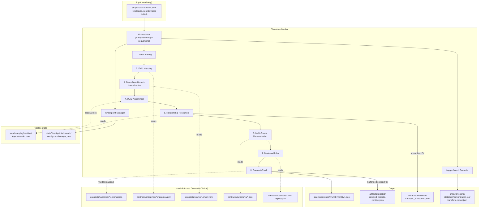
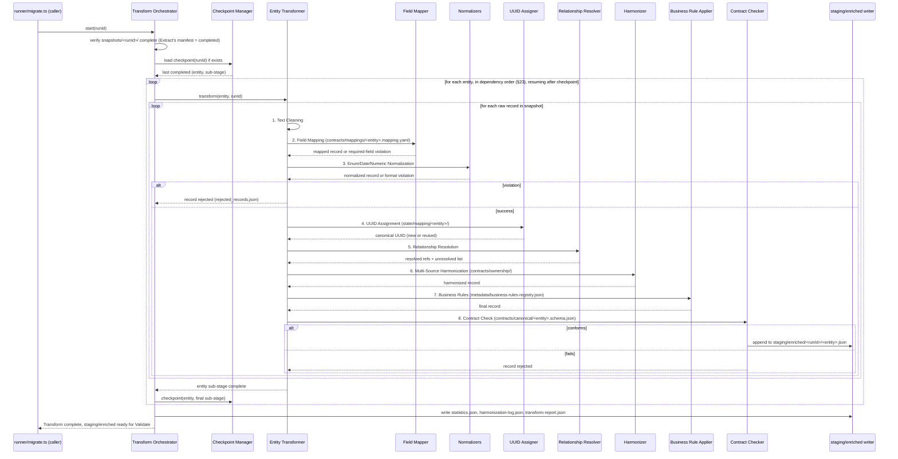
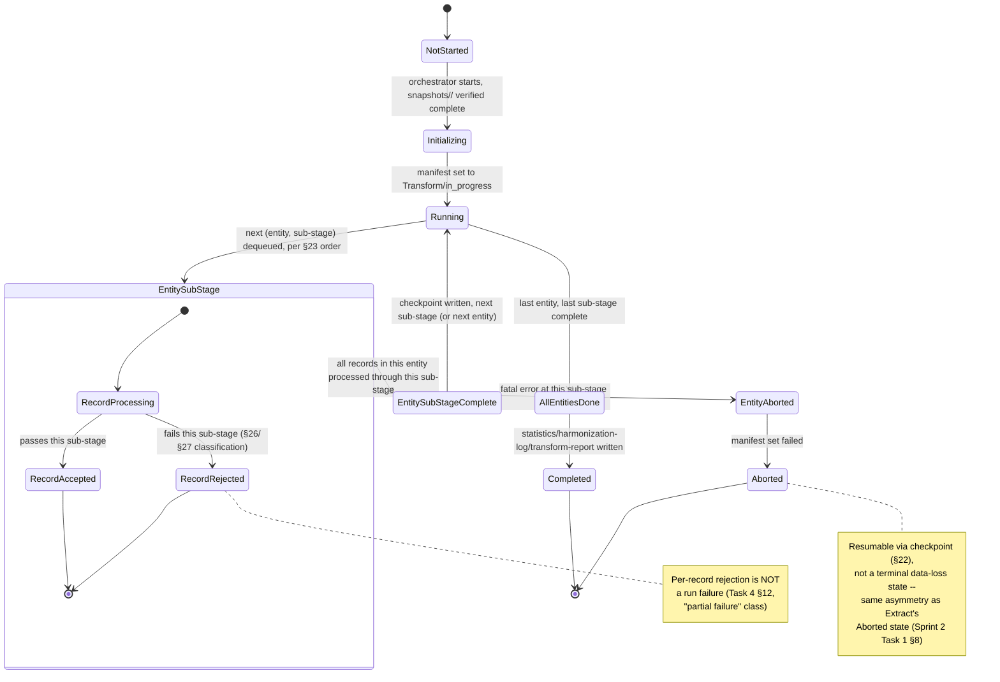
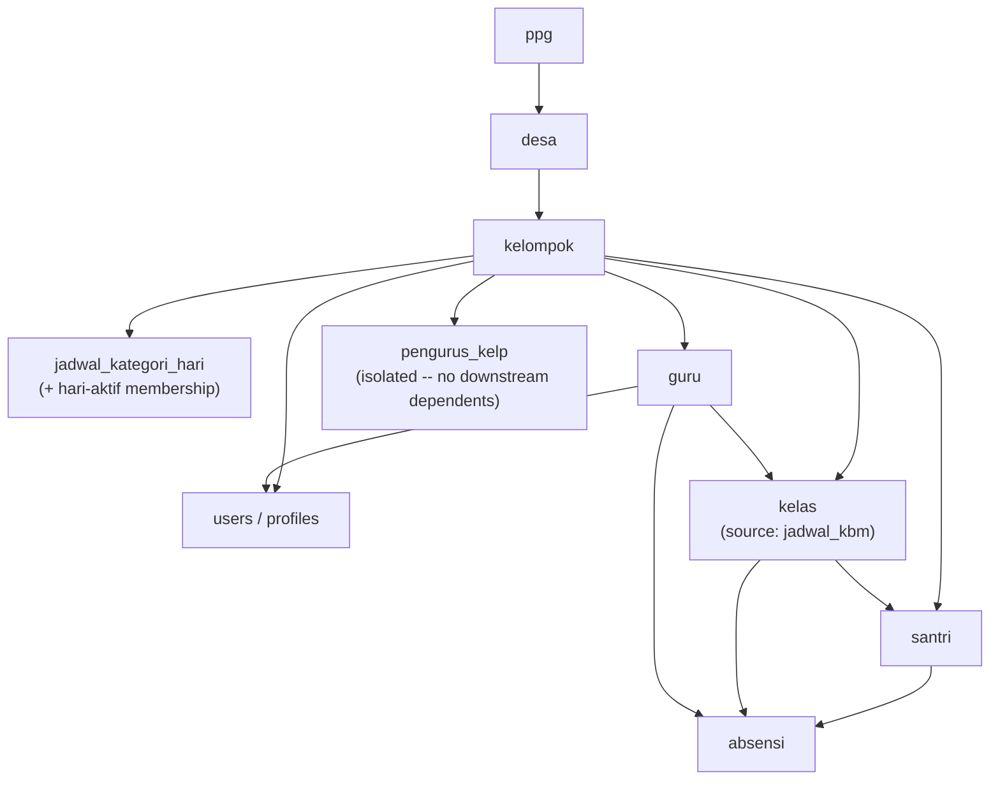

# Sprint 2 — Task 2: Migration Engine — Transform Module
## Product Requirements Document (Design Only)

> **Status**: DRAFT — design only, no implementation, no SQL.
> **Scope**: RUANG NGAJI Migration to Supabase, Sprint 2, second module of the Migration Engine.
> **Governing documents**: [Migration 004 Master Architecture Specification (MAS)](../MAS.md) is
> the Single Source of Truth. [Task 4 — Transformation Strategy](../Task04_Transformation.md) is
> the frozen, approved strategy this PRD elaborates into a buildable module design — it does not
> redefine, revise, or re-litigate any Task 4 decision. [Task 1](../Task01_Architecture.md) and
> [Task 2](../Task02_ExecutionFlow.md) (folder structure, 9-stage flow) and
> [Task 3](../Task03_Extraction.md) (extraction strategy, entity order) are treated as fixed
> upstream context. [Sprint 2 Task 1 — Extract Engine PRD](Task01_ExtractEngine_PRD.md) defines
> this module's entire input surface (`snapshots/<runId>/`) and is treated as authoritative for
> that interface.
> **Non-goals**: no TypeScript/JavaScript, no SQL, no migration scripts — Mermaid diagrams,
> prose, and tables only, per the assignment's explicit constraint.

---

## Table of Contents

1. [Purpose](#1-purpose)
2. [Scope](#2-scope)
3. [Responsibilities](#3-responsibilities)
4. [Non Responsibilities](#4-non-responsibilities)
5. [Architecture Overview](#5-architecture-overview)
6. [Component Diagram](#6-component-diagram)
7. [Data Flow Diagram](#7-data-flow-diagram)
8. [Sequence Diagram](#8-sequence-diagram)
9. [State Machine](#9-state-machine)
10. [Canonical Data Model](#10-canonical-data-model)
11. [Entity Mapping Strategy](#11-entity-mapping-strategy)
12. [Field Mapping Rules](#12-field-mapping-rules)
13. [Data Type Conversion Matrix](#13-data-type-conversion-matrix)
14. [Enum Mapping](#14-enum-mapping)
15. [Date & Time Strategy](#15-date--time-strategy)
16. [Null Handling Strategy](#16-null-handling-strategy)
17. [String Normalization](#17-string-normalization)
18. [Identifier Strategy](#18-identifier-strategy)
19. [Legacy Identifier Preservation](#19-legacy-identifier-preservation)
20. [Foreign Key Preparation](#20-foreign-key-preparation)
21. [Relationship Mapping](#21-relationship-mapping)
22. [Transformation Pipeline](#22-transformation-pipeline)
23. [Dependency Resolution](#23-dependency-resolution)
24. [Configuration Parameters](#24-configuration-parameters)
25. [Error Classification](#25-error-classification)
26. [Recoverable Transformation Errors](#26-recoverable-transformation-errors)
27. [Non-Recoverable Errors](#27-non-recoverable-errors)
28. [Logging Specification](#28-logging-specification)
29. [Audit Trail](#29-audit-trail)
30. [Metrics & Observability](#30-metrics--observability)
31. [Performance Targets](#31-performance-targets)
32. [Capacity Planning](#32-capacity-planning)
33. [Security Considerations](#33-security-considerations)
34. [Privacy Considerations](#34-privacy-considerations)
35. [Versioning Strategy](#35-versioning-strategy)
36. [Testing Strategy](#36-testing-strategy)
37. [Acceptance Criteria](#37-acceptance-criteria)
38. [Future Extension](#38-future-extension)
39. [Risks](#39-risks)
40. [Open Questions](#40-open-questions)

---

## 1. Purpose

The Transform Module is the second executable module of the Migration Engine (MAS §3, Task 2
Stage 3, sitting between Staging/Stage 2 and Validate/Stage 4). It consumes the immutable
snapshots produced by Extract ([Sprint 2 Task 1](Task01_ExtractEngine_PRD.md)) and converts them,
field by field and record by record, into the **Canonical Data Model** (Task 4 §1) — a
source-independent representation ready for Validate (Task 5) to judge and Load (Task 6) to
persist. Transform decides *what a record should look like*; it does not decide *whether that
record is acceptable* (ADR-4, Task 5's exclusive authority) and does not *persist* anything to
Supabase (Task 6's exclusive authority).

- **Design Rationale**: Task 4 already approved the transformation *strategy* (canonical model
  shape, field mapping principles, UUID strategy, enum/date/text normalization rules, business
  rule categories, harmonization approach, the 10-sub-stage pipeline). This PRD's entire
  contribution is turning that approved strategy into an implementable, testable module boundary
  — exactly the same relationship Sprint 2 Task 1 has to Task 3.
- **Tradeoffs**: treating Transform as a hard module boundary (not folded into Extract or
  Validate) costs an extra artifact handoff (`staging/enriched/<runId>/`) in exchange for the
  strict separation of concerns MAS §2 declares non-negotiable ("Transform decides, Validate
  judges, Load persists").
- **Alternative Designs**: fusing Transform and Validate into one "clean and check" stage —
  rejected by ADR-4; fusing Transform and Load into one "convert and write" stage — rejected,
  would make Transform's purity (stateless, side-effect-free with respect to any live system)
  impossible to guarantee.
- **Recommendation**: keep Transform pure with respect to Supabase and business-rule judgment —
  its only external state is the append-only `state/mapping/` UUID registry (Task 4 §3), and even
  that is a lookup/allocation table, not a judgment.

---

## 2. Scope

**In scope**: converting every in-scope entity's raw, source-native snapshot records (Extract's
output) into canonical-shaped records, for all entities MAS §1 lists as in-scope for Migration
004 — `ppg`, `desa`, `kelompok`, `guru`, `users`/`profiles`, `jadwal_kbm`→`kelas`,
`jadwal_kategori_hari`, `santri`, `absensi`, `pengurus_kelp` (isolated/non-blocking per Task 3).

**Out of scope**: `jurnal_kbm`, `kop_surat`, `pengumuman` — explicitly deferred by MAS §1 /
Task 3's Scope Decision, pending a future Migration-003b-style quality audit. Transform builds no
mapping/contract files for these entities in this sprint.

**Temporal scope**: this document covers Transform's steady-state design for a single migration
run (`runId`). It does not cover Task 8 Recovery's re-entry semantics beyond noting where
Transform's own outputs participate in that model (§29).

- **Design Rationale**: scope is pinned to MAS §1's already-approved entity list so this document
  cannot silently expand or shrink what Migration 004 transforms.
- **Tradeoffs**: excluding `jurnal_kbm`/`kop_surat`/`pengumuman` means Transform's canonical model
  and mapping contracts have zero coverage for those entities today — accepted, matches the
  project's own explicit deferral decision.
- **Alternative Designs**: building "placeholder" contracts for the deferred entities now, to save
  effort later — rejected; contracts built without the recommended quality audit would risk
  encoding untested assumptions Task 3 explicitly asked to avoid.
- **Recommendation**: when the deferred-entity audit eventually happens, treat it as a new
  Task-3-and-Task-4-style pair of decisions, then a corresponding Transform PRD addendum — not a
  silent extension of this document.

---

## 3. Responsibilities

| # | Responsibility |
|---|---|
| R1 | Read entity snapshots from `snapshots/<runId>/` (Extract's output contract) |
| R2 | Apply the 10-sub-stage transformation pipeline (Task 4 §11) per entity, in dependency order (§23) |
| R3 | Produce canonical-shaped records into `staging/enriched/<runId>/<entity>.json` |
| R4 | Maintain and consult the deterministic UUID mapping registry (`state/mapping/`, Task 4 §3) |
| R5 | Resolve intra- and cross-entity relationships to canonical identifiers, recording unresolved references rather than failing (Task 4 §4) |
| R6 | Normalize text, enums, dates/times, booleans, and numerics per the declared contracts (Task 4 §5–§8) |
| R7 | Apply declared, registry-listed business-rule transformations only (Task 4 §9) — never ad hoc |
| R8 | Harmonize multi-source data per the ownership/last-write-wins rules Task 4 §10 already decided |
| R9 | Route malformed, unmappable, or contract-violating records to `rejected_records.json` rather than silently dropping or guessing |
| R10 | Checkpoint at `(entity, sub-stage)` granularity so an interrupted run resumes correctly (Task 4 §11) |
| R11 | Emit statistics, harmonization logs, and a transform report sufficient for audit (Task 4 §13) |

- **Design Rationale**: every responsibility here is traceable to a specific Task 4 section number
  — this table exists to make that traceability explicit and reviewable, not to introduce new
  behavior.
- **Tradeoffs**: none beyond those already accepted at Task 4 approval time.
- **Alternative Designs**: N/A.
- **Recommendation**: any responsibility proposed for Transform during implementation that cannot
  be traced to a Task 4 section is a scope-creep signal and should be challenged before being
  built.

---

## 4. Non Responsibilities

Explicitly **out of scope** for the Transform Module (mirrors the assignment's OUT OF SCOPE list,
grounded in Task 4/5/6's boundaries):

- **No extraction** — never reads Sheets/Firestore directly; its only input is Extract's frozen
  snapshot (§1).
- **No Supabase connectivity** — no database driver, no connection string, no network call to
  Supabase of any kind.
- **No referential-integrity validation** — Transform *resolves* a reference to a canonical
  identifier where possible and *records* it as unresolved where not; it never decides whether an
  unresolved reference blocks the run (Task 4 §4, Task 5's authority).
- **No business-rule *violation* detection** — Transform *applies* the specific, registry-declared
  transformation rules (Task 4 §9); judging whether the resulting record is otherwise acceptable
  (e.g. "is this attendance percentage plausible") is Validate's job, not Transform's.
- **No SQL execution** — Transform never constructs or runs a query against any relational
  database.
- **No persistence** — `staging/enriched/` output is a file artifact, not a database write.
- **No retry-of-loading** — Transform has no knowledge of Load's outcome; retry/replay of a failed
  *load* is Task 6/8's concern entirely.
- **No migration reports in the Task 9 operational sense** — Transform emits its own
  `transform-report.json` (a *stage* artifact, Task 4 §13) but never the cross-stage operational
  report Task 9's runbook assembles.

- **Design Rationale**: as with the Extract PRD, this list exists so a future contributor reading
  only this document cannot accidentally re-implement Validate's or Load's job inside a
  transformer.
- **Tradeoffs**: none — pure boundary hygiene.
- **Alternative Designs**: N/A.
- **Recommendation**: treat a pull request that adds any of the above to a transformer as a design
  violation requiring architectural sign-off, exactly per the Extract PRD's equivalent
  recommendation (§4 there).

---

## 5. Architecture Overview

Transform sits strictly between two immutable/durable artifact families: it reads
`snapshots/<runId>/` (never writes there — ADR-1) and writes `staging/enriched/<runId>/` (its own
namespace, immutable once written per entity, but distinct in lifecycle from `snapshots/` per
Task 1's "3 distinct lifecycle concepts").

```text
        snapshots/<runId>/<entity>.jsonl        (Extract's output, read-only input)
                          │
                          ▼
              ┌─────────────────────────────┐
              │   TRANSFORM MODULE (Stage 3)  │
              │  ─────────────────────────    │
              │  Orchestrator                 │
              │  Entity Transformers (10)     │
              │  Field Mapper                 │
              │  Normalizers (text/enum/      │
              │    date/bool/numeric)         │
              │  UUID Assigner (Task 4 §3)    │
              │  Relationship Resolver        │
              │  Harmonizer (Task 4 §10)      │
              │  Business Rule Applier        │
              │  Contract Checker             │
              │  Checkpoint Manager           │
              │  Logger / Audit Recorder      │
              └─────────────────────────────┘
                          │
                          ▼
       staging/enriched/<runId>/<entity>.json  (canonical records, Validate's input)
       artifacts/rejected/rejected_records.<entity>.json
       artifacts/unresolved/<entity>._unresolved.json
       artifacts/reports/{statistics,harmonization-log,transform-report}.json
```

- **Design Rationale**: the architecture is a direct instantiation of Task 4 §11's 10-sub-stage
  pipeline plus Task 4 §13's already-enumerated output artifact list — nothing here is invented
  independently of the frozen strategy.
- **Tradeoffs**: a single orchestrator sequencing 10 sub-stages per entity, per entity in
  dependency order, is more moving parts than a flatter design, in exchange for exactly the
  checkpoint/observability granularity Task 4 §11 specifies.
- **Alternative Designs**: collapsing sub-stages (e.g. merging enum/date/numeric normalization
  into one "normalize" step) — rejected; Task 4 §11 already fixed the 10-sub-stage decomposition,
  and collapsing it would reduce checkpoint granularity below what was approved.
- **Recommendation**: implement the orchestrator so sub-stage order is a declared, reviewable
  constant (mirroring Extract's entity-order treatment in Sprint 2 Task 1 §10), not a
  runtime-configurable sequence.

---

## 6. Component Diagram



- **Design Rationale**: the diagram makes the contract files (Task 4's hand-authored, versioned
  artifacts) first-class inputs alongside the snapshot data — Transform's behavior is meant to be
  almost entirely *data-driven* by these contracts, not hardcoded per-entity logic.
- **Tradeoffs**: a contract-driven design requires more upfront authoring discipline (every field
  mapping, enum, and business rule must be declared in a file before it can take effect) in
  exchange for §35's versionability and §38's extensibility.
- **Alternative Designs**: hardcoding mapping/enum logic per entity in code — rejected by Task 4
  §1's "Extensibility" principle and §14's "a future source system needs only a new mapping file,
  no changes to §3–§9."
- **Recommendation**: enforce in code review that no transformer contains an inline field-rename,
  enum-alias, or business-rule literal that duplicates something a contract file should declare.

---

## 7. Data Flow Diagram

```mermaid
flowchart LR
    A["Raw record<br/>(source-native shape,<br/>from snapshot)"] --> B["1. Text Cleaning<br/>(trim/whitespace/Unicode/UTF-8)"]
    B --> C["2. Field Mapping<br/>(source field -> canonical field,<br/>mapping.yaml)"]
    C --> D["3. Normalization<br/>(enum/date/bool/numeric)"]
    D --> E{"Enum alias miss or<br/>invalid date/number format?"}
    E -->|yes| F["Rejected<br/>(fatal for this record)"]
    E -->|no| G["4. UUID Assignment<br/>(deterministic UUIDv5,<br/>legacy-to-uuid.json)"]
    G --> H["5. Relationship Resolution<br/>(FK legacy-id -> canonical UUID)"]
    H --> I{"Reference resolvable?"}
    I -->|no| J["Unresolved reference recorded<br/>(NOT a failure -- Task 4 §4)"]
    I -->|yes| K["6. Multi-Source Harmonization<br/>(ownership-first / last-write-wins)"]
    J --> K
    K --> L["7. Business Rules<br/>(registry-declared only)"]
    L --> M["8. Contract Check<br/>(canonical schema conformance)"]
    M --> N{"Conforms?"}
    N -->|yes| O["staging/enriched/&lt;runId&gt;/&lt;entity&gt;.json"]
    N -->|no| F
    F --> P["artifacts/rejected/rejected_records.&lt;entity&gt;.json<br/>(raw record embedded, per Task 4 §12)"]
```



- **Design Rationale**: this is Task 4 §11's 10-sub-stage pipeline drawn as a per-record flow,
  with the two explicit "fork" points (enum/format rejection, FK-resolution) that Task 4 already
  specified as structurally different — one is fatal-for-that-record, the other is a legitimate
  non-blocking output.
- **Tradeoffs**: routing an unresolved-FK record *through* harmonization/business-rules/contract
  check (rather than short-circuiting immediately) costs a little extra processing on records that
  may still end up excluded later at Validate, in exchange for the record's canonical shape being
  fully formed and inspectable even while its FK is unresolved — useful for diagnosing *why* a
  reference didn't resolve.
- **Alternative Designs**: short-circuiting a record the moment any FK fails to resolve — rejected;
  it would deprive Validate (Task 5) and human operators of the fully-transformed record shape
  needed to diagnose the orphan.
- **Recommendation**: `staging/enriched/<runId>/<entity>.json` should carry an explicit per-record
  `hasUnresolvedReferences: boolean` flag (a direct, queryable surface for Validate) even though
  the detailed unresolved-reference data lives in the separate `_unresolved.json` file.

---

## 8. Sequence Diagram



- **Design Rationale**: the per-record inner loop shows all 8 processing sub-stages as sequential
  and per-record, while the checkpoint (per Task 4 §11) is recorded at `(entity, sub-stage)`
  granularity at the *entity* level — meaning, precisely, that the checkpoint tracks which
  sub-stage the *entity as a whole* has completed for all its records, not an individual record's
  position. This is deliberately coarser than Extract's page-level checkpointing (Sprint 2 Task 1
  §18) because Task 4 does not call for record-level resumability, and Transform's per-entity
  memory-resident processing (Task 4 §14, except `absensi`) makes entity-level restart cheap.
- **Tradeoffs**: this means an interruption mid-entity re-processes that entity's already-processed
  records from the start of its current sub-stage — acceptable given Transform is
  deterministic/idempotent (re-running produces the same output, MAS "Determinism" principle), so
  reprocessing is wasted time, not a correctness risk.
- **Alternative Designs**: record-level checkpointing within `absensi` specifically (mirroring
  Extract's page-level approach for the same entity) — considered; deferred to §38 pending real
  timing data, since Transform's per-record cost is expected to be far lower than a network round
  trip (Extract's dominant cost).
- **Recommendation**: log entity-level sub-stage timing explicitly (§28) so a real decision on
  `absensi` sub-stage checkpoint granularity can be made from evidence rather than speculation.

---

## 9. State Machine



- **Design Rationale**: nests a per-record micro-state-machine inside the per-(entity, sub-stage)
  macro-state-machine, making explicit that record-level rejection and run-level abortion are
  different severities that must never be conflated (Task 4 §12's class table, elaborated further
  in §25–§27).
- **Tradeoffs**: the nested-state presentation is more diagram complexity than a flat list, in
  exchange for making the "one bad record ≠ one bad run" distinction impossible to miss.
- **Alternative Designs**: a single flat state machine without the nested per-record states —
  rejected; it would obscure exactly the distinction Task 4 §12 is most insistent about.
- **Recommendation**: implementation should make `RecordRejected` a logged event (§28), never a
  thrown exception that could be mistaken for `EntityAborted` if error handling isn't disciplined.

---

## 10. Canonical Data Model

The canonical model (Task 4 §1) is source-independent — a canonical `santri` record carries no
trace of whether it came from Sheets or Firestore. Its authoritative shape lives in
`contracts/canonical/<entity>.schema.json` (hand-authored, versioned, checked into `docs/` per
Task 4 §1) — this PRD does not restate or re-derive those schemas, but documents the *entities*
Transform must model canonically for Migration 004's approved scope:

| Canonical Entity | Category (Task 3 order) | Notes |
|---|---|---|
| `ppg` | Reference | Top of the org hierarchy |
| `desa` | Reference | Belongs to `ppg` |
| `kelompok` | Reference | Belongs to `desa` |
| `jadwal_kategori_hari` (+ its "hari aktif" membership) | Reference | Per-`kelompok` category/day config |
| `users` / `profiles` | Reference | Auth-adjacent identity data |
| `guru` | Entity | Belongs to `kelompok` |
| `kelas` (canonical target of source `jadwal_kbm`) | Entity | **Model change, not a rename** — see §11 |
| `santri` | Entity | Belongs to `kelompok`, references `kelas` |
| `absensi` | Transaction | Largest/riskiest, per Task 3; multi-source (Sheets + Firestore for kelompok 1) |
| `pengurus_kelp` | Entity (isolated) | Extracted in isolation per Task 3; non-blocking if absent |

- **Design Rationale**: the naming convention (`snake_case`, alignment with the *existing*
  Supabase schema `20260805080137_database_foundation.sql` over inventing new names) is Task 4
  §1's explicit rule — this table's canonical names are chosen to match that deployed schema's
  actual table names (e.g. `kelas`, not a Sheets/Apps-Script-era name), consistent with "existing
  schema takes precedence."
- **Tradeoffs**: naming the canonical entity after the *target* schema (rather than the source
  concept) means anyone reading Extract's snapshot (`jadwal_kbm.jsonl`, Sprint 2 Task 1 §16)
  alongside Transform's output (`kelas.json`) must know the two names refer to related-but-not-
  identical entities — mitigated by documenting the relationship explicitly in §11, and by every
  canonical record retaining its legacy provenance (§19).
- **Alternative Designs**: keeping the canonical entity named `jadwal_kbm` for continuity with
  Extract's naming — rejected; Task 4 §1's naming rule is unambiguous, and matching the deployed
  schema reduces translation burden for whoever eventually writes Load (Task 6).
- **Recommendation**: `contracts/canonical/kelas.schema.json`'s header comment should explicitly
  cross-reference "source entity: `jadwal_kbm` (Extract/Sprint 2 Task 1 naming)" so the mapping is
  discoverable without archaeology.

---

## 11. Entity Mapping Strategy

How each source entity becomes a canonical entity:

| Source (Extract snapshot) | Canonical Entity | Mapping Character |
|---|---|---|
| `kelompok.jsonl`, `desa.jsonl`, `ppg.jsonl` (Sheets) | `kelompok`, `desa`, `ppg` | Direct — reference tables, 1:1 record mapping, field renames only |
| `jadwal_kategori_hari.jsonl` (Sheets) | `jadwal_kategori_hari` (+ derived junction membership) | Structural — a CSV-style "hari_aktif" column in source becomes a set of junction-table membership records in canonical output (1NF normalization) |
| `users.jsonl` (Sheets) | `users` / `profiles` | Direct, with identity-boundary awareness — Transform prepares the canonical shape; actual `auth.users` linkage is a Load-stage/Supabase-Auth concern (out of scope here) |
| `guru.jsonl` (Sheets) | `guru` | Direct — field renames + normalization, no structural change |
| `jadwal_kbm.jsonl` (Sheets) | `kelas` | **Structural + semantic collapse.** The deployed schema's `kelas` table comment records a confirmed decision: the old "sesi per tanggal" (session-per-date) model was never actually populated in real production data — every legacy `jadwal_kbm` row was always used as a static class definition. Transform must therefore treat each legacy `jadwal_kbm` row as one canonical `kelas` record, **dropping** the date/hari/legacy-scheduling columns entirely (they carry no data worth preserving, per the schema author's own audit) rather than mapping them to any canonical field. |
| `santri.jsonl` (Sheets) | `santri` | Direct, with one relationship dependency — canonical `santri.kelas_id` resolves against the canonical `kelas` UUID produced above, not a legacy `jadwal_kbm` reference |
| `absensi.jsonl` (Sheets for 17 kelompok; Firestore for kelompok 1) | `absensi` | Multi-source harmonization — ownership-first per Task 4 §10: for kelompok 1, Firestore is authoritative and the Sheets copy is treated as stale/historical, never merged field-by-field |
| `pengurus_kelp.jsonl` (Sheets, or absent if isolated) | `pengurus_kelp` | Direct if present; if Extract isolated this entity (its known 404 anomaly), Transform must treat "entity absent from snapshot" as a legitimate zero-record case, not an error |

- **Design Rationale**: the `jadwal_kbm` → `kelas` row is the single most consequential mapping
  decision in this table, and it is **not a Transform-invented decision** — it is already recorded
  as a confirmed, audited fact in the deployed schema's own comments. Transform's job here is
  narrow: implement the mapping the schema owner already decided, not decide it independently.
- **Tradeoffs**: dropping the date/hari/legacy-scheduling columns means that information is not
  recoverable from the canonical model or downstream Supabase tables after migration — accepted,
  because the schema's own audit found this data was never meaningfully populated; if that
  premise is ever found wrong for a specific kelompok's data, that is a finding for Validate
  (Task 5) to surface, not something Transform should second-guess mid-pipeline.
  See also §39 Risks.
- **Alternative Designs**: preserving the dropped columns in a side/audit table for safety —
  considered; rejected as scope creep beyond Task 4's approved output artifact set (§13) unless a
  real risk is found in snapshot data (flagged as a recommendation below).
  **Alternative Designs**: mapping `jadwal_kbm` 1:many to `kelas` (splitting a source row) — not
  applicable; the confirmed decision is 1:1, source row = static class definition.
- **Recommendation**: before running the `kelas` transformer against real full-scope data (all 18
  kelompok, not just kelompok 1's pilot), spot-check a sample of `jadwal_kbm.jsonl` records for
  meaningfully-populated date/hari columns — if any are found, escalate to the user before
  silently discarding them, since the schema author's audit may have covered only the data
  available at authoring time.

---

## 12. Field Mapping Rules

Field mapping is entirely declarative, per `contracts/mappings/<entity>.mapping.yaml` per entity
per source system (Task 4 §2) — Transform's Field Mapper component (§6) executes these files, it
does not embed mapping logic in code.

| Rule | Behavior |
|---|---|
| **Rename rule** | 1:1 source-field → canonical-field, direction always source → canonical (never canonical → source; Transform is one-directional) |
| **Required fields** | Absence at mapping time is a transformation-time error → record routed to `rejected_records.json` (§27) |
| **Optional fields** | Absence is legal; the canonical field is **omitted** from the output record, not written as an explicit `null`, unless the canonical schema separately marks it nullable (§16 clarifies the omitted-vs-null distinction) |
| **Deprecated fields** | Any source field not carried to canonical must be listed explicitly in the mapping file's `ignored:` block — an unmapped, undeclared field is treated as a mapping-file completeness gap, not silently dropped |
| **Default values** | Field mapping never injects a default value; any default belongs to the business-rule layer (§9 Task 4, §14 canonical here) and must appear in `metadata/business-rules-registry.json`, never inline in a mapping file |

- **Design Rationale**: separating "renaming" from "defaulting" into two different contract files
  (mapping vs. business-rule registry) keeps a reviewer able to answer "does this field ever get a
  value the source didn't provide" by checking exactly one file, the registry — never by having to
  cross-reference mapping logic too.
- **Tradeoffs**: this split requires slightly more file-authoring ceremony (a trivial default must
  still go through the heavier-weight registry process) in exchange for that single-source-of-
  truth property.
- **Alternative Designs**: allowing lightweight defaults inline in mapping YAML — rejected by
  Task 4 §2 explicitly ("defaulting lives in the business-rule layer, not the field-mapping
  layer").
- **Recommendation**: add a mapping-file linter (implementation detail, out of this PRD's design
  scope, but worth flagging) that fails a contract file listing a source field in neither the
  field list nor the `ignored:` block — turns "undeclared field" from a runtime surprise into a
  build-time contract violation.

---

## 13. Data Type Conversion Matrix

| Source Type (Sheets) | Source Type (Firestore) | Canonical Type | Conversion Note |
|---|---|---|---|
| Cell text (string) | `string` | `text` | Text cleaning (§17) applied first |
| Cell text formatted as date (various observed formats) | Firestore `Timestamp` | `date` (timezone-naive) | Only formats explicitly enumerated in the date contract are accepted (§15); no best-effort parsing |
| Cell text formatted as date-time | Firestore `Timestamp` | `timestamptz` (normalized to `Asia/Jakarta`, WIB/UTC+7) | Distinguished from plain `date` per field, per Task 4 §6 |
| Cell text ("Ya"/"Tidak"/"TRUE"/etc., free-form) | `boolean` | `boolean` | Explicit truthy/falsy alias table **per field** (Task 4 §7) — never a universal heuristic across all boolean-like fields |
| Cell text (numeric-looking string) | `number` | `integer` / `numeric` | Strict format validation; a value that fails strict parsing is a format violation (§26/§27), never coerced by best guess |
| Empty cell | Absent field / `null` | `null` or field omission | Per §16's null-handling policy — never silently coerced to `0`, `false`, or `""` |
| Cell text (free-form status/category) | `string` | Canonical enum value | Routed through the enum alias map (§14), not a raw type conversion |
| Firestore nested object/map | (no Sheets equivalent in current scope) | Flattened to canonical fields per mapping contract, or preserved as a canonical `jsonb`-shaped field only if the canonical schema explicitly models it that way | No implicit deep-flattening rule — each nested shape is mapped explicitly per entity |

- **Design Rationale**: the matrix is organized by *canonical* target type (not by source), since
  Transform's whole purpose is source-independence — a reviewer should be able to ask "how does
  anything become a canonical `date`" and get one row's answer regardless of which source it came
  from.
- **Tradeoffs**: strict format validation (reject rather than best-effort-parse) costs some
  records to `rejected_records.json` that a looser parser might have "saved" — accepted
  deliberately, per Task 4 §6's explicit "anything outside that [enumerated] set is rejected,
  never best-effort-parsed."
- **Alternative Designs**: a permissive/best-effort parser (e.g. a generic date-parsing library
  trying multiple formats blindly) — rejected; Task 4 §6 explicitly forecloses this, since
  best-effort parsing of ambiguous formats (e.g. `01/02/2026`, DD/MM vs MM/DD) is a known source of
  silent data corruption, which is unacceptable per MAS's "incorrect data were unacceptable"
  philosophy.
- **Recommendation**: the enumerated date-format set (§15) and boolean alias tables (per field)
  should be derived empirically from a full scan of Extract's actual snapshot data before being
  frozen into contract files — not guessed in advance.

---

## 14. Enum Mapping

Every logical enum gets its own `contracts/enums/<enum-name>.enum.yaml` (Task 4 §5): canonical
value set + an `aliases:` map (every observed source variant → canonical value) + an optional
`default:`.

| Property | Behavior |
|---|---|
| Canonical value set | Fixed, matches the target Postgres enum type (e.g. `gender_type`, `kelompok_status`, `kelas_status`) where the deployed schema defines one |
| Alias resolution | Case-insensitive/whitespace-tolerant lookup against the `aliases:` map, but the *stored* canonical value's casing/form is exactly the declared canonical value, never the source's original casing (§17 clarifies: case-folding is scoped to lookup only) |
| Alias miss | **Fatal for that record** — routed to `rejected_records.json`. Task 4 §5 is explicit this is stricter than FK-orphan handling, "since an unrepresentable status is a real data-integrity risk" |
| Default | Only used where the enum contract explicitly declares one; absence of a default means an unmapped/missing enum value is a required-field violation, not silently defaulted |

- **Design Rationale**: enums get the strictest error posture in the whole pipeline (fatal, not
  deferred) because an enum value Transform can't represent is definitionally impossible to
  express correctly downstream — there is no safe "unresolved enum" concept analogous to
  "unresolved FK."
- **Tradeoffs**: a single new, previously-unobserved status string in a future extraction run (say,
  a guru enters a typo'd `kategori` value) would reject that specific record rather than pass it
  through with a best-guess mapping — accepted; a silently-mismapped enum is a worse outcome than
  a visibly-rejected record needing a one-line alias-map addition.
- **Alternative Designs**: an "UNKNOWN" catch-all canonical enum value used whenever an alias
  lookup misses — rejected; it would hide a real data-quality signal (Validate needs to know a
  distinct new value showed up, not have it silently absorbed).
- **Recommendation**: `guru.kategori` is documented in the deployed schema as deliberately
  free-text, *not* FK'd to a lookup table ("Jadikan lookup table kalau nanti terbukti nilainya
  memang tetap/terbatas") — Transform must NOT treat this specific field as an enum requiring
  alias-map-or-reject; it stays a normalized free-text field (§17), consistent with the schema
  owner's own documented intent.

---

## 15. Date & Time Strategy

Per Task 4 §6, elaborated for implementability:

- **Two distinct canonical shapes**: timezone-naive `date` (calendar dates — birthdates, class
  dates) vs. `timestamptz` (true instants — audit timestamps), normalized to `Asia/Jakarta`
  (WIB, UTC+7) when the source carries or implies a timezone-relevant instant.
- **Format enumeration**: every date format actually observed in the Task 3/Sprint 2 Task 1
  snapshots must be explicitly enumerated in the date-format contract before Transform runs
  against real data; a format outside that enumerated set causes a format-violation rejection
  (§26/§27), never a guess.
- **Empty vs. invalid**: an empty date value is legitimate ("not recorded") *only* where the
  canonical field is marked nullable in `contracts/canonical/<entity>.schema.json`; an empty value
  for a non-nullable date field is a required-field violation, not silently accepted.
- **Firestore Timestamp handling**: Firestore's native `Timestamp` type converts deterministically
  to the canonical `timestamptz` (already UTC-based at the source, then presented in
  `Asia/Jakarta` per the project's display/normalization convention) — no string parsing ambiguity
  exists on this path, unlike Sheets' free-text date cells.
- **No derived/calculated dates here**: any date field computed from other data (e.g. an "age at
  enrollment") is a business-rule concern (Task 4 §9), explicitly recommended *not* to be
  materialized — out of Field Mapping/Normalization's scope.

- **Design Rationale**: dates are the single field family most prone to silent corruption during a
  Sheets-sourced migration (ambiguous locale formats, Excel serial-date artifacts, free-text entry
  drift) — hence the unusually strict, enumerate-or-reject posture, directly inherited from Task 4
  §6 and restated here for implementability.
- **Tradeoffs**: strictness here means a currently-unobserved date format appearing in a future
  full-scope extraction run (e.g. kelompok 12's guru used a different date entry convention) will
  reject those records rather than silently mis-parse them — the correct tradeoff per MAS's
  correctness-over-convenience philosophy.
- **Alternative Designs**: locale-aware fuzzy date parsing — rejected, already excluded by Task 4
  §6.
- **Recommendation**: build the date-format contract from an actual full scan of every kelompok's
  snapshot data (once available), not just kelompok 1's pilot data, before scaling Transform to
  the other 17 kelompok — a format present only in kelompok 7's sheet, say, must not be discovered
  for the first time as a mass-rejection event.

---

## 16. Null Handling Strategy

| Situation | Canonical Representation |
|---|---|
| Source field absent, canonical field optional (not required, not explicitly nullable) | Field **omitted** from the canonical record entirely — not written as `null` |
| Source field present but empty, canonical field explicitly nullable | Canonical field written as `null` |
| Source field present but empty, canonical field required and NOT nullable | Required-field violation → `rejected_records.json` |
| Source field absent, canonical field required | Required-field violation → `rejected_records.json` (Task 4 §2) |
| Empty string for a numeric/boolean/date canonical field | Never passed through as the "empty" representation of that type (e.g. never `0`, never `false`, never an epoch date) — always mapped to `null` (if nullable) or a required-field violation (Task 4 §7) |

- **Design Rationale**: distinguishing "omitted" from "explicit null" is a deliberate, non-obvious
  design choice — it lets downstream consumers (Validate, Load) tell "this source system never
  had an opinion about this field" apart from "this field was actively recorded as empty," which
  matters for entities with multiple possible sources of truth (§21 harmonization).
  This mirrors Task 4 §2's field-mapping rule for optional fields, generalized to a full policy.
- **Tradeoffs**: omission-vs-null adds a small amount of representational complexity (canonical
  JSON records are not uniformly-shaped across all records of one entity) in exchange for that
  provenance signal — accepted as the correct tradeoff since JSON naturally supports optional
  keys without ambiguity.
- **Alternative Designs**: always writing `null` explicitly for any missing value, never omitting —
  rejected; it would erase the "never had an opinion" vs. "explicitly recorded as empty"
  distinction, which downstream harmonization (§21) may need.
- **Recommendation**: `contracts/canonical/<entity>.schema.json` should mark every field as one of
  exactly three states — `required`, `optional-nullable`, `optional-omittable` — so this table's
  rules apply mechanically rather than needing per-field judgment calls during implementation.

---

## 17. String Normalization

Per Task 4 §8, the Text Cleaning sub-stage (always sub-stage 1, applied before field mapping):

| Operation | Applied? | Note |
|---|---|---|
| Trim leading/trailing whitespace | Yes | Universal |
| Collapse internal duplicate whitespace | Yes | Universal (e.g. `"Ahmad    Fauzi"` → `"Ahmad Fauzi"`) |
| Unicode NFC normalization | Yes | Universal — guards against visually-identical but byte-different strings (a real risk with mixed input methods across many guru/admin devices) |
| UTF-8 compliance check | Yes (validation, not conversion) | A non-UTF-8-valid byte sequence is a format violation, not silently re-encoded |
| Control character removal | Yes | Strips non-printing control characters that occasionally leak in from copy-pasted source data |
| Case folding | **Only** for lookup-key matching (e.g. enum alias resolution, §14) | Never applied to the *stored* canonical value — a name like `"Ahmad"` is never forced to `"ahmad"` or `"AHMAD"` in canonical output |
| Semantic punctuation changes | **Never** | Transform does not "fix" apostrophes, hyphens, or other meaningful punctuation in stored values (e.g. a name legitimately containing `'`, as already a known trap per this project's `ERROR_LOG.md`-documented apostrophe-in-onclick bug — a reminder that this project's real data does contain such characters) |

- **Design Rationale**: text cleaning is scoped tightly to whitespace/encoding hygiene, explicitly
  never touching semantic content — Task 4 §8 is emphatic that case and meaningful punctuation are
  preserved in stored values, and this project's own history (an apostrophe in a name breaking a
  UI feature) is a concrete reminder that such characters are real, present data, not edge-case
  noise to "clean away."
- **Tradeoffs**: preserving mixed case and original punctuation means canonical data is not
  uniformly formatted for display purposes — accepted; display-layer formatting (e.g. title-casing
  for a report) is an application/reporting concern, never a canonical-data-mutation concern.
- **Alternative Designs**: title-casing names during Transform for consistency — rejected; would
  destroy legitimately-intended capitalization (e.g. initialisms in an address field) with no
  reliable way to distinguish "typo" from "intentional."
- **Recommendation**: UTF-8 validation failures should be rare (the source app is a modern web
  app) but must still route to `rejected_records.json` rather than crash the whole entity's
  processing — treat as a per-record format violation (§27), not a fatal-run condition.

---

## 18. Identifier Strategy

Transform's canonical output uses **deterministic UUIDv5 identifiers** (Task 4 §3, ADR-3) as the
pipeline-internal, source-independent identity for every record — this UUID is what appears in
`staging/enriched/<runId>/<entity>.json` as the record's `id`, and what every canonical
relationship (§20/§21) references.

**Important boundary**: the deployed Supabase schema
(`20260805080137_database_foundation.sql`) uses `bigint generated always as identity` primary
keys for nearly every table (the sole current exception is `profiles.id`, which is `uuid` and
must equal `auth.users.id`). This means the deterministic UUID Transform assigns is **not**
assumed to become the literal Postgres primary key value for most tables — it is the stable,
rerun-safe identity token that flows through Transform → Validate → Load's own ID-allocation
mechanism (Task 6, out of this document's scope) and Verify's reconciliation (Task 7). How Load
ultimately reconciles a deterministic UUID with a `bigint identity` column is explicitly a Task 6
design question, not one this Transform PRD resolves.

- **Generation rule**: `UUIDv5(namespace, source + ":" + legacy_id)` — namespace UUID fixed per
  entity type, never regenerated (Task 4 §3).
- **Registry**: `state/mapping/<entity>/legacy-to-uuid.json` (forward) +
  `uuid-to-legacy.json` (reverse), loaded once into memory per Transform run, appended-to (never
  rewritten wholesale) as new legacy records are encountered.
- **Idempotency guarantee**: the same `(source, legacy_id)` pair always produces the same UUID,
  across any number of reruns — the foundation of the whole pipeline's rerun-safety (Task 4 §3,
  MAS ADR-3).

- **Design Rationale**: this section exists specifically to prevent a plausible implementation
  mistake — assuming the canonical UUID *is* the final Postgres row identifier, which the deployed
  schema's actual PK types do not support for most tables. Stating this boundary explicitly here
  avoids Transform's design accidentally encoding an assumption that belongs to (and may be
  answered differently by) Task 6.
- **Tradeoffs**: carrying a UUID that isn't the final storage key adds one layer of indirection
  Load must resolve — accepted, since Task 4 §3 already made this exact tradeoff deliberately for
  idempotency, independent of what Load's target column types happen to be.
- **Alternative Designs**: Transform emitting sequential/synthetic integer IDs instead of UUIDs —
  rejected; would violate Task 4 §3's determinism requirement (a rerun must produce the *same*
  identifier, and only a content-derived scheme like UUIDv5 guarantees that without shared mutable
  counter state across runs).
- **Recommendation**: flag the UUID-to-bigint reconciliation mechanism as a named open item for
  the eventual Sprint covering Task 6 (Load) — see §40 — since this Transform PRD can describe the
  boundary but should not presume to resolve it.

---

## 19. Legacy Identifier Preservation

Every canonical record retains full traceability to its source, independent of the deterministic
UUID (§18):

| Field (in canonical record, alongside business fields) | Purpose |
|---|---|
| `_provenance.source` | `sheets` \| `firestore` |
| `_provenance.legacySourceId` | The literal legacy identifier as extracted (row-derived key, Firestore doc path, etc. — as recorded by Extract, Sprint 2 Task 1 §12) |
| `_provenance.legacyKelompokId` (where applicable) | Preserves the pre-migration `kelompok_id` distinguishing column, useful for audit even after canonical `kelompok_id` becomes a resolved UUID/FK |
| `_provenance.extractRunId` | Which Extract run's snapshot this record was transformed from |
| `_provenance.contentHash` | Cross-reference to the specific snapshot entity file's content hash (Sprint 2 Task 1 §13) — the second link in MAS §12's Evidence Chain |

- **Design Rationale**: legacy-identifier preservation is what makes MAS §12's Evidence Chain
  ("Transform — staging/enriched/, contract-checked — schemaVersion + content-hash referenced by
  → Validation") concretely possible — without it, a canonical record could not be traced back to
  the exact source row/document that produced it.
- **Tradeoffs**: every canonical record carries this provenance sub-object, a modest storage/size
  cost, in exchange for permanent forensic traceability — non-negotiable given MAS's
  "Auditability" guiding principle.
- **Alternative Designs**: storing provenance in a separate side-index rather than inline per
  record — rejected; an inline `_provenance` block keeps a single canonical record
  self-describing without requiring a join against a separate file to answer "where did this come
  from."
- **Recommendation**: the `_provenance` sub-object's field names should be prefixed/namespaced
  (e.g. the leading underscore already shown) precisely so `contracts/canonical/<entity>.schema.
  json`'s business-field validation (§10) never confuses provenance metadata with actual entity
  data — Contract Check (sub-stage 8) should validate the two separately.

---

## 20. Foreign Key Preparation

Transform prepares — but never validates the *acceptability* of — every relationship a canonical
record holds:

| Step | Behavior |
|---|---|
| 1. Identify FK-shaped fields | Per the canonical schema's declared relationships (e.g. `santri.kelas_id`, `guru.kelompok_id`, `absensi.santri_id`) |
| 2. Look up the referenced entity's UUID | Via that entity's own `state/mapping/<entity>/legacy-to-uuid.json` (§18) — the referenced record must have been assigned a UUID by the time this record's FK is resolved, which is why dependency order (§23) matters |
| 3a. Reference resolves | Canonical field is written as the target's UUID |
| 3b. Reference does not resolve | Recorded in `staging/enriched/<entity>/_unresolved.json` with the **raw legacy reference preserved** (never silently dropped or nulled) — the canonical record proceeds through the rest of the pipeline with that field left unresolved, flagged via `hasUnresolvedReferences` (§7) |
| 4. No validation of resolved values | Even a successfully-resolved FK is not checked here for whether the *referenced record itself* is valid/acceptable — that composite judgment belongs to Validate (Task 5) |

- **Design Rationale**: "preparation, not validation" is the precise boundary Task 4 §4 draws — an
  unresolved FK is explicitly framed as a Transform-stage *output*, not a Transform-stage
  *failure*, because whether an orphan reference should block the run is a policy decision
  (Validate's `absensi-orphans.policy.json`, per Task 2's execution-gate wiring), not a mechanical
  fact Transform can determine on its own.
- **Tradeoffs**: letting unresolved-FK records flow all the way through the pipeline (rather than
  stopping at FK resolution) means Transform does slightly more work on records that might
  ultimately be excluded — accepted, matches §7's rationale exactly.
- **Alternative Designs**: treating any unresolved FK as an automatic rejection — rejected by
  Task 4 §4 directly; this is precisely the "483 orphaned absensi rows" scenario MAS §9's Risk
  Register already has a named mitigation for (surfaced in Staging, gated in Validate, not
  silently rejected in Transform).
- **Recommendation**: `_unresolved.json` entries should carry enough context (which field, what
  raw legacy value, which entity/record) that Validate's policy engine can classify them without
  re-deriving anything Transform already knows.

---

## 21. Relationship Mapping

**Processing order** (Task 4 §4, restated for Transform's own sequencing, consistent with §23):
reference tables first → entity tables → transaction tables last (`absensi`).

| Relationship | Direction / Resolution Rule |
|---|---|
| `guru.kelompok_id` → `kelompok` | Reference resolved before `guru` processes (kelompok is a reference table, processed first) |
| `santri.kelompok_id` → `kelompok` | Same as above |
| `santri.kelas_id` → `kelas` (source: `jadwal_kbm`) | `kelas` must be fully transformed before `santri`, since `santri` depends on it (§23 ordering) |
| `absensi.santri_id` → `santri`, `absensi.kelas_id`/`guru_id` (as applicable) → `kelas`/`guru` | `absensi` processed last, after all its dependencies are UUID-assigned |
| `jadwal_kategori_hari.kelompok_id` → `kelompok` | Reference-to-reference, resolved early |
| `users.guru_id` ↔ `guru` (soft cycle) | Task 4 §4 already resolved this: **`guru` is treated as authoritative, one-directional only** — Transform does not attempt a bidirectional resolution; `users`/`profiles` records reference `guru`'s UUID, never the reverse during this stage |
| `pengurus_kelp` references (if present) | Isolated entity — resolved independently, never gates or is gated by other entities' processing (Task 3) |

- **Design Rationale**: this table is a direct restatement of Task 4 §4's already-audited finding
  ("no genuine cycles exist in the current entity set... `users.guru_id` ↔ `guru` soft-cycle
  resolved by treating `guru` as authoritative") — Transform must implement this resolution
  exactly as decided, not re-derive it.
- **Tradeoffs**: treating `guru` as strictly authoritative over `users.guru_id` means a
  hypothetical future scenario where `users` data disagrees with `guru` data about the
  relationship would silently favor `guru` — accepted per Task 4's explicit, audited decision;
  revisiting it is out of this PRD's authority.
- **Alternative Designs**: a general bidirectional relationship resolver — explicitly rejected by
  Task 4 §4's own text ("no genuine cycles exist... resolved... one-directional only").
- **Recommendation**: encode entity dependency order (§23) as a literal directed acyclic graph
  constant in code, derived from this table, so a future entity addition that accidentally
  introduces a real cycle fails loudly (a topological-sort error) rather than silently
  processing in an arbitrary order.

---

## 22. Transformation Pipeline

The full, ordered pipeline (Task 4 §11), per entity:

```mermaid
flowchart LR
    S0["Snapshot record<br/>(raw, source-native)"] --> S1["1. Text Cleaning"]
    S1 --> S2["2. Field Mapping"]
    S2 --> S3["3. Enum/Date/Numeric<br/>Normalization"]
    S3 --> S4["4. UUID Assignment"]
    S4 --> S5["5. Relationship Resolution"]
    S5 --> S6["6. Multi-Source<br/>Harmonization"]
    S6 --> S7["7. Business Rules"]
    S7 --> S8["8. Contract Check"]
    S8 --> S9["Output to<br/>staging/enriched/&lt;runId&gt;/&lt;entity&gt;.json"]
```



**Checkpoint granularity**: one checkpoint per `(entity, sub-stage)` pair, written to
`state/checkpoints/<runId>/<entity>.<substage>.json`, only after that sub-stage's processing for
the *entire* entity is confirmed complete (mirroring Sprint 2 Task 1 §18/MAS §17's "checkpoint
after confirmed complete, never optimistic" rule).

- **Design Rationale**: the pipeline order itself is fixed by Task 4 §11 and restated here
  verbatim (not reinterpreted) — its internal logic is worth restating briefly: text must be clean
  before mapping (so mapping doesn't have to also worry about whitespace), mapping must happen
  before normalization (normalization operates on canonical field names), UUIDs must be assigned
  before relationship resolution (resolution targets UUIDs), harmonization happens after
  relationships resolve (so harmonization can consider related-record context), business rules
  apply last before the final contract check (rules may depend on any earlier-stage output).
- **Tradeoffs**: a strictly sequential 8-sub-stage pipeline per record is more overhead than a
  single fused transformation function, in exchange for exactly the checkpoint/observability/
  testability granularity every other section of this document depends on.
- **Alternative Designs**: N/A — Task 4 §11 already fixed this order; reordering is out of this
  PRD's authority.
- **Recommendation**: implement each sub-stage as an independently unit-testable pure function
  (input record → output record or rejection), so the pipeline itself is just a fold/reduce over
  this function list — directly serves §36 Testing Strategy.

---

## 23. Dependency Resolution

**Entity processing order** (extends Task 3's extraction order into Transform's own dependency
graph, since Transform's relationship resolution (§20/§21) requires a dependent entity's UUIDs to
already exist):



| Rule | Statement |
|---|---|
| Reference tables first | `ppg` → `desa` → `kelompok` → `jadwal_kategori_hari` (Task 4 §4) |
| Entity tables next | `guru` before `kelas` and `users` (both reference `guru`); `kelas` before `santri` (santri references kelas) |
| Transaction tables last | `absensi` — depends on `santri`, `kelas`, and `guru` all being UUID-assigned first (Task 3's "largest/riskiest last" applies structurally here too) |
| Isolated entities | `pengurus_kelp` has no downstream dependents and no hard dependency beyond `kelompok` — its processing (or absence) never blocks any other entity (Task 2 §"Migration-003 Decisions" item 3) |
| No genuine cycles | Confirmed by Task 4 §4's audit; the only soft cycle (`users.guru_id` ↔ `guru`) is resolved one-directionally (§21) |

- **Design Rationale**: this dependency graph is Transform's own derived elaboration of Task 4 §4's
  ordering *principle* ("reference → entity → transaction") into an entity-level DAG concrete
  enough to drive an orchestrator's literal processing sequence — it does not add any relationship
  Task 4 didn't already establish.
- **Tradeoffs**: a strict DAG-driven sequential order forgoes any parallelism across independent
  branches (e.g. `guru` and `jadwal_kategori_hari` could theoretically process concurrently) — an
  accepted simplicity-over-throughput tradeoff, consistent with MAS §16's "modest data volume"
  framing; not worth the added complexity of a parallel scheduler.
- **Alternative Designs**: a fully parallel/topological-batch scheduler processing all
  same-depth entities concurrently — deferred to §38; unjustified at current scale.
- **Recommendation**: implement this DAG as a literal, reviewable data structure (not implicit in
  call order) so it can be unit-tested for cycle-freedom independently of the rest of the pipeline
  — directly protects against a future entity addition accidentally introducing a real cycle.

---

## 24. Configuration Parameters

`config/transform.config.json` (Task 1's `config/` folder), scoped strictly to operational
tuning — never to logic that belongs in a contract file (§12):

| Parameter | Default | Description |
|---|---|---|
| `schemaVersion` (per entity) | Pinned per Task 4 §13's versioning discipline | Which `contracts/canonical/<entity>.schema.json` version this run targets — never "latest" (MAS §13) |
| `batchSize` (for `absensi` only) | e.g. 1000 (illustrative; tune from real timing data) | Batch-bound processing applies to `absensi` only; every other entity loads fully into memory (Task 4 §14) |
| `checkpointEnabled` | `true` | Escape hatch for a deliberate full re-run, mirroring Sprint 2 Task 1 §27's equivalent parameter |
| `strictUnicodeValidation` | `true` | Whether a UTF-8 validation failure (§17) is treated as reject-record (true, default) — no "best effort" fallback mode is offered |
| `contractsBasePath` | `contracts/` | Root for mapping/enum/canonical/ownership contract files |
| `mappingRegistryBasePath` | `state/mapping/` | Root for UUID mapping state (§18) |
| `logLevel` | `info` | Per §28 |

- **Design Rationale**: as with Sprint 2 Task 1 §27, configuration is limited to *how* Transform
  runs (batch size, logging, which schema version) — never *what* it does (entity order, field
  mappings, enum values), which stays in reviewed contract files or code constants.
- **Tradeoffs**: none beyond those already accepted in the Extract PRD's equivalent section.
- **Alternative Designs**: N/A — mirrors the established pattern deliberately for consistency
  across Migration Engine modules.
- **Recommendation**: keep `transform.config.json` and `extract.config.json` structurally
  parallel (same top-level shape where concepts overlap, e.g. `checkpointEnabled`, `logLevel`) so
  Task 9's operational tooling can treat all Migration Engine module configs uniformly.

---

## 25. Error Classification

Per Task 4 §12, restated as the authoritative classification Transform's error handling must
implement:

| Class | Definition | Handling |
|---|---|---|
| Recoverable / transient | An error whose cause is expected to be temporary (e.g. a transient I/O error reading a snapshot file, a `state/mapping/` write contention) | Retried with backoff (§26) |
| Fatal (run-level) | An error indicating the run itself cannot proceed correctly (e.g. `snapshots/<runId>/` is missing or incomplete, a contract file fails to parse, a required namespace UUID is missing) | Aborts the entire Transform stage immediately (§27) |
| Partial failure (record-level) | A single record fails a sub-stage (required-field violation, enum alias miss, format violation, contract-check failure) | Routed to `rejected_records.json`; does **not** block processing of the rest of the entity or run (Task 4 §12) |
| Malformed records | A record whose raw shape is unreadable/uninterpretable at the earliest possible sub-stage | Rejected at the earliest detecting sub-stage, with the raw record embedded in the rejection entry for diagnosis |
| Skipped records | A record deliberately not processed for a reason distinct from rejection (e.g. belongs to an out-of-scope kelompok for this run) | Logged distinctly as `skipped`, **never conflated with `rejected`** (Task 4 §12) |

- **Design Rationale**: this five-way classification is Task 4 §12 verbatim — Transform's
  implementation must preserve exactly these categories and never merge "skipped" into
  "rejected," since they carry different operational meaning (a skip is expected/by-design; a
  rejection is a data-quality finding).
- **Tradeoffs**: maintaining five distinct classes (rather than a simpler pass/fail binary) is more
  bookkeeping, in exchange for Validate/Task 9 being able to answer precise questions ("how many
  records failed vs. were intentionally out of scope") without ambiguity.
- **Alternative Designs**: N/A — Task 4 §12 already fixed this classification.
- **Recommendation**: every log line and report entry should carry an explicit `class` field using
  exactly these five vocabulary terms, never a free-text description that could drift from this
  taxonomy over time.

---

## 26. Recoverable Transformation Errors

| Scenario | Recovery Action |
|---|---|
| Transient I/O error reading a `snapshots/<runId>/<entity>.jsonl` line | Retry with backoff, bounded attempts (mirrors Sprint 2 Task 1 §21's retry-policy shape, applied here to file I/O rather than network I/O) |
| `state/mapping/<entity>/legacy-to-uuid.json` write contention (concurrent process unexpectedly touching the file) | Retry with backoff; if persistent, escalate to fatal (this should not happen under Transform's own single-writer design, so persistence indicates a deeper problem) |
| Process interruption mid-entity, mid-sub-stage | Not an "error" per se — resumed via checkpoint (§22) on next invocation, re-processing that entity's current sub-stage from its start |
| A contract file (mapping/enum/canonical) present but momentarily locked by a concurrent read (e.g. a filesystem quirk) | Retry with backoff; if persistent, escalate to fatal (a genuinely malformed/missing contract file is not recoverable — see §27) |

- **Design Rationale**: "recoverable" here is scoped to genuinely transient, environment-level
  hiccups — never to a data-content problem (a bad record is never "recoverable" in this sense;
  it's a rejection, §25).
- **Tradeoffs**: a bounded retry budget (not infinite) means a persistent transient issue still
  eventually surfaces as fatal — intentional, consistent with Sprint 2 Task 1 §21's philosophy
  ("retrying forever would hide a real problem").
- **Alternative Designs**: N/A.
- **Recommendation**: reuse the same retry/backoff parameters and implementation pattern as
  Extract (Sprint 2 Task 1 §21) rather than inventing a second, subtly different retry mechanism —
  consistency across Migration Engine modules reduces operational surprise.

---

## 27. Non-Recoverable Errors

| Scenario | Handling |
|---|---|
| `snapshots/<runId>/` missing, or its `metadata.json` reports `status != completed` (Extract didn't finish) | Fatal — Transform must refuse to start against an incomplete/untrusted snapshot (hard precondition, mirroring MAS's "never let a stage process an unauthorized upstream state") |
| A required contract file (`contracts/canonical/<entity>.schema.json`, a referenced `.mapping.yaml`, a referenced `.enum.yaml`) is missing or fails to parse | Fatal — Transform cannot safely guess a mapping/schema; this blocks the entire entity's (and likely the run's) processing |
| `state/mapping/uuid-namespace.json` missing or altered mid-run | Fatal — the whole determinism guarantee (§18) depends on this namespace being fixed and present; proceeding without it would silently break rerun-safety |
| A snapshot entity file's content hash does not match its `.report.json` (Sprint 2 Task 1 §13) | Fatal for that entity — an untrustworthy snapshot must never be transformed as if it were verified |
| Genuine schema-version mismatch (a snapshot or contract references a `schemaVersion` Transform's current code doesn't know how to handle) | Fatal — never silently "best-effort" transform against an unknown schema version (MAS §13, "nothing... ever reads latest implicitly") |
| A record-level rejection rate for an entity exceeds a sane sanity threshold (e.g. the overwhelming majority of an entity's records are rejected) | Not automatically fatal by this document's design, but must be surfaced prominently (§30/§39) — treated as a strong signal something upstream (mapping contract, source data assumption) is wrong, warranting a human pause even though the mechanism itself keeps processing per-record |

- **Design Rationale**: fatal conditions are, without exception, situations where continuing would
  mean Transform is *guessing* rather than executing a decision someone already made and recorded
  — directly serving MAS's "evidence-first decision making" and "conservative default" guiding
  principles.
- **Tradeoffs**: treating a missing contract file as fatal (rather than falling back to some
  default behavior) means a single missing/misnamed file can halt an entire entity's processing —
  accepted; a fallback here would be exactly the kind of implicit-latest/best-effort behavior MAS
  repeatedly forecloses.
- **Alternative Designs**: allowing Transform to proceed with partial contract coverage (skip
  fields with no mapping rule) — rejected; would silently drop data with no record of the
  omission, violating "no stage silently drops a record" (MAS §17).
- **Recommendation**: the "high rejection rate" sanity check (last row) should be implemented as an
  observability alert (§30), not a hard-coded run-aborting threshold — a genuinely bad batch of
  source data is itself useful signal that shouldn't be suppressed, but a human should be the one
  deciding whether to halt, per MAS's "manual intervention over automatic action."

---

## 28. Logging Specification

Mirrors Sprint 2 Task 1 §22's established pattern, applied to Transform:

- **Format**: structured JSON Lines at `logs/<runId>/transform.<entity>.log` (per-entity log
  files, per Task 4 §13's output artifact list).
- **Required fields**: `timestamp`, `runId`, `entity`, `subStage` (one of the 8 pipeline
  sub-stages, §22), `stage` (always `"transform"`), `level`, `event` (fixed vocabulary — e.g.
  `entity_substage_started`, `record_rejected`, `record_unresolved_reference`,
  `uuid_assigned`, `harmonization_decision`, `entity_substage_completed`, `run_completed`), plus
  event-specific detail fields.
- **What must be logged**: every sub-stage start/completion per entity, every record rejection
  (with class per §25 and the specific rule/contract that triggered it), every unresolved
  reference, every harmonization decision (source chosen and why — directly feeding
  `harmonization-log.json`, §29), checkpoint writes, run start/completion.
- **What must never be logged**: raw personally-identifiable santri/guru field *values* beyond
  what's needed to identify a record (legacy ID, entity, canonical UUID) — same privacy discipline
  as Extract (§34 elaborates further for Transform specifically, since Transform is where PII is
  actively read/reshaped).
- **Level discipline**: `error` for fatal/non-recoverable conditions (§27); `warn` for
  record-level rejections/unresolved references (real findings, but not run-threatening); `info`
  for routine progress.

- **Design Rationale**: reusing Extract's logging schema/vocabulary pattern (rather than inventing
  a parallel one) directly serves Sprint 2 Task 1 §22's own recommendation to standardize
  structured logging across Migration Engine modules.
- **Tradeoffs**: none beyond those already accepted for Extract's equivalent design.
- **Alternative Designs**: N/A.
- **Recommendation**: `subStage` as a required field is Transform-specific (Extract has no
  equivalent concept) — ensure the shared logging library/schema accommodates optional,
  stage-specific fields cleanly rather than forcing every module into an identical flat shape.

---

## 29. Audit Trail

Transform's audit trail answers: *what did this run turn every legacy record into, via which
rule, and why — including every record that did NOT make it through.*

- **Primary audit artifacts** (Task 4 §13, permanent retention per Task 1's Deliverables Matrix
  pattern): `staging/enriched/<runId>/<entity>.json` (what succeeded), `artifacts/rejected/
  rejected_records.<entity>.json` (what failed and why, raw record embedded), `artifacts/
  unresolved/<entity>._unresolved.json` (what's pending Validate's judgment), `artifacts/reports/
  statistics.json`, `artifacts/reports/harmonization-log.json` (every multi-source decision, Task
  4 §10), `artifacts/reports/transform-report.json` (run-level summary).
- **Secondary audit artifacts**: `logs/<runId>/transform.<entity>.log` (per §28) — detailed,
  retained per project log-retention policy, useful for deep troubleshooting beyond the summary
  reports.
- **Evidence Chain participation** (MAS §12): Transform's output is referenced downstream by
  `schemaVersion + content-hash` — every canonical record's `_provenance.contentHash` (§19) links
  back to Extract's snapshot hash, and Transform's own output should itself be content-hashed per
  entity so Validate can reference *this* stage's output by hash too, continuing the chain
  unbroken.
- **Immutability**: once `staging/enriched/<runId>/<entity>.json` is written and its sub-stage
  checkpoint confirms completion, it is not edited in place — a correction requires either
  resuming an interrupted run (before completion) or a new `runId` (after completion), consistent
  with Task 1's "staging = mutable, regenerable" framing applied per-run (mutable *across* runs,
  immutable *within* a completed run).

- **Design Rationale**: Transform is the stage where the Evidence Chain's second link is forged
  (MAS §12: "Transform (Task 4) — staging/enriched/, contract-checked — schemaVersion +
  content-hash referenced by → Validation") — this section makes that concrete rather than
  leaving it as an abstract MAS-level statement.
- **Tradeoffs**: content-hashing per-entity Transform output (in addition to Extract already doing
  so for snapshots) is a small extra computation cost, in exchange for the evidence chain being
  independently verifiable at every link rather than trusting an unhashed intermediate stage.
- **Alternative Designs**: skipping Transform-output hashing since Extract's snapshot hash already
  exists — rejected; without it, a Transform bug that silently altered output between two runs of
  supposedly-identical logic would be undetectable by hash comparison, undermining MAS's
  determinism guarantee's own verifiability.
- **Recommendation**: Task 9's runbook tooling should be able to compare two runs' `transform-
  report.json` + entity content hashes to confirm "rerunning Transform against the same snapshot
  produces byte-identical output" as a literal, automatable determinism check — directly useful
  for §36 Testing Strategy and §37 Acceptance Criteria.

---

## 30. Metrics & Observability

| Metric | Purpose |
|---|---|
| Records processed / accepted / rejected / skipped, per entity, per sub-stage | Core throughput and quality signal; also the basis for §27's "high rejection rate" sanity alert |
| Unresolved-reference count, per entity, per referenced entity | Tracks orphan volume (directly relevant to the known 483-orphan-absensi-rows risk, MAS §9) |
| Harmonization decisions, by outcome (source chosen), per entity | Surfaces whether ownership-first resolution (§21/Task 4 §10) is behaving as expected across kelompok |
| Sub-stage duration, per entity | Feeds §31 performance targets and future checkpoint-granularity decisions (§8's `absensi` open question) |
| UUID registry size / growth, per entity | Sanity signal — should track known entity cardinality; an unexpected jump could indicate a mapping bug generating spurious new legacy keys |
| Enum alias-miss frequency, by enum/field | Directly actionable — repeated misses on one field indicate the alias map needs an addition, not that Transform is broken |
| Rejection reason distribution | Groups `rejected_records.json` entries by rule/class (§25) for triage prioritization |

- **Design Rationale**: metrics are chosen specifically to make Task 4's most consequential open
  risks (orphan rows, harmonization correctness, enum coverage) *observable*, not just
  theoretically loggable — directly serving MAS's "Observable" guiding property for this stage.
- **Tradeoffs**: computing and emitting this many metrics adds modest overhead — negligible given
  MAS §16's "modest data volume" framing, so accepted without reservation.
- **Alternative Designs**: relying on log-mining alone (deriving metrics post hoc from
  `transform.<entity>.log`) rather than first-class metrics — considered acceptable as an
  implementation *mechanism* (metrics need not be a separate real-time system at this scale), but
  the *metrics themselves* as a defined observability surface are not optional.
- **Recommendation**: `artifacts/reports/statistics.json` (already an approved Task 4 §13
  artifact) is the natural home for this table's metrics in aggregate form — no new artifact
  family needs inventing, only this table's specific fields need to be guaranteed present in it.

---

## 31. Performance Targets

| Entity Class | Target | Notes |
|---|---|---|
| Reference tables (`ppg`/`desa`/`kelompok`/`jadwal_kategori_hari`/`users`) | Complete within low tens of seconds each at current (kelompok-1-pilot) scale | Small, bounded record counts; fully in-memory per Task 4 §14 |
| `guru` / `santri` / `kelas` | Complete within a few minutes each at current scale | Fully in-memory (Task 4 §14) |
| `absensi` | Batch-bound processing (Task 4 §14) — must not require the full entity in memory at once, mirroring Extract's own streaming requirement (Sprint 2 Task 1 §24) | The sole unbounded-growth entity |
| `pengurus_kelp` | Near-instant, or skipped near-instant if isolated | Small, isolated |
| Whole-run wall-clock budget | No hard external SLA at this stage (Transform has no shared-quota dependency the way Extract does) — bounded primarily by data volume and sub-stage complexity | Contrast with Extract (Sprint 2 Task 1 §24), whose ceiling is externally imposed by the Apps Script Web App quota; Transform's ceiling is purely computational |
| Resume overhead | Resuming after an interruption should re-process only the interrupted entity's current sub-stage, not the whole run | Validates §22's checkpoint design |

- **Design Rationale**: as with Sprint 2 Task 1 §24, targets are stated relative to current
  (pilot) scale with an explicit streaming requirement for the one unbounded entity, rather than
  a fixed numeric SLA that would age poorly as the migration scales to all 18 kelompok.
- **Tradeoffs**: no hard numeric SLA for full-scale `absensi` transformation (volume not yet
  known) — the same honest hedge Extract's PRD took, for the same reason.
- **Alternative Designs**: setting an aggressive fixed SLA now — rejected, unfounded without a
  real full-scale data point.
- **Recommendation**: capture per-sub-stage timing in `transform-report.json` (already implied by
  §29/§30) across the pilot and later full-scale runs, so a real numeric target can be set from
  evidence rather than guessed.

---

## 32. Capacity Planning

| Dimension | Consideration |
|---|---|
| Memory | Every entity except `absensi` loads fully into memory (Task 4 §14, an explicit, deliberate design choice at current scale) — capacity planning must ensure the execution environment has headroom for `santri`/`guru` at full 18-kelompok scale, which is still "modest" per MAS §16 but not zero |
| Disk / artifact storage | `staging/enriched/<runId>/` + `artifacts/rejected/` + `artifacts/unresolved/` + `artifacts/reports/` all accumulate per run, retained per Task 1's Deliverables Matrix ("until closure + audit window" for staging, "project-lifetime" for reports) — capacity planning must account for multiple historical runs' artifacts coexisting, not just the latest |
| `state/mapping/` growth | Grows monotonically (append-only, never rewritten) as more legacy records are encountered across the project's full run history — bounded by total legacy record count across all entities, not per-run, so it is a one-time-ish cost that stabilizes once all 18 kelompok have been extracted/transformed at least once |
| Compute | Entirely CPU/IO-bound local processing (no external network dependency, unlike Extract) — capacity planning here is about the execution host's resources, not a shared external quota |
| Growth trajectory | The scale-up from kelompok-1-pilot to all-18-kelompok is the primary capacity change this module must absorb without a redesign — `absensi`'s batch-bound design (§31) is the specific mechanism that absorbs it |

- **Design Rationale**: capacity planning here is scoped to what actually changes as the project
  scales (kelompok count), not speculative infrastructure concerns (e.g. multi-tenant capacity),
  consistent with MAS §16's own scoping.
- **Tradeoffs**: relying on full in-memory processing for all but one entity is a real capacity
  ceiling if any of those entities unexpectedly grows large — accepted per Task 4 §14's explicit
  choice, revisit only if evidence (§30 metrics) shows a problem.
- **Alternative Designs**: batch-bounding every entity defensively, not just `absensi` — rejected
  by Task 4 §14 directly, unjustified complexity for entities confirmed to stay small.
- **Recommendation**: re-run the reference/entity-table memory-footprint assumption check once
  real per-kelompok row counts are available from a full extraction (not just kelompok 1) — a
  quick sanity calculation, not a redesign trigger unless the numbers are surprising.

---

## 33. Security Considerations

- **No new access surface**: Transform introduces no network calls and no new credentials beyond
  filesystem access to `snapshots/`, `contracts/`, `state/`, and `staging/` — it is the
  lowest-security-surface module in the Migration Engine specifically because it never talks to a
  live system (unlike Extract's transport, Load's Supabase connection).
- **Contract file integrity**: mapping/enum/canonical/ownership contract files are hand-authored
  and version-controlled (Task 4 §1/§2) — Transform must treat them as trusted input only insofar
  as they come from the reviewed `docs:` location Task 1 specifies, not from an arbitrary runtime
  path.
- **`state/mapping/` write discipline**: as the only mutable-but-persistent state Transform owns,
  it must be written append-only, single-writer-at-a-time (mirrors the concurrency-lock concern
  Sprint 2 Task 1 §25 raises for checkpoints, applied here to the UUID registry).
- **No credential handling**: Transform has zero secrets/credentials of its own — nothing here to
  rotate, leak, or protect beyond normal filesystem/repository access controls.

- **Design Rationale**: Transform's security profile is almost entirely "absence of surface" —
  worth stating explicitly so a reviewer doesn't need to hunt for security concerns that
  structurally don't exist at this stage, and so any *proposed* addition (e.g. "let's have
  Transform call an external validation API") is immediately recognizable as a surface-increasing
  change requiring its own review.
- **Tradeoffs**: none — this is a purely beneficial property of Transform's pure-function design.
- **Alternative Designs**: N/A.
- **Recommendation**: if a future requirement ever proposes giving Transform any network
  capability, treat that as a signal the requirement actually belongs to a different stage (most
  likely Load or a new stage), not as a reason to extend Transform's security surface.

---

## 34. Privacy Considerations

Transform is the stage where personally-identifiable santri/guru data (names, birthdates,
addresses, phone numbers, `nomor_wa`, etc.) is most actively read, reshaped, and — critically —
where it first gets **written into new artifact files** (`staging/enriched/`,
`rejected_records.json`, logs) that did not exist before this stage.

| Concern | Handling |
|---|---|
| PII in canonical output | Expected and unavoidable — canonical `santri`/`guru` records legitimately carry the same PII fields as the source; no new privacy exposure *category* is introduced, but the *number of files* containing PII increases (snapshot + now staging/enriched + rejected + logs) |
| PII in `rejected_records.json` | The raw record is embedded for diagnosability (Task 4 §12) — this file therefore also carries full PII for every rejected record; access controls must cover it identically to `staging/enriched/` |
| PII in logs | Must be minimized per §28 — log lines reference records by legacy ID / canonical UUID / entity, never by embedding name/address/phone fields |
| PII in metrics/reports (§30/§29) | Aggregate counts only — `statistics.json`/`transform-report.json` must never embed individual PII values, only counts and classifications |
| Retention alignment | `staging/enriched/`'s retention ("until closure + audit window," Task 1 Deliverables Matrix) is shorter than `artifacts/reports/`'s ("project-lifetime") specifically because it carries full PII and doesn't need permanent retention the way summary reports do — Transform's design should respect, not fight, that intentional retention asymmetry |

- **Design Rationale**: privacy handling here is not a new policy invention — it is the
  application of this project's existing data-sensitivity posture (the same santri/guru PII
  already resident in Sheets/Firestore/Supabase) to a new set of intermediate files this stage
  creates, with retention/access discipline scaled to each artifact's actual necessity.
- **Tradeoffs**: keeping `rejected_records.json` fully PII-populated (rather than redacting it) is
  necessary for it to be useful for diagnosis/correction — accepted, with the corresponding
  requirement that its access controls match the most sensitive artifact in the pipeline, not the
  least.
- **Alternative Designs**: redacting/hashing PII fields in `rejected_records.json` — rejected;
  would defeat the file's diagnostic purpose (a human needs to see the actual bad value to fix the
  mapping/contract that rejected it).
- **Recommendation**: ensure `staging/`, `artifacts/rejected/`, and `artifacts/unresolved/` are
  never committed to a public repository (same requirement Sprint 2 Task 1 §25 already states for
  snapshots) — this should be a shared `.gitignore`/storage-location decision across the whole
  Migration Engine, not re-decided per module.

---

## 35. Versioning Strategy

| Governed Object | Versioning Mechanism | Consistency With |
|---|---|---|
| Canonical schema | `schemaVersion` field, append-only within a version (Task 4 §1) | MAS §13 |
| Mapping contracts | Version-controlled YAML, hand-edited, changes reviewed like code | Task 4 §2 |
| Enum contracts | Version-controlled YAML, alias-map additions reviewed like code | Task 4 §5 |
| Business-rule registry | Versioned config file; every rule's target field + rationale recorded (Task 4 §9) | MAS §13 |
| Transform module code (transformers, normalizers) | Deterministic, pure functions keyed to `schemaVersion` (Task 4 §11) — a code change that alters output for a given `schemaVersion` is itself a signal the `schemaVersion` should bump | Task 4 §11 |
| `staging/enriched/<runId>/` output | Never overwritten — a rerun produces a new `runId`'s artifact set (immutability once complete, §29) | MAS §13's governing rule |
| `state/mapping/` UUID registry | Append-only across runs, never rewritten wholesale (Task 4 §3) | Persistent, not per-run-versioned in the same sense |

- **Design Rationale**: this table is a direct application of MAS §13's project-wide versioning
  discipline ("nothing... ever reads latest implicitly") to Transform's specific governed
  artifacts — no new versioning mechanism is introduced.
- **Tradeoffs**: pinning every consumer to an explicit `schemaVersion` rather than "latest" adds
  friction when a legitimate schema evolution happens (every consumer must be deliberately
  updated) — accepted, this is precisely MAS §13's intended friction.
- **Alternative Designs**: N/A — MAS §13 already fixed this project-wide.
- **Recommendation**: any change to a mapping/enum/canonical contract file during Sprint 2's
  actual implementation should be treated as requiring a `schemaVersion` bump discussion, not a
  silent edit — even during active development, to keep the versioning discipline muscle memory
  correct from day one.

---

## 36. Testing Strategy

| Test Level | What It Covers |
|---|---|
| Unit — per sub-stage | Each of the 8 pipeline sub-stages (§22) tested as a pure function: given a record and a contract fixture, assert the exact output or rejection |
| Unit — per contract | Mapping/enum/canonical contract files themselves validated for internal consistency (e.g. every source field is either mapped or in `ignored:`, per §12's linter recommendation) |
| Integration — per entity | A full entity's snapshot fixture run through the entire 8-sub-stage pipeline, asserting the resulting `staging/enriched/` shape, rejection counts, and unresolved-reference counts against known expected values |
| Integration — dependency order | Confirms an entity is never processed before its dependencies (§23) have UUID-assigned records available, using deliberately order-shuffled fixture input to catch ordering bugs |
| Determinism test | Running Transform twice against the *same* snapshot produces byte-identical `staging/enriched/` output (content-hash comparison, §29's recommendation) — a direct, automatable check of MAS's Determinism guiding principle |
| Resumability test | Killing a simulated run mid-entity, mid-sub-stage and resuming produces output indistinguishable from an uninterrupted run (mirrors Sprint 2 Task 1's equivalent acceptance criterion) |
| Harmonization test | Fixture data specifically covering the kelompok-1 Firestore-authoritative-`absensi` case (Task 4 §10), confirming Sheets data is correctly treated as non-authoritative, not merged |
| Edge-case fixtures | Empty strings, whitespace-only strings, Unicode edge cases (combining characters, mixed scripts), apostrophes/special punctuation in names (this project's own known trap), boundary date formats, enum near-misses | 
| Negative tests | Fixtures deliberately designed to trigger every §25 error class, confirming each routes to the correct artifact (`rejected_records.json` vs. `_unresolved.json` vs. fatal abort) |

- **Design Rationale**: the determinism and resumability tests are singled out because they are
  the two properties MAS's guiding principles most explicitly demand (§2: "Idempotency,"
  "Resumability") and the two most likely to be silently violated by an innocuous-looking
  implementation shortcut (e.g. iterating a JS object's keys in non-deterministic order, or a
  timestamp accidentally leaking into canonical output).
- **Tradeoffs**: a thorough per-sub-stage unit-test matrix is a real upfront testing investment —
  justified by Transform's pure-function design making each sub-stage cheap to test in isolation
  (§6's architecture directly enables this).
- **Alternative Designs**: end-to-end-only testing (no per-sub-stage unit tests) — rejected;
  would make failures much harder to localize to a specific sub-stage/contract during
  development.
- **Recommendation**: build the fixture snapshot files test data from the same real (anonymized
  if needed) shape Extract actually produces, not synthetic idealized data — the goal is catching
  real observed data quirks (§13/§15's "enumerate actual formats" philosophy), not testing against
  an imagined clean world.

---

## 37. Acceptance Criteria

The Transform Module is considered complete and ready for Task 5 (Validate) integration when:

1. Given a complete `snapshots/<runId>/` (Extract's verified output), running Transform produces
   `staging/enriched/<runId>/` with every in-scope entity (§2) processed through all 8 sub-stages.
2. Every canonical record in `staging/enriched/` conforms to its `contracts/canonical/<entity>.
   schema.json` (contract check, sub-stage 8, has no false passes).
3. Every rejected record appears in `rejected_records.<entity>.json` with its raw content, the
   specific rule/sub-stage that rejected it, and its §25 error class — no record silently
   disappears (MAS §17).
4. Every unresolved FK reference appears in `_unresolved.<entity>.json` with the raw legacy
   reference preserved, and the corresponding canonical record still exists in `staging/enriched/`
   with `hasUnresolvedReferences: true`.
5. The `jadwal_kbm` → `kelas` mapping (§11) correctly drops the date/hari/legacy-scheduling
   columns and produces exactly one canonical `kelas` record per source `jadwal_kbm` row, with no
   data silently misrouted.
6. Kelompok-1 `absensi` harmonization correctly treats Firestore as authoritative over the stale
   Sheets copy, with every decision recorded in `harmonization-log.json` (§21/Task 4 §10).
7. Running Transform twice against the same snapshot produces byte-identical `staging/enriched/`
   output (determinism, §36).
8. Killing Transform mid-run and resuming produces output indistinguishable from an uninterrupted
   run (resumability, §36).
9. No record's `_provenance` fields (§19) are missing or incorrect for any successfully-canonical
   record, verified by cross-referencing against the source snapshot's own metadata.
10. Every acceptance scenario above is verifiable from `staging/enriched/` + the artifact/report
    files alone, without needing to re-inspect the raw snapshot manually (audit trail
    sufficiency, §29).

- **Design Rationale**: as with Sprint 2 Task 1 §28, criteria are phrased as observable, testable
  outcomes to gate a real go/no-go for Sprint 2 Task 2, continuing the same evidence-first
  engineering discipline applied to the engineering process itself.
- **Tradeoffs**: criterion 5 (the `kelas` mapping) is called out individually despite being "just"
  one entity's mapping, because it is this document's single highest-consequence,
  already-audited-but-unverified-against-real-data decision (§11, §39).
- **Alternative Designs**: N/A.
- **Recommendation**: run criteria 5 and 6 as literal fixture-based tests using real (or
  faithfully representative) kelompok-1 pilot data specifically, before Sprint 2 Task 2 is called
  done — these are the two decisions in this document with the most real-world nuance behind them.

---

## 38. Future Extension

Explicitly deferred, not designed now, but structurally not precluded:

- **Record-level checkpointing for `absensi`** (§8) — deferred pending real sub-stage timing data;
  Transform's per-record cost is expected far lower than Extract's network-bound cost, so
  entity-level checkpointing may remain sufficient indefinitely.
- **Parallel/topological-batch entity processing** (§23) — deferred; unjustified at current scale,
  revisit only if wall-clock time (§31) becomes a real constraint at full 18-kelompok scope.
- **Mapping/enum contract linting tooling** (§12, §36) — a concrete, valuable implementation
  detail flagged repeatedly through this document; worth prioritizing early in actual
  implementation even though it's "tooling" rather than "core module."
  UUID-to-bigint reconciliation resolution — explicitly deferred to whichever future sprint covers
  Task 6 (Load); this document intentionally states the boundary (§18) without resolving it.
- **Deferred-entity wave** (`jurnal_kbm`/`kop_surat`/`pengumuument`) — once the recommended
  Migration-003b-style quality audit happens, this document's structure (canonical model
  additions, new mapping/enum contracts, dependency-graph extension) is the template a future
  addendum would follow, not a rewrite.
- **Reusable Migration Engine framework** (MAS §18) — Transform's contract-driven design (§6) is
  specifically structured to generalize well: "a future source system needs only a new mapping
  file, no changes to §3–§9" (Task 4 §14) is already the architecture's own stated aspiration.

- **Design Rationale**: as with the Extract PRD's equivalent section, this list keeps Sprint 2's
  actual scope honest rather than silently building unrequested headroom.
- **Tradeoffs**: accepted rework risk if/when these become real requirements, per YAGNI — same
  reasoning as Sprint 2 Task 1 §29.
- **Alternative Designs**: over-building extensibility now — rejected, matches this project's
  stated engineering discipline (CLAUDE.md).
- **Recommendation**: revisit this list at the start of any future sprint touching Transform.

---

## 39. Risks

| Risk | Likelihood | Impact | Mitigation | Owning Section |
|---|---|---|---|---|
| `jadwal_kbm` → `kelas` date/hari-column-drop premise doesn't hold for some kelompok's real data (schema audit covered only data available at authoring time) | Low–Medium | Medium–High (silent, permanent data loss if wrong) | Spot-check full-scope snapshot data before trusting the drop at scale; escalate to user if populated data found | §11 |
| Task 3's 3 unconfirmed extraction assumptions (single spreadsheet, single Firestore project, transport) turn out false | Medium | High | Inherited risk from Extract (Sprint 2 Task 1 §30); Transform's `snapshots/<runId>/metadata.json` consumption should surface this via the fatal-precondition check (§27) rather than silently processing a false-assumption snapshot | Inherited from Sprint 2 Task 1 §30, MAS §9 |
| 483 orphaned `absensi` rows (known, Migration 003) surfacing as unresolved references at unexpectedly large scale once all 18 kelompok are processed | Confirmed present at some scale | Medium | Already wired as an execution gate (Task 2); Transform's job is only to surface them accurately via `_unresolved.json` — the volume itself is Validate's concern, not something Transform should try to fix | §20, MAS §9 |
| Enum alias maps built from kelompok-1-only pilot data miss real variants present in the other 17 kelompok | Medium | Medium (mass rejection events at scale-up) | Build final alias maps from a full-scope data scan before scaling Transform beyond the pilot (§14) | §14, §15 |
| High per-entity rejection rate at full scale goes unnoticed because the sanity-check is only an observability alert, not a hard gate (§27) | Low–Medium | Medium | Ensure Task 9's operational tooling actually surfaces this metric prominently, not buried in a report file nobody opens | §27, §30 |
| Determinism silently broken by an implementation detail (e.g. non-deterministic object-key iteration order, an accidental wall-clock read) | Low (if tested) | High (undermines the whole pipeline's rerun-safety guarantee) | Automated determinism test (§36) as a required, not optional, part of the test suite | §36 |
| PII exposure surface grows across more intermediate files (`staging/enriched/`, `rejected_records.json`, logs) than existed pre-Transform | Confirmed structural fact, not a probabilistic risk | Medium | Access-control/retention discipline per §34, consistent with existing project data-sensitivity posture | §34 |
| `guru.kategori`-style "looks like an enum but isn't" fields get mistakenly routed through the strict enum-or-reject path (§14) instead of free-text normalization | Low–Medium | Medium (spurious mass rejections on a field the schema owner deliberately left free-text) | Explicit per-field classification (enum vs. free-text) must be a reviewed contract-authoring decision, cross-checked against schema comments like `guru.kategori`'s | §14 |

- **Design Rationale**: this risk matrix consolidates risks already scattered through individual
  sections (§11, §14, §20, §27, §34, §36) into one reviewable table, plus explicitly inherits the
  one risk (Task 3's assumptions) that both Extract and Transform share, rather than treating it
  as resolved just because it was already flagged once.
- **Tradeoffs**: some duplication with individual sections' own "Tradeoffs"/"Recommendation"
  language — accepted, a consolidated risk view serves a different reader (someone doing a
  pre-implementation risk review) than the section-by-section design rationale does.
- **Alternative Designs**: N/A.
- **Recommendation**: treat the top two rows (kelas mapping premise, Task 3 assumptions) as the
  two items that must be actively addressed — not just documented — before Transform runs against
  real, non-pilot-scope data.

---

## 40. Open Questions

| # | Question | Status | Blocking? |
|---|---|---|---|
| 1 | Does the `jadwal_kbm` → `kelas` date/hari-drop decision hold across all 18 kelompok's actual data, not just the data available when the schema comment was authored? | Not yet verified against full-scope snapshot data | Yes, before scaling Transform beyond kelompok 1 |
| 2 | Task 3's 3 unconfirmed extraction assumptions (single spreadsheet, single Firestore project, transport) — inherited directly from Sprint 2 Task 1 §30 | Not yet confirmed by user | Yes — Transform's fatal-precondition check (§27) is a safety net, not a substitute for asking directly |
| 3 | How exactly will Load (Task 6, future sprint) reconcile Transform's deterministic UUIDs with the deployed schema's `bigint identity` primary keys? | Explicitly out of this PRD's scope (§18); open for the eventual Task 6 sprint | No — does not block Transform's own design/implementation, only Load's |
| 4 | What is the full, empirically-derived set of date formats / boolean aliases / enum variants across all 18 kelompok (currently only kelompok-1-pilot data is available)? | Unknown until full-scope extraction happens | No for Sprint 2 (pilot-scope contracts can be built now); Yes before scaling Transform beyond the pilot |
| 5 | Should the "high rejection rate" sanity signal (§27) be a hard-gate threshold or remain purely observational? | Not decided | No — reasonable default (observational, human-reviewed) can proceed without blocking |
| 6 | Is `staging/enriched/<runId>/`'s retention window ("until closure + audit window," Task 1) precisely defined in days/months anywhere, or only qualitatively? | Not confirmed | No — can default to "retain until explicitly told otherwise," revisit if storage becomes a concern (mirrors Sprint 2 Task 1 §30 item 7's pattern) |
| 7 | Are there any other `users.guru_id` ↔ `guru`-style soft cycles among the deferred entities (`jurnal_kbm`/`kop_surat`/`pengumuman`) that would need auditing before their eventual inclusion? | Unaudited — those entities are entirely out of current scope (§2) | No — irrelevant until the deferred-entity wave is scoped |

- **Design Rationale**: as with Sprint 2 Task 1 §30, separating blocking from non-blocking
  questions lets Sprint 2 Task 2 proceed on module *design* while making unmistakably clear which
  items must be resolved before Transform runs against real, full-scope production data.
- **Tradeoffs**: none — explicit ambiguity beats implicit ambiguity, per MAS's own principle.
- **Alternative Designs**: N/A.
- **Recommendation**: questions 1 and 2 should be the two items raised with the user before
  Sprint 2 moves from "PRD approved" to "transformer code written" — question 2 was already
  flagged as blocking in the Extract PRD and remains unresolved; question 1 is new to this
  document and specifically load-bearing for `santri`/`kelas` data integrity.

---

## Summary

This PRD elaborates Task 4's approved transformation strategy into a concrete Transform Module
design: a contract-driven, 8-sub-stage pipeline per entity, executed in a dependency-ordered DAG,
producing immutable canonical records into `staging/enriched/<runId>/` alongside rejected and
unresolved-reference artifacts that preserve every record's fate and every relationship's
resolution status. It introduces no new architectural decisions beyond what Task 1–4 and the MAS
already approved — including the single most consequential concrete mapping this sprint surfaces,
the `jadwal_kbm` → `kelas` structural collapse, which is a schema-owner-already-audited decision
that Transform implements rather than invents. Two items remain this design's most important open
concerns before real transformer code touches production-derived data: Task 3's three
still-unconfirmed extraction assumptions (inherited from Sprint 2 Task 1), and empirical
verification that the `kelas` mapping's dropped-column premise holds across all 18 kelompok, not
only the data available when that premise was first audited.
