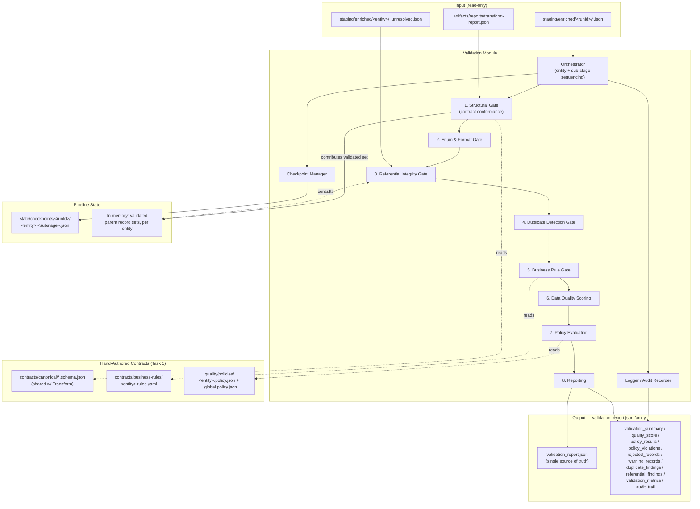
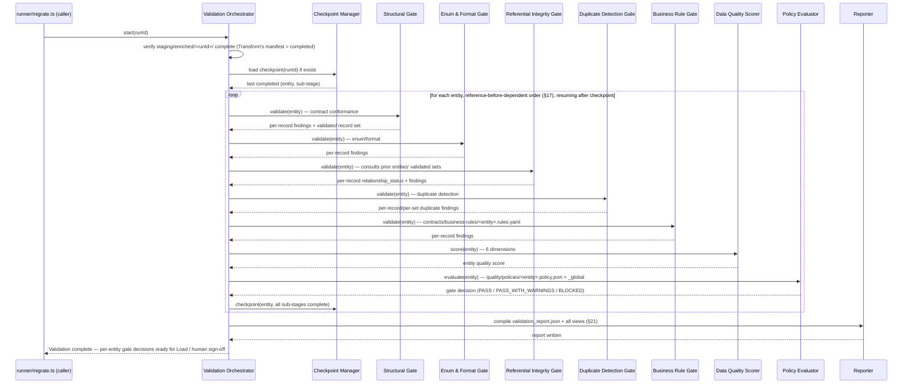
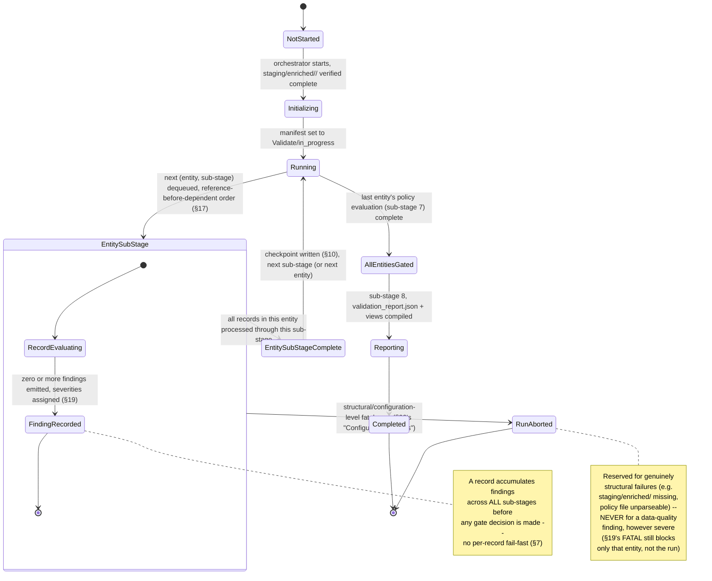
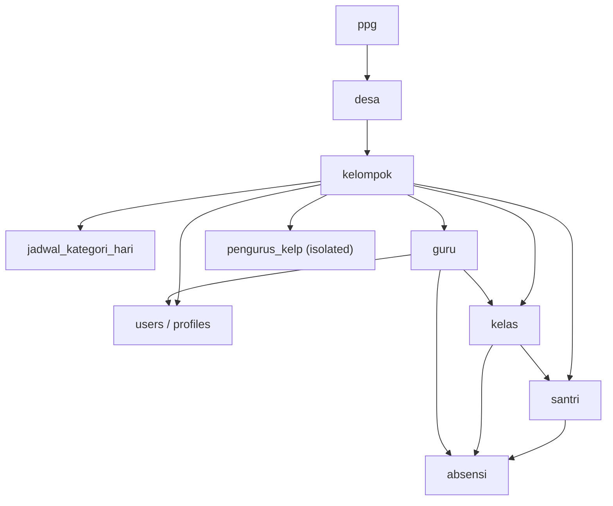

# Sprint 2 — Task 3: Migration Engine — Validation Module
## Product Requirements Document (Design Only)

> **Status**: DRAFT — design only, no implementation, no SQL.
> **Scope**: RUANG NGAJI Migration to Supabase, Sprint 2, third module of the Migration Engine.
> **Governing documents**: [Migration 004 Master Architecture Specification (MAS)](../MAS.md) is
> the Single Source of Truth. [Task 5 — Validation Strategy](../Task05_Validation.md) is the
> frozen, approved strategy this PRD elaborates into a buildable module design — it does not
> redefine, revise, or re-litigate any Task 5 decision. [Task 1](../Task01_Architecture.md),
> [Task 2](../Task02_ExecutionFlow.md), [Task 3](../Task03_Extraction.md), and
> [Task 4](../Task04_Transformation.md) are treated as fixed upstream context.
> [Sprint 2 Task 1 — Extract Engine PRD](Task01_ExtractEngine_PRD.md) and
> [Sprint 2 Task 2 — Transform Engine PRD](Task02_TransformEngine_PRD.md) define this module's
> entire input surface (`staging/enriched/<runId>/`, `_unresolved.*.json`,
> `rejected_records.*.json`) and are treated as authoritative for that interface.
> **Non-goals**: no TypeScript/JavaScript, no SQL, no migration scripts — Mermaid diagrams,
> prose, and tables only, per the assignment's explicit constraint.

---

## Table of Contents

1. [Purpose](#1-purpose)
2. [Scope](#2-scope)
3. [Responsibilities](#3-responsibilities)
4. [Non Responsibilities](#4-non-responsibilities)
5. [Validation Architecture](#5-validation-architecture)
6. [Component Diagram](#6-component-diagram)
7. [Data Flow Diagram](#7-data-flow-diagram)
8. [Sequence Diagram](#8-sequence-diagram)
9. [State Machine](#9-state-machine)
10. [Validation Pipeline](#10-validation-pipeline)
11. [Validation Rule Taxonomy](#11-validation-rule-taxonomy)
12. [Schema Validation](#12-schema-validation)
13. [Domain Validation](#13-domain-validation)
14. [Referential Readiness Validation](#14-referential-readiness-validation)
15. [Business Constraint Validation](#15-business-constraint-validation)
16. [Duplicate Detection](#16-duplicate-detection)
17. [Entity Dependency Validation](#17-entity-dependency-validation)
18. [Batch Validation](#18-batch-validation)
19. [Severity Classification](#19-severity-classification)
20. [Error Classification](#20-error-classification)
21. [Validation Report Model](#21-validation-report-model)
22. [Metrics & Observability](#22-metrics--observability)
23. [Audit Trail](#23-audit-trail)
24. [Logging Strategy](#24-logging-strategy)
25. [Performance Targets](#25-performance-targets)
26. [Capacity Planning](#26-capacity-planning)
27. [Security Considerations](#27-security-considerations)
28. [Configuration](#28-configuration)
29. [Testing Strategy](#29-testing-strategy)
30. [Acceptance Criteria](#30-acceptance-criteria)
31. [Risks](#31-risks)
32. [Future Extension](#32-future-extension)
33. [Open Questions](#33-open-questions)

---

## 1. Purpose

The Validation Module is the third executable module of the Migration Engine (MAS §3, Task 2
Stage 4). It consumes canonical records from `staging/enriched/<runId>/` (Transform's output,
[Sprint 2 Task 2](Task02_TransformEngine_PRD.md)) and produces a **gate decision** — per record,
per entity, and per run — answering exactly one question: *is this data safe to load, and if not,
why not*. Validation is read-only and judgment-only: it classifies and reports, it never repairs,
never mutates a canonical value, and never touches Supabase (ADR-4).

- **Design Rationale**: Task 5 already approved the validation *strategy* in full detail (10
  sub-stages, severity model, error classification, artifact set, quality-gate outcomes). This
  PRD's entire contribution is the same one Sprint 2 Task 1 and Task 2 already made for their
  respective stages — turning an approved strategy into an implementable, testable module
  boundary, not inventing new judgment.
- **Tradeoffs**: keeping Validation as a hard module boundary, strictly downstream of Transform
  and strictly upstream of Load, costs an extra artifact handoff (`validation_report.json` and its
  views) in exchange for MAS §2's non-negotiable separation of concerns ("Validate judges" —
  nothing else).
- **Alternative Designs**: folding validation into Transform ("clean and check" in one pass) —
  rejected by ADR-4 directly; folding validation into Load ("check right before writing") —
  rejected, it would make Validate's independence from Load's own execution context impossible,
  and would prevent a clean PASS/BLOCKED decision from existing *before* any write is attempted.
- **Recommendation**: keep Validation's only side effect its own artifact family (§21) — no
  canonical record leaving Validation should differ, byte-for-byte, from the one that entered it.

---

## 2. Scope

**In scope**: judging every in-scope entity's canonical records (the same entity set Transform
covers, per [Sprint 2 Task 2 §2](Task02_TransformEngine_PRD.md#2-scope)) — `ppg`, `desa`,
`kelompok`, `jadwal_kategori_hari`, `users`/`profiles`, `guru`, `kelas` (canonical target of
source `jadwal_kbm`), `santri`, `absensi`, `pengurus_kelp` (isolated/non-blocking).

**Out of scope**: `jurnal_kbm`, `kop_surat`, `pengumuman` — same MAS §1 deferral Extract and
Transform already respect; Validation builds no policy/business-rule contracts for these entities
this sprint.

**Temporal scope**: this document covers Validation's steady-state design for a single migration
run (`runId`), consuming one Transform run's complete output. Task 5 explicitly places
incremental/cross-run validation out of scope ("one-time migration, not ongoing sync") — this PRD
inherits that boundary without re-deriving it.

- **Design Rationale**: scope is pinned to the same entity list Extract/Transform already
  established, so Validation cannot silently judge an entity neither upstream module produced.
- **Tradeoffs**: none beyond those already accepted by the two prior PRDs for the same entity
  scoping decision.
- **Alternative Designs**: N/A.
- **Recommendation**: when the deferred-entity audit eventually happens, this document's structure
  (rule taxonomy, severity table, gate model) is the template a future addendum would extend — not
  a rewrite, mirroring the equivalent recommendation in Sprint 2 Task 2 §2.

---

## 3. Responsibilities

| # | Responsibility |
|---|---|
| R1 | Read canonical records from `staging/enriched/<runId>/` (Transform's output contract) |
| R2 | Apply the 8-sub-stage validation pipeline (Task 5 §2) per entity, in dependency order (§17) |
| R3 | Classify every finding by severity (`INFO`/`WARNING`/`ERROR`/`FATAL`, §19) and by error class (Task 5 §11, §20) |
| R4 | Evaluate policy (`quality/policies/<entity>.policy.json` + `_global.policy.json`) to produce a per-entity gate decision (`PASS`/`PASS_WITH_WARNINGS`/`BLOCKED`) |
| R5 | Detect duplicates (exact, logical, conflicting, cross-source) without resolving them (Task 5 §7) |
| R6 | Confirm referential readiness against *validated* parent record sets, not merely UUID-map presence (Task 5 §4) |
| R7 | Compute per-entity and run-level data quality scores across six measurable dimensions (Task 5 §6) |
| R8 | Produce `validation_report.json` as the single source of truth, plus its declared views (Task 5 §12–13) |
| R9 | Checkpoint at `(entity, sub-stage)` granularity so an interrupted run resumes correctly (Task 5 §2) |
| R10 | Surface every finding with a `rule_id` traceable to a specific contract/policy clause — never free-text-only (Task 5 §18) |

- **Design Rationale**: every responsibility is traceable to a specific Task 5 section, mirroring
  the traceability discipline both prior Sprint 2 PRDs already established.
- **Tradeoffs**: none beyond those already accepted at Task 5 approval time.
- **Alternative Designs**: N/A.
- **Recommendation**: any responsibility proposed for Validation during implementation that
  cannot be traced to a Task 5 section is a scope-creep signal, exactly as in the prior two PRDs.

---

## 4. Non Responsibilities

Explicitly **out of scope** for the Validation Module:

- **No repair** — Validation never corrects a bad value, even an obviously-fixable one (a typo'd
  enum, a swapped day/month in a date); "just fix it" is exactly the temptation ADR-4 forecloses.
- **No transformation** — no re-mapping, re-normalizing, or re-shaping of any field; if a record
  needs a different shape, that is a finding routed back to Transform (via a human-reviewed
  feedback loop, MAS §8 "Change management"), never an in-place Validation edit.
- **No identifier generation** — Validation never mints a UUID, never assigns a sequence number;
  it only consumes identifiers Transform already assigned (§18 of Sprint 2 Task 2) and checks
  their format/uniqueness (§16).
- **No Supabase connectivity** — no database driver, no connection string, no network call to
  Supabase of any kind.
- **No SQL execution** — Validation never constructs or runs a query against any relational
  database (its "queries" are entirely in-memory/file-based comparisons against
  `staging/enriched/`).
- **No persistence to a live system** — `validation_report.json` and its views are file artifacts,
  not database writes.
- **No retry-of-loading** — Validation has no knowledge of Load's execution; that is Task 6/8's
  concern entirely.
- **No migration reports in the Task 9 operational sense** — Validation emits its own
  `validation_report.json` family (a *stage* artifact) but never the cross-stage operational
  report Task 9's runbook assembles.
- **No automatic resolution of duplicates** — Task 5 §7 is explicit: even a high-confidence
  `merge_candidate` finding is never auto-merged; resolution is always a human sign-off in
  `reports/decisions/`.

- **Design Rationale**: this list exists for the same reason Extract's and Transform's equivalent
  sections do — preventing a future contributor from accidentally re-implementing an adjacent
  stage's job inside a validator. The "no repair" item is the single most important one here,
  since Validation sits closest, causally, to the temptation to "just fix it while we're looking
  at it."
- **Tradeoffs**: none — pure boundary hygiene.
- **Alternative Designs**: N/A.
- **Recommendation**: treat any pull request that adds a value-mutating operation to a validator
  as a design violation requiring architectural sign-off — the bright line is: Validation may
  produce *findings about* a record, never a *different* record.

---

## 5. Validation Architecture

Validation sits strictly between `staging/enriched/<runId>/` (Transform's immutable-once-complete
output, read-only input here) and Load's go/no-go decision (Task 6, out of this document's
scope). Its own output is exclusively the `validation_report.json` artifact family (§21) — it
writes nothing back into `staging/`.

```text
        staging/enriched/<runId>/<entity>.json     (Transform's output, read-only input)
        staging/enriched/<entity>/_unresolved.json (Transform's unresolved-FK carry-forward)
        artifacts/rejected/rejected_records.<entity>.json  (Transform's own rejections, context only)
                          │
                          ▼
              ┌─────────────────────────────┐
              │  VALIDATION MODULE (Stage 4)  │
              │  ─────────────────────────    │
              │  Orchestrator                 │
              │  Structural Gate               │
              │  Enum & Format Gate             │
              │  Referential Integrity Gate      │
              │  Duplicate Detection Gate         │
              │  Business Rule Gate                │
              │  Data Quality Scorer                 │
              │  Policy Evaluator                      │
              │  Reporter                                │
              │  Checkpoint Manager                        │
              │  Logger / Audit Recorder                     │
              └─────────────────────────────┘
                          │
                          ▼
       validation_report.json (single source of truth)
       + validation_summary / quality_score / policy_results /
         policy_violations / rejected_records / warning_records /
         duplicate_findings / referential_findings /
         validation_metrics / audit_trail  (all views, Task 5 §12–13)
                          │
                          ▼
              PASS / PASS_WITH_WARNINGS / BLOCKED
              per entity  →  Task 6: LOAD (hard precondition)
```

- **Design Rationale**: the architecture is a direct instantiation of Task 5 §2's 8-sub-stage
  pipeline (elaborated in §10) plus §12–13's already-enumerated artifact list — nothing here is
  invented independently of the frozen strategy, exactly matching the pattern both prior Sprint 2
  PRDs established.
- **Tradeoffs**: a single orchestrator sequencing 8 sub-stages across all entities, with reference
  entities validated to completion before dependent entities' referential sub-stage runs (Task 5
  §2), is more coordination overhead than per-entity-independent validation, in exchange for
  Task 5 §4's requirement that FK resolution checks against *validated* parent sets, not just
  raw UUID presence.
- **Alternative Designs**: validating every entity fully independently, in parallel, with no
  cross-entity ordering — rejected; it would make "does this record's parent pass structural
  validation" (Task 5 §4's "missing parents" rule) impossible to answer correctly without a second
  pass.
- **Recommendation**: implement the orchestrator so entity + sub-stage order is a declared,
  reviewable constant (mirroring both prior modules' treatment of their own core ordering), not a
  runtime-configurable sequence.

---

## 6. Component Diagram



- **Design Rationale**: the diagram makes explicit that "validated parent record sets" is
  *shared, accumulating state within a single Validation run* — a reference entity's structural
  gate outcome feeds forward into a dependent entity's referential integrity gate later in the
  same run, which is precisely what Task 5 §4's "resolve against validated parent sets" requires.
- **Tradeoffs**: this in-run shared state adds a coordination dependency between sub-stages across
  entities (not just within one entity's own pipeline) — a necessary complexity, since a purely
  per-entity-isolated design cannot implement Task 5 §4's distinction between "orphan, no parent
  at all" and "orphan, parent exists but itself failed validation."
- **Alternative Designs**: a two-pass design (validate all entities structurally first in one full
  pass, then a second full pass for everything referential) — considered, and is effectively what
  this diagram already describes at a coarser granularity (reference entities validated to
  completion before dependents' referential sub-stage, Task 5 §2); a naive interleaved single-pass
  design was rejected as it cannot guarantee parent-before-child ordering.
- **Recommendation**: keep "validated parent record sets" as a well-defined, append-only in-memory
  (or checkpoint-backed) structure scoped strictly to one `runId` — never leaked across runs,
  consistent with Task 5's "one-time migration" framing (§32).

---

## 7. Data Flow Diagram

```mermaid
flowchart LR
    A["Canonical record<br/>(from staging/enriched/)"] --> B["1. Structural Gate<br/>(contract: required/optional/type/nullable)"]
    B -->|unknown field, or required missing, or wrong type| C["ERROR (record blocked)"]
    B -->|conforms| D["2. Enum & Format Gate"]
    D -->|value outside canonical enum set| E["FATAL (record blocked)"]
    D -->|unsupported but recognizable string| F["ERROR, raw value preserved"]
    D -->|deprecated but loadable| G["WARNING (loadable, flagged)"]
    D -->|conforms| H["3. Referential Integrity Gate"]
    H --> I{"FK status?"}
    I -->|resolved, parent validated| J["relationship_status = resolved"]
    I -->|orphan, no parent record| K["WARNING (Task 4 carry-forward)"]
    I -->|orphan, parent exists but itself invalid| L["ERROR"]
    I -->|duplicate parent conflict, reference entity| M["FATAL"]
    J --> N["4. Duplicate Detection Gate"]
    K --> N
    L --> N
    N --> O{"Duplicate class?"}
    O -->|exact duplicate| P["ERROR"]
    O -->|logical duplicate| Q["WARNING, never auto-merged"]
    O -->|conflicting duplicate| R["ERROR"]
    O -->|none| S["5. Business Rule Gate"]
    P --> S
    Q --> S
    R --> S
    S -->|rule violation| T["Default WARNING<br/>(per-rule severity overridable)"]
    S -->|conforms| U["6. Data Quality Scoring<br/>(6 dimensions, 0.0-1.0)"]
    T --> U
    U --> V["7. Policy Evaluation<br/>(quality/policies/*.json)"]
    V --> W["8. Reporting<br/>(validation_report.json + views)"]
    W --> X{"Gate decision"}
    X -->|PASS| Y["Auto-proceeds to Load"]
    X -->|PASS_WITH_WARNINGS| Z["Requires recorded human sign-off"]
    X -->|BLOCKED| AA["Entity excluded from this Load run"]
```



- **Design Rationale**: the flow shows every finding accumulating rather than short-circuiting —
  a record with a `WARNING`-severity finding still proceeds through every subsequent sub-stage, so
  a single record's *complete* set of findings is always known before the gate decision, directly
  implementing Task 5 §1's "complete validation, not fail-fast" philosophy at the record level
  (fail-fast is reserved for genuinely structural, run-level failures — §9).
- **Tradeoffs**: running every sub-stage even on a record already known to have an `ERROR` finding
  costs some extra processing versus stopping early, in exchange for a validation report that
  never has to say "we don't know if this record has other problems too because we stopped
  checking."
- **Alternative Designs**: fail-fast per record (stop at first `ERROR`) — explicitly rejected by
  Task 5 §1; would produce an incomplete finding set per record, undermining §21's
  single-source-of-truth report and making a fixed-and-rerun record potentially surface a *second*
  wave of previously-hidden findings.
- **Recommendation**: only `FATAL`-severity findings that make further processing of *that
  specific record* structurally meaningless (e.g. a structural-gate failure so severe the record
  can't be typed at all) should short-circuit that one record's remaining sub-stages — and even
  then, the short-circuit itself must be logged as a distinct event, not silently absorbed.

---

## 8. Sequence Diagram



- **Design Rationale**: policy evaluation (sub-stage 7) happens *after* every finding-producing
  sub-stage has run for that entity, never interleaved earlier — a gate decision must be computed
  from a record's complete finding set, consistent with §7's "complete validation, not fail-fast"
  rationale.
- **Tradeoffs**: the checkpoint is written once per entity (after all 8 sub-stages complete), not
  per sub-stage within an entity — a deliberate granularity choice; see §9/§10 for the
  distinction between this run-time simplification and Task 5 §2's stated `(entity, sub-stage)`
  checkpoint granularity, reconciled explicitly there.
- **Alternative Designs**: evaluating policy incrementally as each sub-stage completes (early exit
  once a `FATAL` is seen) — rejected for the same reason §7 rejects per-record fail-fast: it would
  produce an incomplete picture for anything downstream of the exit point.
- **Recommendation**: keep the Policy Evaluator a pure function of "this entity's complete finding
  set + the policy file" — never given the ability to short-circuit earlier sub-stages itself.

---

## 9. State Machine



- **Design Rationale**: the state machine deliberately distinguishes a *run-level* abort
  (structural/configuration failure, extremely rare, e.g. a missing policy file) from an
  *entity-level* `BLOCKED` gate decision (a normal, expected outcome of a `FATAL`-severity
  finding, per §19) — conflating these would violate Task 5 §1's explicit "quality gates map ...
  per-entity/kelompok, not run-wide binary."
  This mirrors MAS §4's own per-entity-terminal-state philosophy, applied one stage earlier.
- **Tradeoffs**: maintaining two structurally different "things went badly" outcomes (RunAborted
  vs. an entity's BLOCKED gate decision) adds a small amount of conceptual overhead, in exchange
  for preserving the exact distinction Task 5 insists on.
- **Alternative Designs**: a single unified "failure" state regardless of scope — rejected; would
  make it impossible to express MAS §4's correct outcome shape ("some entities Completed, others
  Blocked-Pending-Fix... a correct, expected outcome, not a degraded one").
- **Recommendation**: implementation should make `RunAborted` genuinely rare and reserved
  exclusively for configuration-class defects (§20) — any code path tempted to abort the whole run
  over a data finding, however severe, is a design bug against this state machine.

---

## 10. Validation Pipeline

The full, ordered pipeline (Task 5 §2), restated for implementability:


**Checkpoint granularity**: Task 5 §2 specifies `(entity, sub-stage)` — this PRD's sequence design
(§8) checkpoints once per entity after all sub-stages complete as its primary implementation
default, which is a **coarsening**, not a contradiction: an interrupted mid-entity Validation run
is cheap to fully re-run from that entity's start (validation is read-only, side-effect-free, and
computation-bound, unlike Extract's network-bound cost that justified finer-grained
checkpointing). Sub-stage-level checkpoint files remain available as an optional finer-grained
resume point for `absensi` specifically (§18), consistent with Task 5 §2's letter while matching
the coarser default to Validation's actual re-run cost profile.

- **Design Rationale**: the pipeline order is fixed by Task 5 §2 and restated verbatim; its
  internal logic mirrors Transform's own reasoning (Sprint 2 Task 2 §22) — structure must be
  confirmed before content is judged (Structural Gate before Enum/Format), format must be
  confirmed before relationships are checked (a malformed value can't meaningfully participate in
  a duplicate/reference comparison), duplicates must be known before business rules run (a
  business rule might reasonably behave differently for a flagged duplicate), and quality scoring
  + policy evaluation always come last since they synthesize everything upstream.
- **Tradeoffs**: choosing entity-level checkpoint granularity as the default (rather than literal
  sub-stage-level) trades away some resumability fineness for simplicity, justified specifically
  by Validation's cheap-to-rerun cost profile — a tradeoff Extract's design explicitly could not
  make (§18 of Sprint 2 Task 1) because network calls are expensive to redo.
- **Alternative Designs**: implementing literal sub-stage-level checkpointing uniformly, exactly
  as Task 5 §2 states — viable and not precluded; deferred to §32 as the "upgrade path" if
  `absensi`'s validation cost ever proves non-trivial at full scale.
- **Recommendation**: measure actual per-sub-stage timing for `absensi` (§25) before deciding
  whether the coarser default needs upgrading to true sub-stage granularity — don't build the
  finer mechanism speculatively.

---

## 11. Validation Rule Taxonomy

Every rule Validation evaluates belongs to exactly one of these families, each with its own
default severity posture (elaborated in §12–§16, severities defined in §19):

| Family | Sub-Stage | Default Severity Posture | Example |
|---|---|---|---|
| Structural / contract | 1 | Strict — `ERROR` for shape violations | Required field missing, wrong type, unknown field |
| Enum / format | 2 | Strict — `FATAL` for out-of-set values | An `absensi.status` value outside the canonical enum |
| Referential integrity | 3 | Mixed — `WARNING` for orphans, `ERROR` for broken parents, `FATAL` for duplicate reference parents | An `absensi.santri_id` pointing at a `santri` UUID with no matching record |
| Duplicate detection | 4 | Mixed — `ERROR` for exact/conflicting, `WARNING` for logical | Two `santri` records with identical `(kelompok_id, nis)` |
| Business rule | 5 | Lenient — `WARNING` by default, per-rule overridable | A `guru.mulai_mengajar` date after the record's own `created_at` |
| Data quality (scoring) | 6 | Not pass/fail itself — feeds policy | Completeness score for `santri.tanggal_lahir` across an entity |
| Domain constraint | Spans 2/5 | Depends on which gate the specific constraint is declared under | A numeric range check (§13) may be enum-adjacent (Gate 2) or business-rule-adjacent (Gate 5) depending on its nature |

- **Design Rationale**: this taxonomy exists so every individual rule authored in a contract file
  has an unambiguous home — a reviewer authoring a new rule should be able to answer "which family
  is this" and get the correct default severity and gate placement without guessing.
  It also directly reflects Task 5's own graduated-strictness design: structural/enum rules are
  strictest (a malformed or unrepresentable value is close to unconditionally unsafe), business
  rules are most lenient (they encode "does this make sense," which is inherently softer than "is
  this well-formed").
- **Tradeoffs**: "domain constraint" spanning two families (rather than being its own gate) adds a
  small classification judgment call per rule — accepted, since Task 5 §2 does not define a
  separate "domain constraint" sub-stage; domain constraints are enforced as specific rule
  instances *within* the enum/format or business-rule gates, not as a ninth pipeline stage.
- **Alternative Designs**: a single flat rule list without family grouping — rejected; would make
  severity-posture defaults ungoverned per-rule guesses rather than a principled default with
  documented, reviewable overrides.
- **Recommendation**: `rule_id` (Task 5 §18) should encode its family as a prefix (e.g.
  `struct.`, `enum.`, `ref.`, `dup.`, `biz.`) so the taxonomy is machine-readable from the
  identifier alone, not just documented separately.

---

## 12. Schema Validation

Sub-stage 1, the Structural Gate (Task 5 §3):

| Check | Rule |
|---|---|
| Required fields | Absence → `ERROR` — blocks that record |
| Optional fields | Absence is legal per the 3-way nullable model below |
| Nullable model (3-way) | `nullable` (explicit `null` legal) / `must-omit` (field must be entirely absent, not present-as-null) / `never-null` (must have a real value if present at all) — matches Transform's own omission-vs-null distinction (Sprint 2 Task 2 §16), Validation now *enforces* what Transform *represented* |
| Data types | Must match the canonical schema's declared type exactly — no implicit coercion at this stage (Validation checks, it never converts) |
| Unknown fields | **Always `ERROR`, never silently ignored** — an unexpected field on a canonical record is itself a signal something upstream (a mapping contract, a schema version mismatch) is wrong |
| Schema evolution | The contract validated against is the exact `schemaVersion` recorded in the run's own `transform-report.json` — never "whatever's latest" (MAS §13) |

- **Design Rationale**: Structural Gate is intentionally the strictest, least-forgiving gate in the
  entire pipeline — it is checking a property (contract conformance) that should be
  deterministically guaranteed by a correctly-functioning Transform, so any violation here is a
  strong signal of an upstream defect, not merely "messy source data."
- **Tradeoffs**: treating unknown fields as always-`ERROR` (rather than a lenient "ignore extra
  fields") means a benign, forward-compatible field addition to a canonical schema that
  Validation's policy file hasn't caught up to yet would incorrectly block records — accepted per
  Task 5 §3's explicit rule, and mitigated structurally by MAS §13's discipline of never reading
  "latest" implicitly (schema and policy versions are always pinned together, so this scenario
  shouldn't arise if versioning discipline (§28, §32) is followed correctly).
- **Alternative Designs**: a permissive "warn but pass" posture for unknown fields — rejected by
  Task 5 §3 directly.
- **Recommendation**: a Structural Gate finding on a *high volume* of records for the same entity
  is a strong signal to pause and investigate a Transform/schema mismatch before proceeding
  entity-by-entity — this is the validation-side mirror of Sprint 2 Task 2 §27's "high rejection
  rate" sanity signal.

---

## 13. Domain Validation

Covers the assignment's explicit scope items not already addressed by §12/§14/§15/§16 — enum
values, date/timestamp/boolean/numeric validity, string length, character encoding, null-policy
compliance, and domain constraints generally (Task 5 §8–§9):

| Check | Severity | Rationale |
|---|---|---|
| Enum canonical membership | `FATAL` | Task 5 §8 — an unrepresentable status is a real data-integrity risk (mirrors Transform's own enum-alias-miss severity, Sprint 2 Task 2 §14, now enforced independently as a second check rather than trusted from Transform) |
| Enum alias-resolution completeness cross-check | Informational cross-check | Confirms Transform's alias resolution and Validation's canonical-set membership check agree — a disagreement here indicates the two modules' contract files have drifted out of sync |
| Unsupported enum value | `ERROR` | Raw string preserved for future alias-table growth (Task 5 §8) — distinct from `FATAL` outside-set because "unsupported but recognizable" is a different signal than "genuinely never-seen" |
| Deprecated enum value | `WARNING` | Loadable but flagged — the value is valid, just discouraged going forward |
| Invalid date reaching Validation | `FATAL` | Task 5 §9 — Transform's own strict enumerate-or-reject date policy (Sprint 2 Task 2 §15) should have already caught this; its presence here signals a possible Transform regression, not ordinary bad source data |
| Impossible date in context (e.g. `mulai_mengajar` before `tanggal_lahir`) | `ERROR` | A well-formed date that is contextually nonsensical |
| Timezone consistency | Checked per Task 4 §6's `Asia/Jakarta` normalization rule | Confirms every `timestamptz` field is genuinely normalized, not silently left in a different offset |
| Range plausibility (e.g. implausible ages) | `WARNING` | Plausibility, not impossibility — a 95-year-old guru is unusual but not provably wrong |
| Numeric range / precision / overflow | `FATAL` if would overflow the target Postgres column type | The one domain check with a direct, mechanical tie to the target schema's actual column definitions |
| Numeric format compliance | `ERROR` | Value present but not parseable as the declared numeric type |
| String length | `ERROR` if exceeds the canonical schema's declared max length (where applicable) | Direct schema-declared constraint, checked here rather than at sub-stage 1 since it is a value-content check, not a shape check |
| Character encoding | `FATAL` if invalid UTF-8 reaches this stage | Mirrors Transform's own UTF-8 validation (Sprint 2 Task 2 §17); reaching Validation still invalid is itself a possible Transform regression signal, same posture as invalid dates above |
| Null-policy compliance | Enforced structurally at §12 (the 3-way nullable model) — restated here as the domain-level consequence: a `null` value in a `never-null` field, or a present-but-empty value in a `must-omit` field, is a structural/domain violation | `ERROR` |

- **Design Rationale**: several domain checks here (invalid dates, invalid UTF-8) are
  *deliberately* classified `FATAL` even though they are "just" a formatting problem, because
  Task 5 §9 frames their presence at this stage as a possible regression in an upstream module
  that should have already caught them — Validation treats "should never happen if Transform
  worked correctly" findings more severely than "Transform correctly passed this along, and it's
  genuinely a judgment call" findings.
- **Tradeoffs**: this asymmetry means the *same-looking* problem (a bad date) is `FATAL` if found
  here but was `ERROR`/rejection at Transform (Sprint 2 Task 2 §27) — intentional, not
  inconsistent: at Transform, a bad date is expected, ordinary source-data noise; at Validation,
  it's a sign the safety net itself may have a hole.
- **Alternative Designs**: treating regression-signal findings identically to ordinary domain
  findings (same severity as range-plausibility, say) — rejected; would blur the diagnostic value
  of distinguishing "source data is imperfect" from "our own pipeline may be broken."
- **Recommendation**: any `FATAL` finding classified as a "possible regression" (invalid date,
  invalid encoding) should be tagged distinctly in the report (a `possibleUpstreamRegression:
  true` flag) so Task 9's operational review treats it as a pipeline-health signal, not merely a
  data-quality one.

---

## 14. Referential Readiness Validation

Sub-stage 3 (Task 5 §4) — the assignment's "foreign key readiness" and "referential readiness"
scope items:

| Check | Classification | Severity |
|---|---|---|
| FK resolves against a *validated* parent record | `relationship_status = resolved` | — |
| Orphan record — no parent record exists at all | `relationship_status = orphan_no_parent` | `WARNING` by default (Task 5 §4) — carried forward from Transform's own `_unresolved.*.json` (Sprint 2 Task 2 §20) |
| Orphan record — FK is well-formed and the parent record *exists*, but the parent itself failed structural validation | `relationship_status = orphan_broken_parent` | `ERROR` |
| Duplicate parents — more than one candidate parent record for a reference-table entity's key | `relationship_status = duplicate_parent_conflict` | `FATAL` |
| Circular reference detected at runtime | Structural guard only | `FATAL` if ever triggered — Task 4 §4 already audited that no genuine cycles exist in the current entity set, so this is a defense-in-depth check, not an expected code path |

**"Readiness" vs. "resolution"**: Validation checks whether a reference is *ready to be loaded
safely* — it does not itself resolve anything (that already happened at Transform, §20 of Sprint
2 Task 2). Validation's contribution is judging the *quality* of an already-resolved-or-unresolved
reference against the current, validated state of the parent entity.

- **Design Rationale**: the four-way `relationship_status` classification is Task 5 §4 verbatim,
  and its severities are deliberately graded by how *fixable* and *expected* each scenario is: an
  orphan with genuinely no parent is the least surprising outcome (already flagged by Transform as
  a known, expected-to-occur category, including the specific 483-row historical case, MAS §9);
  an orphan whose parent exists but is itself broken indicates a deeper problem (something is
  wrong with *two* records, not one); duplicate parents on a reference table is the most severe,
  since reference tables are supposed to have unambiguous identity.
- **Tradeoffs**: requiring FK checks to consult a *validated* parent set (not merely a UUID-map
  lookup) means referential integrity validation cannot begin for a dependent entity until its
  parent entity has completed structural validation — a real sequencing constraint (§17), in
  exchange for correctly distinguishing `orphan_no_parent` from `orphan_broken_parent`, a
  distinction a UUID-map-only check could never make.
- **Alternative Designs**: checking FK resolution purely against Transform's UUID map (no
  cross-reference to the parent's own validation outcome) — rejected by Task 5 §4 explicitly
  ("foreign keys resolve against validated parent record sets, not just the UUID map").
- **Recommendation**: the 483-orphan-absensi-rows case (MAS §9 Risk Register) should be the
  primary fixture used to test `orphan_no_parent` handling end-to-end (§29) — it is a real,
  already-known, already-quantified instance of exactly this category.

---

## 15. Business Constraint Validation

Sub-stage 5 (Task 5 §5):

- **Definition**: structural validation (§12) asks "does this record have the right shape";
  business validation asks "does this record make sense as a fact about the world" — a
  categorically different, softer question.
- **Declaration**: every business rule lives in `contracts/business-rules/<entity>.rules.yaml`,
  hand-authored, versioned like every other contract file in this pipeline.
- **Categories** (per Task 5 §5): lifecycle rules (e.g. a `kelas.status` transition that doesn't
  make sense), status consistency (e.g. a `deleted_at`-set record that's still referenced as
  active elsewhere), entity ownership (e.g. a `guru` record's `kelompok_id` disagreeing with the
  `kelas` it's assigned to teach), logical consistency (e.g. `jam_selesai` before `jam_mulai` on a
  `kelas` — mirroring the deployed schema's own `chk_kelas_jam` constraint, but checked here
  *before* Load rather than relying solely on the Postgres constraint to catch it at write time),
  domain-specific restrictions (project-specific facts, e.g. plausible attendance patterns).
- **Default severity**: `WARNING` — deliberately more lenient than §12's structural gate or §13's
  domain gate (Task 5 §5), reflecting that a business rule is judgment about plausibility, not a
  hard shape/format fact.

- **Design Rationale**: business rules are the one gate whose severity is explicitly meant to be
  more forgiving by default — Task 5 §5 states this deliberately, because a business rule
  violation might reflect a genuine, valid real-world edge case (a guru who started teaching the
  same day they were born-record-corrected, an unusual but real kelas schedule) rather than a
  data defect.
- **Tradeoffs**: a lenient default means real problems captured only by business rules could pass
  through as `WARNING` (requiring human sign-off, §19) rather than blocking outright — accepted;
  per-rule severity is explicitly overridable in the contract file for cases the org judges should
  be stricter (e.g. a status-consistency rule the org considers non-negotiable could be authored
  as `ERROR`).
- **Alternative Designs**: a uniform severity across all rule families — rejected; Task 5's
  graduated model (strict structural/enum, lenient business) reflects a real difference in
  epistemic confidence between "this is malformed" and "this seems unusual."
- **Recommendation**: the `chk_kelas_jam`-mirroring rule (jam_selesai > jam_mulai) is a good
  concrete example to author first, since it's traceable to an actual Postgres constraint already
  in the deployed schema — validating it pre-Load means Load never discovers this violation only
  at INSERT time (Task 6's concern, but Validation catching it first is strictly better for
  diagnosability).

---

## 16. Duplicate Detection

Sub-stage 4 (Task 5 §7) — covers both the assignment's "duplicate canonical IDs" and "duplicate
business keys" scope items:

| Duplicate Class | Definition | Severity | Auto-Resolved? |
|---|---|---|---|
| Exact duplicate | Two records with identical canonical UUID (should be structurally impossible given Transform's deterministic assignment, §18 of Sprint 2 Task 2 — its presence here is itself a strong signal of a Transform-stage or state/mapping/ defect) | `ERROR` | No |
| Exact duplicate (business key) | Two records with identical business-key field combination (e.g. `(kelompok_id, nis)` for `santri`, `(kelompok_id, lower(nama))` for `kelas` — mirroring the deployed schema's own `uq_kelas_kelompok_nama` unique index) | `ERROR` | No |
| Logical duplicate | Records that are plausibly the same real-world entity but not byte-identical (e.g. near-identical `nama` + same `kelompok_id`, differing only in whitespace/typo — text differences Transform's normalization, Sprint 2 Task 2 §17, did not and should not collapse) | `WARNING` | **No — never auto-merged** (Task 5 §7) |
| Conflicting duplicate | Same identity key, but disagreeing field values (e.g. two `guru` records with the same legacy ID but different `nama`) | `ERROR` | No |
| Cross-source duplicate | A record that appears to represent the same real-world entity across Sheets and Firestore extraction (relevant chiefly to `absensi` for kelompok 1) | Flagged `cross_source: true`, severity per its underlying class above | Governed by harmonization (Task 4 §10), but Validation still flags it as a finding independent of whatever Transform's harmonization already decided — a second, independent check |

**Confidence scoring**: every duplicate finding carries a confidence score (0.0–1.0). **Resolution
categories** (`merge_candidate` / `keep_both_verified_distinct` / `needs_manual_review`) are
descriptive labels on the finding, never an executed action — actual resolution is always a human
sign-off recorded in `reports/decisions/`.

- **Design Rationale**: "exact duplicate canonical UUID" is listed even though it should be
  structurally impossible, precisely because Task 5's evidence-first philosophy (MAS §2) demands
  Validation independently re-check things Transform is *supposed* to guarantee, not merely trust
  them — the same principle underlying ADR-5's "independent, evidence-recomputing Verification"
  one stage later, applied here one stage earlier at a smaller scale.
- **Tradeoffs**: computing full logical-duplicate detection (fuzzy matching across a whole
  entity's record set) is more computationally expensive than exact-key comparison — accepted
  given MAS §16's "modest data volume" framing; not a concern requiring streaming/batching outside
  of `absensi` (§18).
- **Alternative Designs**: auto-merging high-confidence `merge_candidate` findings — explicitly
  rejected by Task 5 §7 ("never auto-merged"); this is a deliberate, non-negotiable human-in-the-
  loop requirement, not an oversight to optimize away.
- **Recommendation**: implement business-key duplicate checks by directly mirroring the deployed
  schema's own unique constraints/indexes (`uq_kelas_kelompok_nama` and any equivalent for
  `santri`/`guru`) wherever such an index already exists — Validation should never invent a
  business-key definition Load's target schema doesn't itself enforce, and should always invent
  one where the target schema *does* enforce it but Transform's canonical model doesn't yet
  encode it as a declared uniqueness rule.

---

## 17. Entity Dependency Validation

Cross-entity consistency and dependency-ordering checks — the assignment's "entity dependency
consistency" and "cross-entity consistency" scope items, elaborating Task 5 §2's "reference
entities validated to completion before dependent entities' referential sub-stage runs":



*(This is the same dependency DAG Transform established — [Sprint 2 Task 2
§23](Task02_TransformEngine_PRD.md#23-dependency-resolution) — reused deliberately here rather
than re-derived, since referential readiness (§14) depends on exactly the same "which entity's
validated set must exist before which other entity's referential gate runs" question Transform's
dependency ordering already answers for UUID assignment.)*

| Cross-entity check | What it confirms |
|---|---|
| Parent-before-child validation order | A dependent entity's referential integrity gate (§14) never runs before its declared parent entity has completed its own structural gate (§12) |
| Aggregate consistency (e.g. `kelas.santri_count`) | Where a canonical field is a cached/denormalized count (the deployed schema documents `kelas.santri_count` as exactly this kind of cache), Validation may check it against the actual count of validated child records as a `WARNING`-level consistency finding — informational, since Load/application logic (not Validation) owns keeping such caches correct going forward |
| Cross-kelompok consistency | A `santri`/`guru` record's `kelompok_id` must agree with the `kelompok_id` of any entity it references transitively (e.g. a `santri.kelas_id` pointing at a `kelas` belonging to a *different* `kelompok`) — `ERROR`, a real cross-entity data-integrity problem |
| Ownership boundary consistency (Task 4 §10) | For entities with an ownership-first harmonization decision (kelompok 1 `absensi`), confirms Transform's `harmonization-log.json` decision was actually applied consistently across the entity's records — a cross-check against Transform's own audit trail, not a re-derivation of the harmonization decision itself |

- **Design Rationale**: reusing Transform's dependency DAG (rather than authoring a second,
  possibly-divergent one) directly serves MAS §13's "nothing... ever reads latest implicitly" /
  single-source-of-truth discipline extended to *structural* decisions, not just data — there
  should be exactly one place the entity dependency graph is declared across the whole Migration
  Engine.
- **Tradeoffs**: sharing the DAG across Transform and Validation creates a cross-module coupling
  (a change to the DAG must be reviewed with both modules in mind) — accepted; the alternative
  (two independently-maintained copies) risks silent drift, a strictly worse outcome.
- **Alternative Designs**: Validation deriving its own independent dependency order from its own
  first-principles analysis of the canonical schema's FK declarations — considered, and arguably a
  useful *cross-check* (if it disagrees with Transform's DAG, that's itself a finding worth
  surfacing) but not adopted as the primary mechanism, to avoid two sources of truth for the same
  structural fact.
- **Recommendation**: implement the DAG as a single shared, versioned constant/file both Transform
  and Validation import — not copy-pasted between the two modules' codebases.

---

## 18. Batch Validation

Per Task 5 §15 ("Absensi is the only entity needing batch-bounded processing"), extended for
implementability:

| Aspect | Design |
|---|---|
| Entities requiring batching | `absensi` only — every other entity's record count remains small enough (per MAS §16's "modest data volume" and Task 4 §14's equivalent statement for Transform) to validate fully in memory |
| Batch boundary | Aligned with Transform's own batching boundary (`batchSize` config, Sprint 2 Task 2 §24) so a batch of canonical `absensi` records corresponds predictably to a batch Transform already produced |
| Cross-batch findings | Duplicate detection (§16) and quality scoring (§22) for `absensi` must correctly aggregate across batch boundaries — a duplicate spanning two different batches must still be detected, which requires either a full-entity index kept in memory (small enough per-key, even if the full records aren't) or a bounded two-pass batch design |
| Checkpoint interaction | A batch completing all 8 sub-stages is the natural checkpoint unit for `absensi` specifically — the finer-grained option flagged in §10 as available if needed |
| Gate decision timing | An entity-level gate decision (PASS/PASS_WITH_WARNINGS/BLOCKED) for `absensi` is only computed once *all* its batches have completed sub-stage 7 (Policy Evaluation) — a partial-batch gate decision is not a valid intermediate state |

- **Design Rationale**: batching is scoped to exactly the one entity Task 5 §15 already identifies
  as needing it, mirroring both Extract's (Sprint 2 Task 1 §24) and Transform's (Sprint 2 Task 2
  §31) identical scoping decision for the same entity — a consistent pattern across all three
  modules for the one genuinely-unbounded-growth entity in this migration.
- **Tradeoffs**: cross-batch duplicate detection is the one genuinely tricky aspect of batching
  Validation (unlike Extract/Transform, which don't need cross-batch *comparison*, only
  cross-batch *processing*) — a lightweight in-memory index of business keys (not full records)
  is a reasonable middle ground, accepted here as a design direction without over-specifying an
  implementation.
- **Alternative Designs**: validating `absensi` duplicates only *within* each batch, accepting
  that cross-batch duplicates might be missed — rejected; would silently weaken exactly the
  guarantee §16 exists to provide, for the one entity (transaction-table, largest volume) where
  duplicate detection matters most.
- **Recommendation**: build the lightweight cross-batch key index as a `(business key) → (first
  seen batch, record identifier)` lookup, sized to hold keys-only (not full records) for the full
  `absensi` entity at even 18-kelompok scale — keep it out of the "must batch everything" concern
  since it's small by construction.

---

## 19. Severity Classification

The single most consequential table in this document — the assignment's explicit "Special
Requirements" (blocking vs. warning, which failures prevent Load, which are reportable but
non-blocking) are answered entirely by this table, restating Task 5 §10:

| Severity | Meaning | Default Gate Effect | Blocks Load? |
|---|---|---|---|
| `INFO` | Purely informational — a fact worth recording, not a problem | Never blocks | No |
| `WARNING` | A real finding, but not disqualifying by default | Doesn't block by default; **requires a recorded human sign-off before Load** (`reports/decisions/<runId>/<entity>-approval.json`) | Not directly — but the *entity* cannot proceed to Load without that sign-off existing |
| `ERROR` | A finding serious enough that the specific *record* cannot be safely loaded | Blocks that record | That record only — other records in the same entity are unaffected |
| `FATAL` | A finding serious enough that the entire *entity* (for this run/kelompok scope) cannot be safely loaded | Blocks the entire entity/run scope | Yes — entity-wide |

**Gate decision, per entity** (Task 5 §10, §14):

| Gate Decision | Condition | Load Behavior |
|---|---|---|
| `PASS` | No `ERROR`/`FATAL` findings anywhere in the entity; `WARNING`s may exist but none require sign-off per policy, or policy marks this entity's `WARNING` classes as auto-acceptable | **Auto-proceeds to Load** |
| `PASS_WITH_WARNINGS` | No `FATAL` findings; some `ERROR`-level records exist (excluded individually) and/or `WARNING`s exist that policy requires sign-off for | **Requires a recorded human decision** in `reports/decisions/<runId>/<entity>-approval.json` before Load may proceed for this entity |
| `BLOCKED` | At least one `FATAL` finding for this entity (or a run-level structural failure specific to this entity, e.g. a fatal duplicate-parent-conflict) | **Entity excluded from this Load run entirely** — the run as a whole may still proceed for other, non-blocked entities (MAS §4's per-entity terminal state) |

- **Design Rationale**: the four-severity model plus three-way gate decision is Task 5 §10
  verbatim — this section exists to make the *consequence* of each severity explicit and
  unambiguous, directly answering the assignment's special requirements without requiring a
  reader to cross-reference multiple sections.
- **Tradeoffs**: `ERROR` blocking only the individual record (not the whole entity) while `FATAL`
  blocks the whole entity is a real asymmetry that requires careful implementation discipline (an
  `ERROR`-classified rule must never accidentally propagate to an entity-wide block, and vice
  versa) — accepted, since this asymmetry is precisely what lets MAS's "some entities Completed,
  others not" outcome shape apply *within* an entity too (some records loadable, others excluded,
  same entity).
- **Alternative Designs**: a simpler two-severity model (block / don't block) — rejected; would
  collapse Task 5's deliberately graduated response (a `WARNING` genuinely differs operationally
  from an `ERROR` — one needs a human glance, the other needs per-record exclusion) into a binary
  that loses real information Task 9's approval-gate model (MAS ADR-7) depends on.
- **Recommendation**: every rule's severity (default and any per-instance override) must be
  declared in its owning contract/policy file, never hardcoded in a validator implementation —
  this is what makes severity itself versionable (§32/Task 5 §18) and auditable (§23).

---

## 20. Error Classification

Task 5 §11's classification, restated as the taxonomy Validation's findings must be tagged with
(`defect_origin`), independent of severity (§19) — severity says *how bad*, error classification
says *whose problem it is*:

| Class | `defect_origin` | Meaning |
|---|---|---|
| Recoverable (data) | `source` (typically) | A finding whose underlying cause could plausibly be fixed by correcting source data or a mapping/business rule, then re-running Transform |
| Unrecoverable (data) | `source` (typically) | A finding whose underlying cause reflects a genuine, permanent gap or contradiction in the source data itself (e.g. a record that legitimately never had the required information) |
| Data defects | `source` | The finding is a property of the actual data content — most enum/format/business-rule findings |
| Configuration defects | `configuration` | The finding indicates a Migration Engine *configuration* problem (a missing contract file, an unparseable policy file) — **fatal at run-start** (§9's `RunAborted`), never conflated with a data finding however severe |
| Source defects | `source_system` | The finding indicates a structural problem in the source *system* itself (e.g. Sheets vs. Firestore disagreeing in a way that indicates a genuine app-level data-integrity issue, not just a migration artifact) |
| Operator defects | (governance, not data) | The finding reflects a human/process gap (e.g. an approval recorded without evidence of genuine review, Task 9's ADR-6 concern) — flagged for governance review, not a data-quality finding at all |

- **Design Rationale**: separating "how bad" (§19) from "whose problem" (this section) lets a
  single severity level (say, `ERROR`) still be triaged differently depending on origin — an
  `ERROR` with `defect_origin: configuration` needs an engineer to fix a contract file; an
  `ERROR` with `defect_origin: source` needs either a source-data correction or a documented
  acceptance that the record can't be loaded.
- **Tradeoffs**: two independent classification axes (severity × origin) is more bookkeeping than
  severity alone, in exchange for actionable triage information — directly serving the
  assignment's "Traceability" and "Auditability" quality attributes.
- **Alternative Designs**: folding origin into severity (e.g. a "configuration-fatal" severity
  level distinct from "data-fatal") — rejected; would conflate two genuinely orthogonal
  dimensions and complicate the clean four-level severity model (§19) that Load's gate logic
  depends on.
- **Recommendation**: `defect_origin: configuration` findings should route to a distinct,
  prominently-surfaced alert path (not buried in `rejected_records.json` alongside ordinary data
  findings) — a configuration defect discovered mid-run is an engineering incident, not a data-
  quality statistic.

---

## 21. Validation Report Model

Per Task 5 §12–13, `validation_report.json` is the **single source of truth**; every other file
is a generated *view* over it, never an independent record:

| Artifact | Content |
|---|---|
| `validation_report.json` | The complete, canonical record of every finding, every gate decision, every quality score — everything else derives from this |
| `validation_summary.json` | Per-entity gate decisions + finding counts by severity — the "executive view" |
| `quality_score.json` | The six-dimension scores (§22), per entity and rolled up run-level |
| `policy_results.json` | Which policy clauses fired, with what outcome, per entity |
| `policy_violations.json` | Specifically the findings that *did* trigger a policy consequence (subset of the full finding set) |
| `rejected_records.json` | Records excluded from Load due to `ERROR`/`FATAL` findings — analogous in shape to Transform's own `rejected_records.json` (Sprint 2 Task 2 §11), but reflecting Validation's own, later-stage rejections |
| `warning_records.json` | Records with `WARNING`-level findings requiring sign-off, not yet excluded |
| `duplicate_findings.json` | All duplicate-detection output (§16), independent of final gate outcome |
| `referential_findings.json` | All `relationship_status` classifications (§14), independent of final gate outcome |
| `validation_metrics.json` | The observability metrics (§22) |
| `audit_trail.json` | The evidence-chain-relevant record (§23) |

- **Design Rationale**: the single-source-of-truth model (Task 5 §12) prevents exactly the failure
  mode where two views of "the same" validation outcome could disagree — every view is
  mechanically *derived*, never separately computed, so they cannot drift apart.
- **Tradeoffs**: generating ten-plus view files from one canonical report is more output
  bookkeeping than emitting each view independently as it's computed — accepted; derivation-only
  views are strictly safer, and the extra generation step is cheap relative to the validation
  computation itself.
- **Alternative Designs**: computing each view independently in its own pipeline branch — rejected;
  reintroduces the drift risk the single-source-of-truth design exists specifically to prevent.
- **Recommendation**: implement view generation as a final, pure post-processing step over the
  completed `validation_report.json` (sub-stage 8, Reporting) — never interleaved with the
  finding-producing sub-stages themselves.

---

## 22. Metrics & Observability

The six data-quality dimensions (Task 5 §6), each 0.0–1.0 per entity, policy-weighted into a
composite entity score, rolled up to a run-level score:

| Dimension | What it measures |
|---|---|
| Completeness | Proportion of expected fields actually populated (respecting the nullable model, §12 — a legitimately-omitted optional field doesn't penalize completeness) |
| Uniqueness | Absence of duplicate findings (§16) relative to entity size |
| Consistency | Agreement across related fields/records (cross-entity consistency, §17; internal logical consistency, §15) |
| Accuracy | Business-rule conformance rate (§15) — a proxy for "does the data reflect reality," which cannot be measured directly, only inferred from rule conformance |
| Validity | Structural/enum/format/domain conformance rate (§12/§13) |
| Timeliness | Freshness of the source data relative to extraction (most relevant to `absensi`, where a stale-vs-live source disagreement, Task 4 §10, is itself a timeliness signal) |

**Additional observability metrics** (beyond the six quality dimensions):

| Metric | Purpose |
|---|---|
| Finding counts by severity, by entity, by sub-stage | Core operational signal for Task 9's dashboard |
| Gate decision distribution across entities (`PASS`/`PASS_WITH_WARNINGS`/`BLOCKED` counts) | Run-level health at a glance |
| `relationship_status` distribution (§14) | Direct visibility into orphan-rate trends, including tracking the known 483-row historical case as new kelompok are validated |
| Sign-off latency (time between a `PASS_WITH_WARNINGS` gate decision and its recorded approval) | Operational/governance signal, feeds Task 9's approval-gate model |
| `defect_origin` distribution (§20) | Separates "data needs cleanup" volume from "pipeline needs fixing" volume |

- **Design Rationale**: the six quality dimensions are Task 5 §6 verbatim; the additional metrics
  are chosen to make Validation's most consequential outputs (gate decisions, orphan rates,
  sign-off latency) directly observable rather than requiring a manual read of
  `validation_report.json`, mirroring Sprint 2 Task 2 §30's same design instinct.
- **Tradeoffs**: computing and weighting six independent quality dimensions per entity is more
  design/config surface than a single composite score — accepted per Task 5 §6's explicit design;
  a single opaque score would hide *which* dimension is driving a low score.
- **Alternative Designs**: a single unweighted average across dimensions — rejected; Task 5 §6
  specifies policy-configurable weighting, since e.g. completeness might matter more for `santri`
  than for `absensi`.
- **Recommendation**: expose the six-dimension breakdown (not just the composite) in
  `quality_score.json` and in Task 9's eventual operational dashboard — a composite score alone
  invites exactly the kind of "is it fine? I don't know, the number is 0.82" ambiguity MAS's
  evidence-first philosophy tries to avoid.

---

## 23. Audit Trail

Validation's audit trail is the third link in MAS §12's Evidence Chain: "Validation (Task 5) —
`validation_report.json`, gate decision — policy version referenced by → Loading."

- **Primary audit artifacts**: `validation_report.json` + its views (§21), permanent retention per
  Task 1's Deliverables Matrix pattern.
- **Evidence Chain linkage**: every finding in `validation_report.json` references, by
  content-hash, the specific `staging/enriched/<runId>/<entity>.json` record it evaluated
  (continuing the chain Transform started at its own output hash, Sprint 2 Task 2 §29) — and the
  gate decision itself references the specific policy file version (`quality/policies/
  <entity>.policy.json`, versioned per §28) that produced it.
- **Sign-off traceability**: every `PASS_WITH_WARNINGS` gate decision's eventual human approval is
  recorded in `reports/decisions/<runId>/<entity>-approval.json`, referencing the specific
  findings the approver reviewed — not a blanket "approved," per MAS §8's "approval artifacts
  require referencing specific findings reviewed."
- **Immutability**: `validation_report.json` and its views, once written, are never edited in
  place — a re-validation (e.g. after a Transform fix) is a new `runId`'s artifact set, consistent
  with every other stage's immutability discipline.
- **`rule_id` traceability** (Task 5 §18): every finding traces to a specific `rule_id` referencing
  a specific contract/policy clause — never a free-text-only explanation — meaning any finding in
  the audit trail is independently re-derivable by inspecting the exact rule that produced it.

- **Design Rationale**: this section makes MAS §12's abstract Evidence Chain statement concrete
  for Validation specifically, continuing the same pattern both prior Sprint 2 PRDs established
  for their own stages (Sprint 2 Task 1 §23, Sprint 2 Task 2 §29).
- **Tradeoffs**: content-hashing every finding's source record reference (not just the record set
  as a whole) is a finer granularity than the prior two stages needed — justified because
  Validation's findings are the artifact Task 9's human approvers actually read and act on; the
  hash-level precision makes an approver's review defensible ("I approved sign-off having reviewed
  exactly these three findings against exactly this record state").
- **Alternative Designs**: coarser, entity-level-only hashing (no per-finding record reference) —
  rejected; would weaken exactly the specific-findings-referenced discipline MAS §8 demands of
  approval artifacts.
- **Recommendation**: Task 9's runbook tooling should read `validation_report.json` directly as
  its Validation-stage evidence source for Go/No-Go decisions, never re-deriving equivalent
  information from the view files, which exist for human/dashboard convenience, not as a
  second source of truth.

---

## 24. Logging Strategy

Mirrors the established pattern from Sprint 2 Task 1 §22 and Sprint 2 Task 2 §28, applied to
Validation:

- **Format**: structured JSON Lines at `logs/<runId>/validate.<entity>.log` (per-entity, matching
  Transform's per-entity log convention).
- **Required fields**: `timestamp`, `runId`, `entity`, `subStage` (one of the 8 pipeline
  sub-stages, §10), `stage` (always `"validate"`), `level`, `event` (fixed vocabulary — e.g.
  `entity_substage_started`, `finding_recorded`, `gate_decision_computed`,
  `entity_substage_completed`, `run_completed`), plus event-specific detail fields including
  `rule_id`, `severity`, and `defect_origin` for any `finding_recorded` event.
- **What must be logged**: every sub-stage start/completion per entity, every finding (with its
  full classification — severity, origin, `rule_id`), every gate decision computed, every
  checkpoint write, run start/completion.
- **What must never be logged**: raw personally-identifiable santri/guru field *values* beyond
  what's needed to identify a record (legacy ID, canonical UUID, entity) — same privacy discipline
  as Extract and Transform (§27 elaborates further).
- **Level discipline**: `error` for `RunAborted`-class conditions (§9, configuration defects
  only); `warn` for `ERROR`/`FATAL`-severity findings (real, entity/record-blocking data issues);
  `info` for `WARNING`/`INFO`-severity findings and routine progress.

- **Design Rationale**: reusing the established logging schema/vocabulary (rather than inventing a
  third variant) continues the cross-module consistency both prior PRDs recommend maintaining.
- **Tradeoffs**: none beyond those already accepted for the equivalent designs in the prior two
  modules.
- **Alternative Designs**: N/A.
- **Recommendation**: because Validation's findings are the artifact human approvers act on most
  directly (§23), ensure the log's `finding_recorded` events carry enough context
  (`rule_id`, severity, `defect_origin`, plus the record's canonical UUID) that a log-based
  triage view could, in principle, substitute for opening `validation_report.json` directly during
  active incident response.

---

## 25. Performance Targets

| Entity Class | Target | Notes |
|---|---|---|
| Reference entities (`ppg`/`desa`/`kelompok`/`jadwal_kategori_hari`/`users`) | Complete within low tens of seconds each at current (kelompok-1-pilot) scale | Small, bounded record counts; fully in-memory |
| `guru` / `santri` / `kelas` | Complete within a few minutes each at current scale | Fully in-memory; referential integrity gate (§14) for these depends on reference entities' prior completion |
| `absensi` | Batch-bound (§18); must not require the full entity in memory at once | The sole unbounded-growth entity, same as Extract/Transform |
| `pengurus_kelp` | Near-instant, or a legitimate zero-record pass-through if isolated at Extract | Small, isolated |
| Whole-run wall-clock budget | No external shared-quota dependency (unlike Extract) — bounded by data volume and rule-evaluation complexity, similar to Transform's own framing | Contrast directly with Sprint 2 Task 1 §24's externally-imposed Apps Script quota ceiling |
| Resume overhead | Re-running an interrupted entity from its checkpoint (§10) should add negligible time versus its original run for entities already fully validated | Validates the entity-level checkpoint design |

- **Design Rationale**: targets are stated relative to current (pilot) scale with an explicit
  batching requirement for the one unbounded entity, exactly mirroring both prior modules'
  identical framing and rationale.
- **Tradeoffs**: no hard numeric SLA for full-scale `absensi` validation — the same honest hedge
  both prior PRDs already took, for the same reason (volume at full 18-kelompok scale not yet
  known).
- **Alternative Designs**: setting an aggressive fixed SLA now — rejected, unfounded without real
  full-scale data.
- **Recommendation**: capture per-sub-stage timing (already implied by §22's metrics) across the
  pilot and later full-scale runs, so a real numeric target for Validation specifically — likely
  the most compute-intensive of the three modules given business-rule and duplicate-detection
  complexity — can be set from evidence.

---

## 26. Capacity Planning

| Dimension | Consideration |
|---|---|
| Memory | Every entity except `absensi` loads fully into memory, same as Transform (Task 4 §14); additionally, Validation must hold "validated parent record sets" (§6) in memory for referential checks across dependent entities within a run — a modest additional footprint beyond raw record storage |
| Duplicate-detection working set | Business-key indexes (§16) for logical-duplicate detection are the one component whose memory cost scales with entity size in a way worth watching, particularly for `santri`/`guru` at full 18-kelompok scale |
| Disk / artifact storage | `validation_report.json` + its ten-plus views + `reports/decisions/` accumulate per run, retained per Task 1's Deliverables Matrix ("project-lifetime" — validation reports are permanent, unlike Transform's shorter-retention `staging/enriched/`) |
| Compute | Entirely CPU/IO-bound local processing, no external network dependency — like Transform, capacity planning here concerns the execution host, not a shared external quota |
| Growth trajectory | The kelompok-1-pilot → all-18-kelompok scale-up is the primary capacity change; `absensi`'s batch-bound design (§18) is the specific mechanism absorbing it, same pattern as the other two modules |

- **Design Rationale**: capacity planning is scoped to the same two growth axes (entity count,
  `absensi` volume) MAS §16 identifies, consistent with both prior modules' identical framing.
- **Tradeoffs**: relying on full in-memory processing (plus in-memory validated-parent-set
  tracking) for all but one entity is a real capacity ceiling if any of those entities
  unexpectedly grows large — accepted per the same reasoning Transform's PRD already gave, revisit
  only if evidence (§22 metrics) shows a problem.
- **Alternative Designs**: batch-bounding every entity defensively — rejected, unjustified
  complexity for entities confirmed to stay small, same reasoning as Sprint 2 Task 2 §32.
- **Recommendation**: re-run the memory-footprint sanity calculation once real per-kelompok row
  counts are available from a full extraction, same recommendation as Transform's equivalent
  section — a coordinated check across all three modules would be efficient to do once, together.

---

## 27. Security Considerations

- **No new access surface**: Validation introduces no network calls and no new credentials beyond
  filesystem access to `staging/enriched/`, contract/policy files, and its own output directories
  — the same "lowest-security-surface" profile Transform's PRD claims for itself (Sprint 2 Task 2
  §33), for the same structural reason (no live-system connectivity of any kind).
- **Contract/policy file integrity**: `contracts/business-rules/` and `quality/policies/` files
  are hand-authored and version-controlled — Validation must treat them as trusted input only
  insofar as they come from the reviewed, checked-in location, never an arbitrary runtime path.
- **`reports/decisions/` integrity**: approval artifacts recorded there must be
  identity-and-timestamp-attributed (MAS §14 "Approval integrity") — while *recording* an
  approval decision is arguably closer to Task 9's operational layer than Validation's own core
  logic, Validation's report structure (§21) must support that attribution cleanly, since
  `PASS_WITH_WARNINGS` gate decisions are the direct trigger for needing one.
- **No credential handling**: Validation has zero secrets/credentials of its own.

- **Design Rationale**: Validation's security profile is, like Transform's, almost entirely
  "absence of surface" — worth stating explicitly for the same reason.
- **Tradeoffs**: none — a purely beneficial property of Validation's read-only, side-effect-free
  design.
- **Alternative Designs**: N/A.
- **Recommendation**: if a future requirement ever proposes giving Validation any network
  capability (e.g. "check against a live external reference"), treat that as a signal the
  requirement belongs to a different stage or a genuinely new module, not a reason to extend
  Validation's security surface — identical recommendation to Transform's equivalent section.

---

## 28. Configuration

`config/validate.config.json` (Task 1's `config/` folder), scoped strictly to operational tuning:

| Parameter | Default | Description |
|---|---|---|
| `schemaVersion` (per entity) | Pinned, matching the `schemaVersion` recorded in `transform-report.json` (§12) | Never "latest" (MAS §13) |
| `policyVersion` (per entity + `_global`) | Pinned, versioned config file reference | Which `quality/policies/*.json` version this run evaluates against |
| `businessRuleVersion` (per entity) | Pinned | Which `contracts/business-rules/<entity>.rules.yaml` version |
| `batchSize` (for `absensi` only) | Aligned with Transform's own `batchSize` (Sprint 2 Task 2 §24) | §18 |
| `checkpointEnabled` | `true` | Same escape-hatch pattern as both prior modules |
| `duplicateDetectionEnabled` | `true` | An explicit off-switch exists structurally but should never be the default — flagged as a deliberate crack analogous to `checkpointEnabled: false`, for rare, explicit operator scenarios only, never routine use |
| `logLevel` | `info` | Per §24 |

- **Design Rationale**: configuration limited to *how* Validation runs (which versions, batch
  size, logging) — never *what* it judges (rule content, severity defaults, gate thresholds),
  which stays in reviewed contract/policy files, exactly mirroring both prior modules' identical
  discipline.
- **Tradeoffs**: `duplicateDetectionEnabled: false` as a theoretical escape hatch carries real
  risk if ever defaulted or forgotten-on — justified only for an explicit, rare "we already know
  this entity has no duplicates and need a faster diagnostic pass" operator choice.
- **Alternative Designs**: environment-variable-only configuration — rejected, same reasoning as
  both prior modules' equivalent sections.
- **Recommendation**: keep `validate.config.json` structurally parallel to `extract.config.json`
  and `transform.config.json` wherever concepts overlap, continuing the cross-module consistency
  both prior PRDs establish.

---

## 29. Testing Strategy

| Test Level | What It Covers |
|---|---|
| Unit — per sub-stage | Each of the 8 pipeline sub-stages (§10) tested as a pure function: given a canonical record (or record set) and a contract/policy fixture, assert the exact findings produced |
| Unit — per policy file | `quality/policies/<entity>.policy.json` + `_global.policy.json` validated for internal consistency (every severity referenced maps to a defined gate-effect rule) |
| Integration — per entity | A full entity's `staging/enriched/` fixture run through the entire 8-sub-stage pipeline, asserting the resulting `validation_report.json` findings, gate decision, and quality score against known expected values |
| Integration — dependency order | Confirms `orphan_no_parent` vs. `orphan_broken_parent` (§14) is classified correctly only when parent-before-child ordering (§17) is respected, using deliberately order-shuffled fixture input |
| Determinism test | Running Validation twice against the same `staging/enriched/` input produces byte-identical `validation_report.json` output (content-hash comparison, mirroring Sprint 2 Task 2 §36's equivalent test) |
| Resumability test | Killing a simulated run mid-entity and resuming produces output indistinguishable from an uninterrupted run |
| The 483-orphan-absensi fixture | A dedicated integration test using the real, already-quantified historical orphan case (MAS §9) to confirm `orphan_no_parent` handling end-to-end, per §14's recommendation |
| Severity/gate matrix test | Exhaustive fixture coverage of every §19 severity → gate-effect combination, confirming `PASS`/`PASS_WITH_WARNINGS`/`BLOCKED` are computed correctly for every plausible finding-set shape |
| Duplicate detection fixtures | Exact, logical, conflicting, and cross-source duplicate cases (§16), confirming correct classification and confirming **no auto-merge ever occurs** under any fixture |
| Negative tests | Fixtures deliberately triggering every §20 `defect_origin` class, confirming correct routing (especially that a configuration defect triggers `RunAborted`, §9, and never gets misclassified as a data finding) |

- **Design Rationale**: the severity/gate matrix test and the no-auto-merge confirmation are
  singled out because they are the two properties this document's "Special Requirements" section
  most explicitly demands be unambiguous — exactly the kind of property that's easy to get subtly
  wrong in implementation (e.g. an off-by-one in gate-decision logic silently reclassifying
  `PASS_WITH_WARNINGS` as `PASS`).
- **Tradeoffs**: a thorough per-sub-stage and per-severity-combination test matrix is a real
  upfront investment — justified by Validation's pure-function, side-effect-free design (§6)
  making each piece cheap to test in isolation, same justification as Transform's equivalent
  section.
- **Alternative Designs**: end-to-end-only testing — rejected, same reasoning as both prior
  modules' equivalent sections.
- **Recommendation**: build fixture data from real (or faithfully representative) kelompok-1 pilot
  output specifically, continuing the same recommendation both prior PRDs make — the 483-orphan
  fixture in particular should use the actual historical counts where feasible, not synthetic
  approximations.

---

## 30. Acceptance Criteria

The Validation Module is considered complete and ready for Task 6 (Load) integration when:

1. Given a complete `staging/enriched/<runId>/` (Transform's verified output), running Validation
   produces `validation_report.json` + all declared views (§21) for every in-scope entity (§2).
2. Every finding in the report carries a `rule_id`, a severity (§19), and a `defect_origin` (§20)
   — no finding is free-text-only.
3. Every entity has exactly one gate decision (`PASS`/`PASS_WITH_WARNINGS`/`BLOCKED`), computed
   only after all 8 sub-stages have completed for that entity (no partial-pipeline gate decision).
4. A record with any `ERROR`-severity finding is excluded from Load individually; the rest of its
   entity's records are unaffected — confirming `ERROR`'s record-only blast radius (§19).
5. An entity with any `FATAL`-severity finding is `BLOCKED` in its entirety, while other,
   non-blocked entities in the same run still reach a valid gate decision — confirming `FATAL`'s
   entity-wide blast radius without run-wide contamination (§19, MAS §4's per-entity terminal
   states).
6. The 483-orphan-absensi historical case (or its available fixture-scale equivalent) is correctly
   classified `orphan_no_parent`, `WARNING`, and does not block the `absensi` entity outright
   (§14).
7. No duplicate finding, regardless of confidence score, ever results in an automatic merge or
   record modification — verified by fixture (§29).
8. Running Validation twice against the same `staging/enriched/` input produces byte-identical
   `validation_report.json` output (determinism).
9. Killing Validation mid-run and resuming produces output indistinguishable from an uninterrupted
   run (resumability).
10. Every criterion above is verifiable from `validation_report.json` + its views alone, without
    needing to re-run validation logic manually (audit trail sufficiency, §23).

- **Design Rationale**: criteria are phrased as observable, testable outcomes to gate a real
  go/no-go for Sprint 2 Task 3, continuing the same evidence-first engineering discipline both
  prior PRDs applied to their own acceptance criteria.
- **Tradeoffs**: criterion 6 (the specific orphan fixture) is called out individually because it
  is the one already-quantified, real historical data point available to test against — a
  stronger form of evidence than a synthetic fixture alone.
- **Alternative Designs**: N/A.
- **Recommendation**: run criteria 4, 5, and 7 as literal fixture-based tests before Sprint 2
  Task 3 is called done — these three are exactly the properties the assignment's "Special
  Requirements" section is most insistent about, and are the easiest to get subtly wrong.

---

## 31. Risks

| Risk | Likelihood | Impact | Mitigation | Owning Section |
|---|---|---|---|---|
| Task 3's 3 unconfirmed extraction assumptions (single spreadsheet, single Firestore project, transport) turn out false | Medium | High | Inherited from Extract/Transform; Validation's Structural Gate should surface schema/shape anomalies consistent with a false assumption, but this is a safety net, not a substitute for direct confirmation | Inherited, MAS §9 |
| `jadwal_kbm` → `kelas` dropped-column premise (Sprint 2 Task 2 §11) turns out wrong for some kelompok | Low–Medium | Medium–High | Validation's business-rule gate (§15) is a second opportunity to catch this if a `kelas`-specific rule is authored to sanity-check the collapse — worth explicit authorship, not automatic | Inherited from Sprint 2 Task 2 §39 |
| 483 orphaned `absensi` rows scale up unexpectedly once all 18 kelompok are validated | Confirmed present at some scale | Medium | Already wired as an execution gate (Task 2); Validation's job is accurate classification (`orphan_no_parent`, `WARNING`), not resolution — volume monitoring is an observability concern (§22) | §14, MAS §9 |
| Business-rule contracts (`contracts/business-rules/<entity>.rules.yaml`) authored from kelompok-1-only pilot data miss real patterns present in the other 17 kelompok, causing either false positives (over-flagging) or false negatives (missed real issues) at scale-up | Medium | Medium | Same mitigation posture as Transform's enum-alias risk — build/expand rules from full-scope data before trusting them broadly | §15 |
| Duplicate-detection logical-match thresholds (fuzzy matching, §16) tuned too loosely or too tightly, producing either alert fatigue (too many `WARNING`s) or missed real duplicates | Medium | Medium | Confidence scores + explicit resolution categories (never auto-merge) mean a miscalibration is correctable without data-integrity risk — but still an operational quality-of-life risk worth tuning carefully with real data | §16 |
| `PASS_WITH_WARNINGS` sign-off becomes a rubber-stamp step in practice (approver doesn't genuinely review findings) | Low–Medium | Medium | MAS §8/ADR-7's requirement that approval artifacts reference specific findings reviewed is the structural mitigation; Validation's own contribution is making the finding set genuinely reviewable (not an unreadable wall of data) — see §21/§22 | Governance risk, MAS §8 |
| Validation's compute cost at full 18-kelompok scale (business rules + duplicate detection are the most compute-intensive checks in the whole pipeline) exceeds informal expectations | Low–Medium | Low–Medium | No hard SLA committed yet (§25); mitigation is measuring early and revisiting batching/checkpoint granularity (§10/§18) if evidence warrants | §25, §26 |
| Configuration defects (missing/malformed policy or business-rule file) discovered only mid-run, wasting a partial run's compute | Low | Low–Medium | `RunAborted` is reserved for exactly this and should ideally be caught by an early pre-flight file-presence/parseability check before the main pipeline begins (mirrors Sprint 2 Task 1 §20's "assumption probe" recommendation) | §9, §20 |

- **Design Rationale**: this risk matrix consolidates risks already scattered through individual
  sections into one reviewable table, plus explicitly carries forward the two risks both prior
  Sprint 2 PRDs already flagged as unresolved (Task 3's assumptions, the `kelas` mapping premise),
  rather than treating them as someone else's problem now that Validation is a different module.
- **Tradeoffs**: some duplication with individual sections' own rationale — accepted, a
  consolidated risk view serves a pre-implementation risk review differently than section-by-
  section design rationale does, same justification as Transform's equivalent section.
- **Alternative Designs**: N/A.
- **Recommendation**: treat the first three rows (inherited Task 3 assumptions, inherited `kelas`
  premise, orphan-scale-up) as the risks requiring active attention — not just documentation —
  before Validation runs against real, non-pilot-scope data, consistent with both prior PRDs'
  equivalent recommendations.

---

## 32. Future Extension

Explicitly deferred, not designed now, but structurally not precluded:

- **True sub-stage-level checkpointing for `absensi`** (§10, §18) — deferred pending real timing
  data, mirroring Transform's identical deferral (Sprint 2 Task 2 §38) for the same underlying
  reason.
- **Cross-run/incremental validation** — explicitly out of scope per Task 5 §15 ("one-time
  migration, not ongoing sync"); would only become relevant if this project's future evolves
  toward an ongoing-sync platform (MAS §18's "Internal Platform" future evolution note), which
  would need genuinely new capability, not an extension of this design.
- **Automated (not merely flagged) duplicate resolution workflows** — explicitly and permanently
  out of scope per Task 5 §7's "never auto-merged"; any future tooling here would be a *decision-
  support* aid for the human sign-off step, never an automatic action.
- **Configurable dependency-graph-driven parallel validation** (mirroring Transform's equivalent
  deferred item, Sprint 2 Task 2 §38) — deferred; unjustified at current scale.
- **Deferred-entity wave** (`jurnal_kbm`/`kop_surat`/`pengumuman`) — this document's structure
  (rule taxonomy, severity/gate model, artifact set) is the template a future addendum would
  follow once those entities' quality audit happens, not a rewrite.
- **Reusable Migration Engine framework** (MAS §18) — Validation's contract/policy-driven design
  is structured to generalize the same way Transform's is ("new entities/sources/rules are config
  additions, not pipeline changes," Task 5 §18) — already the architecture's own stated
  aspiration.

- **Design Rationale**: as with both prior modules, this list keeps Sprint 2's actual scope honest
  rather than silently building unrequested headroom.
- **Tradeoffs**: accepted rework risk if/when these become real requirements, per YAGNI, same
  reasoning as both prior PRDs.
- **Alternative Designs**: over-building extensibility now — rejected, matches this project's
  stated engineering discipline (CLAUDE.md).
- **Recommendation**: revisit this list at the start of any future sprint touching Validation.

---

## 33. Open Questions

| # | Question | Status | Blocking? |
|---|---|---|---|
| 1 | Task 3's 3 unconfirmed extraction assumptions — inherited directly from Sprint 2 Task 1 §30 / Task 2 §40 | Not yet confirmed by user | Yes — same standing item across all three Sprint 2 PRDs so far |
| 2 | Does the `jadwal_kbm` → `kelas` dropped-column premise hold across all 18 kelompok? — inherited from Sprint 2 Task 2 §40 | Not yet verified against full-scope data | Yes, before scaling Validation's `kelas`-related business rules beyond kelompok 1 |
| 3 | What business-key uniqueness rules (§16) should Validation enforce for `santri` specifically — is there a deployed-schema-equivalent unique index to mirror the way `kelas` mirrors `uq_kelas_kelompok_nama`? | Not confirmed — schema excerpt reviewed for this PRD did not show a `santri`-level unique constraint | No — a reasonable default (flag as `WARNING`-level logical-duplicate candidate pending confirmation) can proceed without blocking, but should be resolved before treating any `santri` duplicate finding as `ERROR`-severity |
| 4 | Where should the fuzzy-matching thresholds for logical-duplicate detection (§16) be tuned from — is there existing santri/guru data available to calibrate against, or must this be tuned blind on first real run? | Not decided | No — can default to a conservative (high-precision, lower-recall) threshold initially, revisit with real data |
| 5 | Should `PASS_WITH_WARNINGS` sign-off be scoped per-entity-per-run only, or should a policy allow a *standing* approval for a known, recurring, low-risk warning class (to reduce approval fatigue at scale across 18 kelompok × multiple runs)? | Not decided — Task 5/MAS do not explicitly address recurring-approval ergonomics | No — the safe default (no standing approvals, every run requires fresh sign-off) can proceed without blocking; worth raising with the user before Task 9's operational tooling is designed, since it affects that stage's ergonomics more than Validation's own correctness |
| 6 | What is `validation_report.json`'s exact retention/versioning relationship to a *re-validation* of the same entity after a Transform fix — is the corrected run's report expected to reference or supersede the earlier one, or are they simply two independent `runId`s with no cross-reference? | Not decided | No — MAS's `runId`-namespacing already provides a safe default (independent, both retained); an explicit supersession link would be a nice-to-have, not a correctness requirement |

- **Design Rationale**: as with both prior modules, separating blocking from non-blocking
  questions lets Sprint 2 Task 3 proceed on module *design* while making clear which items need
  resolution before Validation runs against real, full-scope production-derived data.
- **Tradeoffs**: none — explicit ambiguity beats implicit ambiguity, per MAS's own principle.
- **Alternative Designs**: N/A.
- **Recommendation**: questions 1 and 2 remain the standing, cross-module items to raise with the
  user first — they are now confirmed as blocking concerns across all three Sprint 2 PRDs to date,
  which is itself a signal they should be resolved before any further Migration Engine module
  design work (Task 6/Load) proceeds much further, let alone before real implementation begins.

---

## Summary

This PRD elaborates Task 5's approved validation strategy into a concrete Validation Module
design: an 8-sub-stage, complete-not-fail-fast pipeline per entity, executed in the same
dependency-ordered DAG Transform already established, producing a single-source-of-truth
`validation_report.json` and its derived views. It defines, unambiguously, the assignment's core
special requirements — `WARNING` requires human sign-off but doesn't block by default, `ERROR`
blocks only the specific record, `FATAL` blocks the entire entity while leaving other entities
free to proceed, and every gate decision (`PASS`/`PASS_WITH_WARNINGS`/`BLOCKED`) is computed only
after a record's complete finding set is known. It introduces no new architectural decisions
beyond what Task 1–5 and the MAS already approved. Three risks now stand across all three Sprint 2
PRDs produced so far and should be treated as this sprint's most important unresolved items before
real implementation begins: Task 3's still-unconfirmed extraction assumptions, empirical
verification of the `kelas` mapping's dropped-column premise, and — new to this document —
confirming whether `santri`'s business-key duplicate rule should mirror an existing deployed-
schema constraint that this review did not find one for.
