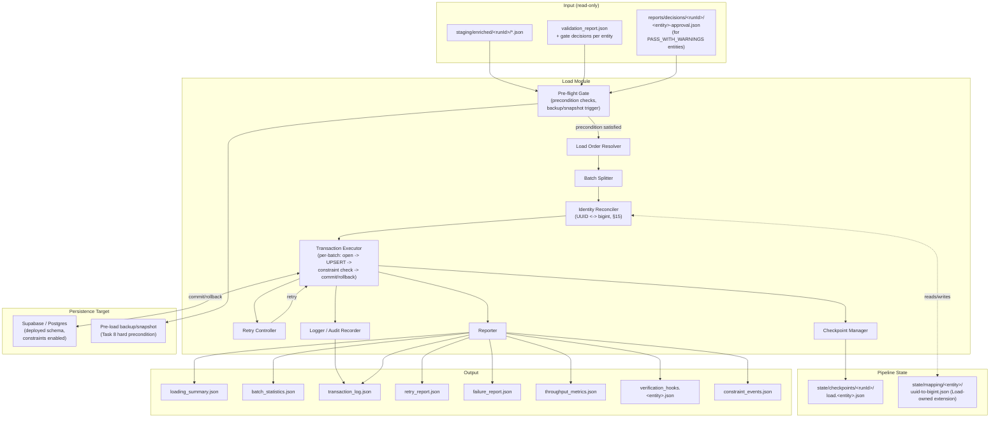
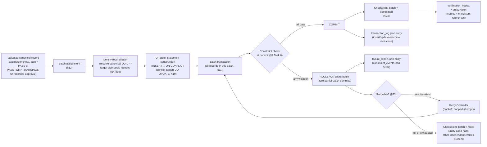
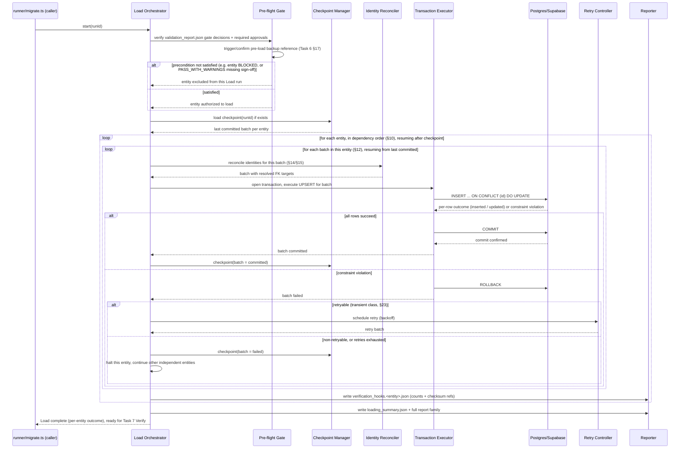
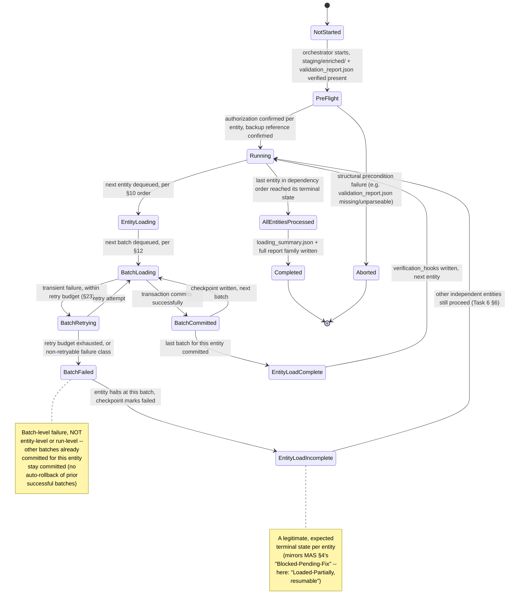
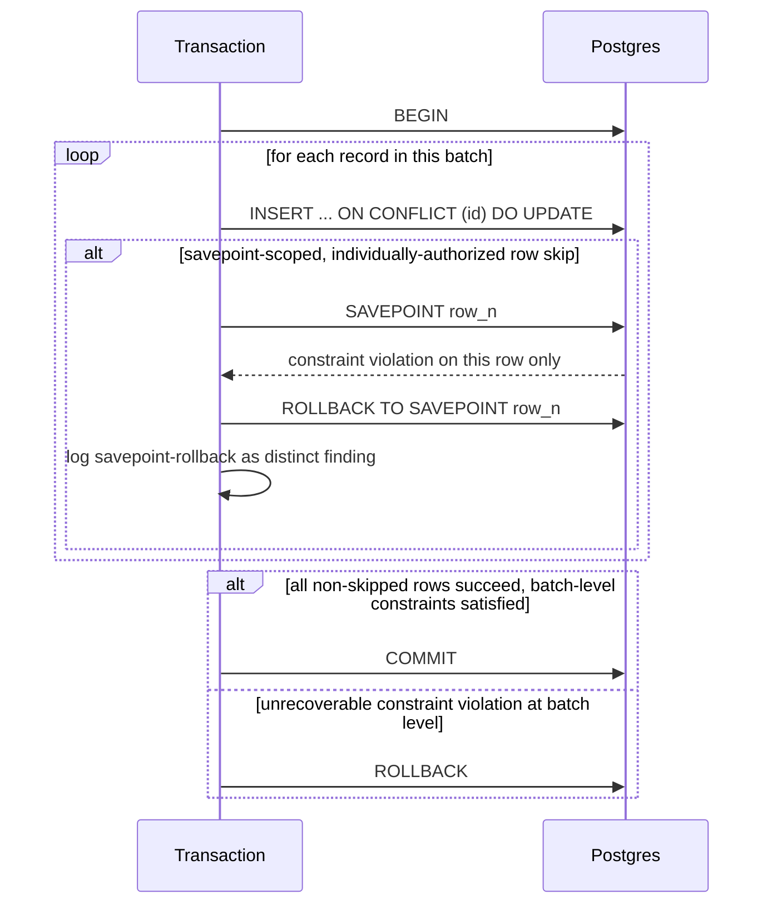
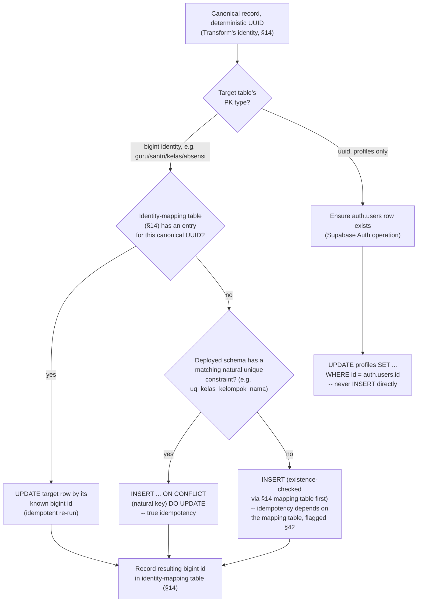
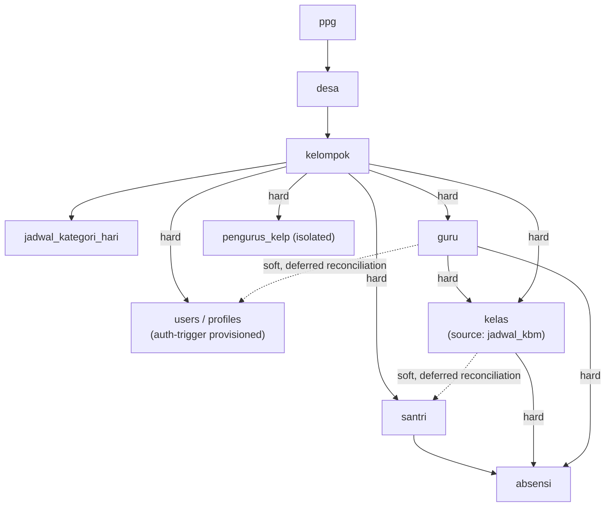

# Sprint 2 — Task 4: Migration Engine — Load Module
## Product Requirements Document (Design Only)

> **Status**: DRAFT — design only, no implementation, no SQL, no migration scripts.
> **Scope**: RUANG NGAJI Migration to Supabase, Sprint 2, fourth module of the Migration Engine.
> **Governing documents**: [Migration 004 Master Architecture Specification (MAS)](../MAS.md) is
> the Single Source of Truth. [Task 6 — Loading Strategy](../Task06_Loading.md) is the frozen,
> approved strategy this PRD elaborates into a buildable module design — it does not redefine,
> revise, or re-litigate any Task 6 decision. [Task 1](../Task01_Architecture.md),
> [Task 2](../Task02_ExecutionFlow.md), [Task 3](../Task03_Extraction.md),
> [Task 4](../Task04_Transformation.md), and [Task 5](../Task05_Validation.md) are treated as
> fixed upstream context; [Task 8 — Recovery Strategy](../Task08_Recovery.md) and
> [Task 7 — Verification Strategy](../Task07_Verification.md) are treated as fixed *downstream*
> context this module must hand off to correctly, without performing their work.
> [Sprint 2 Task 1](Task01_ExtractEngine_PRD.md), [Sprint 2 Task 2](Task02_TransformEngine_PRD.md),
> and [Sprint 2 Task 3](Task03_ValidationEngine_PRD.md) define this module's entire input surface
> (`staging/enriched/<runId>/`, `validation_report.json` and its gate decisions) and are treated
> as authoritative for that interface. The **deployed Supabase schema**
> (`08_Development/tpq-app/supabase/migrations/20260805080137_database_foundation.sql`) is
> reviewed and treated as the ground truth for actual table/column/constraint shapes referenced
> throughout this document.
> **Non-goals**: no TypeScript/JavaScript, no SQL, no migration scripts — Mermaid diagrams,
> prose, and tables only, per the assignment's explicit constraint.

---

## Table of Contents

1. [Purpose](#1-purpose)
2. [Scope](#2-scope)
3. [Responsibilities](#3-responsibilities)
4. [Non Responsibilities](#4-non-responsibilities)
5. [Architecture Overview](#5-architecture-overview)
6. [Component Diagram](#6-component-diagram)
7. [Data Flow Diagram](#7-data-flow-diagram)
8. [Sequence Diagram](#8-sequence-diagram)
9. [State Machine](#9-state-machine)
10. [Entity Load Order](#10-entity-load-order)
11. [Transaction Strategy](#11-transaction-strategy)
12. [Batch Strategy](#12-batch-strategy)
13. [Chunking Strategy](#13-chunking-strategy)
14. [Identity Mapping Strategy](#14-identity-mapping-strategy)
15. [UUID ↔ bigint Reconciliation Strategy](#15-uuid--bigint-reconciliation-strategy)
16. [Foreign Key Resolution](#16-foreign-key-resolution)
17. [Dependency Resolution](#17-dependency-resolution)
18. [Insert Strategy](#18-insert-strategy)
19. [Upsert Strategy](#19-upsert-strategy)
20. [Conflict Resolution Matrix](#20-conflict-resolution-matrix)
21. [Commit Strategy](#21-commit-strategy)
22. [Rollback Strategy](#22-rollback-strategy)
23. [Retry Strategy](#23-retry-strategy)
24. [Resume Strategy](#24-resume-strategy)
25. [Dead Letter Queue Strategy](#25-dead-letter-queue-strategy)
26. [Partial Success Policy](#26-partial-success-policy)
27. [Connection Management](#27-connection-management)
28. [Performance Targets](#28-performance-targets)
29. [Capacity Planning](#29-capacity-planning)
30. [Logging Requirements](#30-logging-requirements)
31. [Audit Trail](#31-audit-trail)
32. [Metrics & Observability](#32-metrics--observability)
33. [Security Considerations](#33-security-considerations)
34. [Data Integrity Guarantees](#34-data-integrity-guarantees)
35. [Failure Scenarios](#35-failure-scenarios)
36. [Recovery Interface](#36-recovery-interface)
37. [Configuration Parameters](#37-configuration-parameters)
38. [Testing Strategy](#38-testing-strategy)
39. [Acceptance Criteria](#39-acceptance-criteria)
40. [Risks](#40-risks)
41. [Future Extension](#41-future-extension)
42. [Open Questions](#42-open-questions)

---

## 1. Purpose

The Load Module is the fourth executable module of the Migration Engine (MAS §3, Task 2 Stage 5).
It consumes only records an entity's Validation gate decision has authorized
(`PASS`/`PASS_WITH_WARNINGS`, [Sprint 2 Task 3 §19](Task03_ValidationEngine_PRD.md#19-severity-classification))
and persists them into the deployed Supabase/Postgres schema with maximum safety guarantees. Load
performs **zero business logic** (Task 6 §1) — it does not decide what a record should look like
(Transform's job) or whether it's acceptable (Validate's job); it only gets already-correct data
durably and safely into the database, ending its own responsibility at "the write succeeded and
Postgres accepted it" — provable correctness of the *loaded state* is Task 7's job (Verification),
not this module's.

- **Design Rationale**: Task 6 already approved the loading *strategy* in full detail (loading
  architecture, entity order, transaction/batch/idempotency model, error handling, checkpointing,
  verification hooks, recovery readiness). This PRD's entire contribution is the same one all
  three prior Sprint 2 PRDs already made for their respective stages — turning an approved
  strategy into an implementable, testable module boundary, not inventing new judgment.
- **Tradeoffs**: keeping Load as a hard module boundary strictly downstream of Validate and
  strictly upstream of Verify costs an extra artifact handoff (`loading_summary.json` and its
  family) in exchange for MAS §2's non-negotiable separation of concerns ("Load persists" —
  nothing else, and critically, "Verify proves" is explicitly *not* Load's job even though Load is
  the module physically touching the database).
- **Alternative Designs**: fusing Load and Verify into one "write and confirm" stage — rejected by
  ADR-5 directly ("a loader verifying its own work isn't independent evidence"); fusing Load and
  Recovery into one "write, and fix it if it goes wrong" stage — rejected, Recovery must remain a
  distinct, evidence-gated, human-approved process (ADR-6), not an automatic Load-triggered
  action.
- **Recommendation**: keep Load's only judgment-adjacent behavior the mechanical application of
  already-decided rules (constraint enforcement, conflict-target selection) — any place Load's
  implementation is tempted to "decide" something about data correctness is a design violation.

- **Decision Log**: 2026-08-07 — Section drafted directly from Task 6 §1 with no elaboration
  beyond restating the "zero business logic" boundary for implementability; no new decision made.

---

## 2. Scope

**In scope**: persisting every in-scope entity Validation authorized, for the entity set already
fixed by Extract/Transform/Validate — `ppg`, `desa`, `kelompok`, `jadwal_kategori_hari`,
`users`/`profiles`, `guru`, `kelas` (canonical target of source `jadwal_kbm`), `santri`,
`absensi`, `pengurus_kelp` (isolated/non-blocking).

**Out of scope**: `jurnal_kbm`, `kop_surat`, `pengumuman` — same MAS §1 deferral every prior
Sprint 2 module respects.

**Temporal scope**: this document covers Load's steady-state design for a single migration run
(`runId`), persisting one Validation run's authorized output. It defines the *interface contract*
with Recovery (Task 8, §36) but does not design Recovery itself; it defines the *interface
contract* with a possible future generalized Checkpoint Engine (§36) but does not design that
engine either — both are explicitly future modules this PRD hands off to, not builds.

- **Design Rationale**: scope is pinned to the same entity list every upstream module already
  established, so Load cannot silently persist an entity none of the upstream modules produced or
  authorized.
- **Tradeoffs**: none beyond those already accepted by the three prior PRDs for the same entity
  scoping decision.
- **Alternative Designs**: N/A.
- **Recommendation**: when the deferred-entity audit eventually happens, this document's
  structure (load order, transaction model, conflict matrix) is the template a future addendum
  would extend.

- **Decision Log**: 2026-08-07 — Entity scope carried forward unchanged from Sprint 2 Task 1 §2 /
  Task 2 §2 / Task 3 §2. No new scoping decision made in this document.

---

## 3. Responsibilities

| # | Responsibility |
|---|---|
| R1 | Read validated canonical records from `staging/enriched/<runId>/`, gated by `validation_report.json`'s per-entity decision (Task 6 §1's hard precondition) |
| R2 | Resolve entity load order per the fixed dependency sequence (§10) |
| R3 | Split each entity's authorized records into batches (§12) and further into chunks where applicable (§13) |
| R4 | Execute one transaction per batch (§11), applying idempotent `INSERT ... ON CONFLICT DO UPDATE` writes (§19) against the deterministic UUID conflict target |
| R5 | Resolve every canonical UUID reference to its actual persisted-row identity, including the UUID↔bigint reconciliation this schema requires (§14, §15) |
| R6 | Enforce every Postgres constraint (FK, unique, check, NOT NULL) as a genuine integrity net — never disabled for throughput (Task 6 §7) |
| R7 | Checkpoint per-batch, only after commit is confirmed (§24) |
| R8 | Retry transient failures per policy (§23), routing exhausted or non-retryable failures to `failure_report.json` (§25) |
| R9 | Emit `verification_hooks.<entity>.json` as Task 7's designated primary input — Load never performs verification itself (Task 6 §11) |
| R10 | Produce the full loading report artifact family (§31) sufficient to answer every audit question about what loaded, when, and how |
| R11 | Trigger (or confirm) the pre-load backup/snapshot Task 8 depends on as a hard recovery precondition (§36, Task 6 §17) |

- **Design Rationale**: every responsibility is traceable to a specific Task 6 section, continuing
  the traceability discipline established by all three prior Sprint 2 PRDs.
- **Tradeoffs**: none beyond those already accepted at Task 6 approval time.
- **Alternative Designs**: N/A.
- **Recommendation**: any responsibility proposed for Load during implementation that cannot be
  traced to a Task 6 section is a scope-creep signal, exactly as in the prior three PRDs.

- **Decision Log**: 2026-08-07 — Responsibility list assembled from Task 6 §1–§17; no
  responsibility introduced that Task 6 did not already establish.

---

## 4. Non Responsibilities

Explicitly **out of scope** for the Load Module (mirrors the assignment's OUT OF SCOPE list):

- **No extraction** — never reads Sheets/Firestore; input is exclusively `staging/enriched/` +
  `validation_report.json`.
- **No transformation** — no field renaming, no re-normalization; a record's shape entering Load
  is byte-identical to the shape leaving it, modulo the identity-reconciliation bookkeeping (§15)
  which is metadata *about* the record, never a mutation *of* it.
- **No business-rule validation** — Load treats Validation's gate decision as a hard precondition
  and never re-evaluates it (Task 6 §1); a record that reaches Load with a `PASS`/
  `PASS_WITH_WARNINGS` authorization is trusted, not re-judged.
- **No data repair** — Load never "fixes" a value it happens to notice looks wrong; anything
  Load's own constraint enforcement rejects (§7's integrity net) is routed to `failure_report.json`
  for human/upstream attention, never silently patched.
- **No final/operational reports** — Load emits its own stage artifacts (§31), never Task 9's
  cross-stage operational report.
- **No archiving of Extract's snapshots** — snapshot lifecycle (retention, eventual archival) is
  outside Load's concern entirely; Load only *reads* Transform's downstream output, never touches
  `snapshots/` at all.
- **No SQL execution as a generated artifact** — this document, and by extension the module it
  describes, never emits SQL migration scripts; Load's writes are structured operations against
  the already-deployed schema, not schema-authoring actions.
- **No implementation code** — per this PRD's own non-goals; also not a runtime responsibility of
  the module design itself, restated for completeness against the assignment's explicit list.

- **Design Rationale**: as with every prior Sprint 2 PRD, this list exists so a future contributor
  reading only this document cannot accidentally re-implement an adjacent stage's job inside a
  loader. "No data repair" is the Load-specific analogue of Validation's "no repair" boundary
  ([Sprint 2 Task 3 §4](Task03_ValidationEngine_PRD.md#4-non-responsibilities)) — the temptation
  recurs at every stage and must be refused at every stage.
- **Tradeoffs**: none — pure boundary hygiene.
- **Alternative Designs**: N/A.
- **Recommendation**: treat any pull request that adds a value-mutating or judgment-making
  operation to a loader as a design violation requiring architectural sign-off — the bright line
  is: Load may change *where* a record lives (in Postgres vs. only in `staging/`) and *how it's
  identified there* (§15), never *what* it says.

- **Decision Log**: 2026-08-07 — Non-responsibilities enumerated to mirror the assignment's
  explicit OUT OF SCOPE list, cross-checked against Task 6 §1's "zero business transformations"
  framing; no deviation from either source.

---

## 5. Architecture Overview

Load sits strictly between `staging/enriched/<runId>/` + `validation_report.json` (read-only
inputs, Validation's authoritative gate decision) and the deployed Supabase/Postgres database
(the sole system this module writes to). Its own artifact output is the `loading_summary.json`
family (§31) plus `verification_hooks.<entity>.json`, the designated handoff to Task 7.

```text
        staging/enriched/<runId>/<entity>.json    (Transform's output, read-only)
        validation_report.json (+ policy_results, rejected_records, warning_records)
                          │  gate decision per entity: PASS / PASS_WITH_WARNINGS / BLOCKED
                          │  (hard precondition -- Load never re-evaluates it, Task 6 §1)
                          ▼
              ┌─────────────────────────────┐
              │   LOAD MODULE (Stage 5)       │
              │  ─────────────────────────    │
              │  Pre-flight Gate                │
              │  Load Order Resolver              │
              │  Batch Splitter                     │
              │  Identity Reconciler                   │
              │  Transaction Executor                    │
              │    (per-batch: open tx → UPSERT →         │
              │     constraint check → commit/rollback)    │
              │  Checkpoint Manager                          │
              │  Retry Controller                              │
              │  Reporter                                        │
              └─────────────────────────────┘
                          │
                          ▼
              Supabase / Postgres (deployed schema)
                          │
                          ▼
       loading_summary.json, batch_statistics.json, transaction_log.json,
       retry_report.json, failure_report.json, throughput_metrics.json,
       verification_hooks.<entity>.json, constraint_events.json
                          │
                          ▼
              Task 7: VERIFY (independent, evidence-recomputing)
```

- **Design Rationale**: the architecture is a direct instantiation of Task 6 §2's stated pipeline
  (Pre-flight Gate → Load Order Resolution → Per-Entity Batch Load → Post-Entity Reconciliation →
  Reporting), elaborated with the components each phase requires — nothing here is invented
  independently of the frozen strategy, matching the pattern of all three prior Sprint 2 PRDs.
- **Tradeoffs**: a single orchestrated pipeline touching a live database is a fundamentally
  higher-stakes architecture than Extract/Transform/Validate's file-to-file designs — this is the
  first Migration Engine module with an irreversible-by-default side effect (a committed
  transaction), which is why every subsequent section (transaction scope, rollback boundary,
  retry/resume, recovery interface) carries materially more weight here than in the prior three
  PRDs.
- **Alternative Designs**: loading directly into the live, currently-served application schema
  with no staging layer — Task 6 §13 flags a **staging-schema-then-cutover** approach as a
  recommendation, not a unilateral decision, given concurrent-user risk; this PRD treats that
  choice as still-open (§42) and designs Load's mechanics (batch/transaction/UPSERT model) to work
  identically against either target, since the mechanism doesn't actually depend on which target
  is chosen.
- **Recommendation**: implement the orchestrator so it is target-schema-agnostic at the connection
  layer (a configuration parameter, §37) — so that whichever way Task 6 §13's open question
  resolves, the loading mechanism itself needs no redesign.

- **Decision Log**: 2026-08-07 — Architecture elaborated from Task 6 §2's 5-phase pipeline;
  explicitly deferred Task 6 §13's staging-schema-vs-live-tables question rather than resolving it
  unilaterally, consistent with "design only" scope and Task 6's own framing of it as a
  recommendation pending operator decision.

---

## 6. Component Diagram



- **Design Rationale**: the diagram makes the Pre-flight Gate's dual role explicit — it is both a
  precondition check (does this run have valid authorization to proceed) and the trigger point for
  the pre-load backup Task 8 depends on (Task 6 §17) — these are two different concerns co-located
  at the same phase because both must complete before the first batch commits.
- **Tradeoffs**: co-locating backup-triggering with precondition-checking in one phase risks
  conflating "is it safe to start" with "have we made it safe to recover if this goes wrong" —
  mitigated by treating them as two distinct, independently-logged steps within the same phase,
  not one fused check.
- **Alternative Designs**: triggering the backup as a wholly separate, earlier pipeline phase
  (before Load even begins) — considered, and arguably cleaner; not adopted as the primary design
  here only because Task 6 §17 frames it as *Load's* pre-flight responsibility specifically, not a
  separate stage's; flagged as a reasonable implementation variation, not a competing decision.
- **Recommendation**: log the backup-trigger step and its confirmation as a distinct, first-class
  event (§30) — a Load run that proceeded without a confirmed backup reference must be
  unmistakably flagged, never silently indistinguishable from a normal run in the logs.

- **Decision Log**: 2026-08-07 — Component diagram elaborates Task 6 §2/§17 into concrete
  components; backup-trigger placement inside Pre-flight Gate adopted as the literal reading of
  Task 6 §17's "Load's pre-flight stage recommended to trigger" language.

---

## 7. Data Flow Diagram



- **Design Rationale**: the diagram makes explicit that constraint violations are checked *at
  commit*, not pre-emptively before the transaction opens — directly reflecting Task 6 §7's "last
  resort integrity net, not routine" framing: Load doesn't try to out-guess Postgres's own
  constraints, it lets them do their job and reacts to their verdict.
  It also makes explicit the all-or-nothing batch rollback (Task 6 §4) as a single arrow from
  "any violation" to "ROLLBACK entire batch" — there is no partial-batch commit path in this
  diagram because none exists in the design.
- **Tradeoffs**: letting Postgres's constraints be the actual gate (rather than Load
  pre-validating referential/uniqueness facts itself before attempting the write) means a batch
  with even one bad record fails the *whole batch*, wasting the good records' write attempt too —
  accepted; this is precisely Task 6 §4's chosen tradeoff (blast radius vs. throughput), already
  decided and not re-litigated here.
- **Alternative Designs**: Load performing its own pre-write referential/uniqueness pre-check to
  avoid wasted batch attempts — rejected; this would duplicate work Validation (Task 5) and
  Postgres's own constraints already do, and risks the same "two sources of truth for the same
  fact" problem every prior module's PRD has warned against.
- **Recommendation**: `constraint_events.json` should record not just *that* a constraint fired,
  but which specific constraint (by name, matching the deployed schema's actual constraint
  identifiers, e.g. `chk_kelas_jam`, `uq_kelas_kelompok_nama`) — this makes a constraint-triggered
  batch failure immediately diagnosable against the known schema, not a generic "insert failed."

- **Decision Log**: 2026-08-07 — Data flow elaborates Task 6 §4/§7's commit-time constraint
  enforcement and all-or-nothing batch rollback into a literal flow; no deviation.

---

## 8. Sequence Diagram



- **Design Rationale**: the sequence makes explicit that the Pre-flight Gate's authorization check
  happens *per entity* (an entity can be excluded from this specific Load run without aborting the
  whole run), directly implementing MAS §4's per-entity terminal-state philosophy one stage later
  than Validate.
- **Tradeoffs**: checking authorization once per entity at the start (rather than re-checking per
  batch) means a very long-running entity's authorization is effectively "locked in" for the
  duration of that entity's load — acceptable since Validation's gate decision for a given `runId`
  is itself immutable once computed (Sprint 2 Task 3's immutability discipline), so there's no
  scenario where re-checking mid-entity would ever produce a different answer.
- **Alternative Designs**: re-verifying the gate decision before every batch — rejected as
  redundant given `validation_report.json`'s immutability; would add overhead with no
  correctness benefit.
- **Recommendation**: the Pre-flight Gate's authorization check should be logged once per entity,
  referencing the exact `validation_report.json` content hash it read (§31) — so a later audit can
  confirm Load actually looked at the report it claims to have honored.

- **Decision Log**: 2026-08-07 — Sequence elaborates Task 6 §2/§3/§4/§9/§10 into a literal
  per-entity, per-batch execution order; authorization-check granularity (per-entity, not
  per-batch) is a new implementability decision made here, justified by validation-report
  immutability — flagged for review since Task 6 does not state this granularity explicitly.

---

## 9. State Machine



- **Design Rationale**: the state machine's most important property is that `BatchFailed` does
  **not** cascade backward to undo already-committed batches of the same entity — Task 6 §4's
  transaction-per-batch decision means each batch's commit is final and independent; a later
  batch's failure is a forward-looking halt, never a backward-looking undo (undoing already-
  committed data is Recovery's job, Task 8, triggered by a human/Verification decision, never an
  automatic Load-stage reaction).
- **Tradeoffs**: this means an entity can end a Load run in a "partially loaded" state (some
  batches committed, one failed, remainder not attempted) — a real, visible intermediate state
  rather than an all-or-nothing entity outcome; accepted deliberately, since Task 6 §6 explicitly
  frames "entity Load marked incomplete, other independent entities still proceed" as correct
  behavior, not a degraded one.
- **Alternative Designs**: auto-rolling-back an entity's entire load the moment any one batch
  fails (making entity load itself atomic) — rejected; would defeat the whole purpose of
  batch-scoped transactions (Task 6 §4's stated rationale: balance blast radius against
  throughput and enable clean checkpointed resume) and would make a single bad batch far more
  costly than necessary.
- **Recommendation**: `EntityLoadIncomplete` should be a first-class, clearly-labeled outcome in
  `loading_summary.json` (not merely inferable from batch-level detail) — an operator scanning the
  summary should immediately see which entities are fully loaded, partially loaded, or excluded
  entirely (never-attempted due to Pre-flight authorization failure), three genuinely different
  outcomes that must never be visually conflated.

- **Decision Log**: 2026-08-07 — State machine formalizes Task 6 §4/§6/§10's batch-failure
  semantics; explicitly confirms (does not newly decide) that batch failure never triggers
  automatic rollback of prior committed batches within the same entity, per Task 6 §4's stated
  rationale.

---

## 10. Entity Load Order

Per Task 6 §3 (frozen, restated verbatim):

```text
ppg → desa → kelompok → jadwal_kategori_hari → users → guru → santri → jadwal_kbm → absensi
```

**A documented tension, surfaced but not resolved by this PRD**: this order places `santri`
*before* `jadwal_kbm` (canonical `kelas`), yet the deployed schema's `santri.kelas_id` is a
foreign key referencing `kelas(id)`. Read strictly as an FK-topological order, `kelas` would need
to load before `santri`, not after — the same tension exists for `users` (canonical `profiles`)
loading before `guru`, when `profiles.guru_id` references `guru(id)`.

**Why this order is nonetheless executable without violating any constraint** (Task 6 §7 keeps
every FK enabled, never disabled): both of the forward-referencing columns are **nullable** in the
deployed schema —
`santri.kelas_id bigint references kelas (id) on delete set null` and
`profiles.guru_id bigint references guru (id) on delete set null`. This means:

1. `santri` and `profiles` records can be inserted with their forward-referencing FK column left
   `NULL` on first pass, satisfying the FK constraint trivially (a `NULL` FK value is always
   valid).
2. Once `kelas` (respectively `guru`) has been loaded and its identities reconciled (§15), a
   **second, later reconciliation pass** — scoped as an `UPDATE`, not a fresh `INSERT` — sets the
   deferred FK column on the already-loaded `santri`/`profiles` rows.
3. This reconciliation pass is itself a batch-transactional operation (§11), checkpointed and
   retried identically to any other batch (§23/§24) — it is not a special, unaudited side channel.

| Column | Table | Nullable? | Deferred-FK reconciliation needed? |
|---|---|---|---|
| `santri.kelas_id` | `santri` | Yes (`on delete set null`) | Yes — set after `jadwal_kbm`(`kelas`) loads |
| `profiles.guru_id` | `profiles` (canonical `users`) | Yes (`on delete set null`) | Yes — set after `guru` loads |
| Every other FK column referenced by the load order above | various | No (all other in-scope FKs are `not null` per the deployed schema, e.g. `guru.kelompok_id`, `kelas.kelompok_id`, `santri.kelompok_id`) | No — these must resolve at first-insert time; their referenced parent is already earlier in the load order |

- **Design Rationale**: this is the single most consequential mechanical finding this PRD
  contributes to the Load design — it is not a new architectural decision (Task 6 §3's order is
  frozen and this document does not change it), but an elaboration explaining precisely *how*
  that already-approved order remains constraint-safe, grounded in the deployed schema's actual
  nullability, not assumed.
- **Tradeoffs**: the two-phase insert-then-reconcile pattern for `santri.kelas_id` and
  `profiles.guru_id` adds a genuinely new mechanism (a deferred-FK reconciliation batch) beyond
  the "one pass, ordered, done" mental model Task 6 §3's order might otherwise suggest — a real
  implementation cost, in exchange for honoring Task 6 §3's frozen order *and* Task 6 §7's
  "never disable FK constraints" rule simultaneously, which would otherwise be in direct
  contradiction for these two columns.
- **Alternative Designs**: (a) reordering Load to place `kelas` before `santri` and `guru` before
  `users`, a strict FK-topological order — rejected here as out of this PRD's authority; Task 6
  §3 is frozen and "do not redefine architecture" is explicit in this sprint's instructions,
  though this is flagged prominently in §42 as worth raising with the architecture owner, since it
  would eliminate the two-phase mechanism entirely if adopted; (b) temporarily disabling the FK
  constraint for the load window — explicitly rejected by Task 6 §7 ("never disabled for
  load-speed"); (c) deferring the constraint to transaction-commit time — Task 6 §7 permits
  deferred constraints only *within a single batch transaction*, which does not span the gap
  between loading `santri` and later loading `kelas` in a *different* batch/entity, so this does
  not resolve the tension either.
- **Recommendation**: implement the two-phase reconciliation mechanism as designed above, but
  raise the reordering alternative explicitly with whoever owns Task 6 (§42) — if the order was
  fixed at Task 6 approval time before this specific nullable-FK mechanic was worked out in detail,
  a future Task 6 revision might prefer the simpler strict-topological order now that the
  nullability is confirmed to make either order valid.

- **Decision Log**: 2026-08-07 — Task 6 §3's order adopted verbatim per "do not redefine
  architecture." New elaboration added: identified and resolved the santri/kelas and
  users/guru forward-reference tension via a two-phase nullable-FK insert-then-reconcile
  mechanism, grounded in the deployed schema's actual `on delete set null` nullability. Flagged as
  an open question (§42) whether Task 6's order should be revisited given this finding, rather
  than resolved unilaterally in this document.

---

## 11. Transaction Strategy

Per Task 6 §4 (frozen):

| Property | Decision |
|---|---|
| Transaction granularity | **One transaction per batch** — not per record, not per entity |
| Rationale | Balances blast radius of failure against throughput; enables clean checkpointed resume |
| **Maximum rollback boundary** | **One batch** — a transaction never spans more than one batch, so the largest possible single-transaction rollback is exactly one batch's worth of records, never more |
| Rollback behavior | Entire batch rolls back on any constraint violation — **zero partial-batch commits** |
| Savepoints | Used sparingly, *within* a batch, for individually-authorized row-level skips only — every savepoint-rollback logged as a distinct finding, never silent |
| Deferred FK reconciliation batches (§10) | Each reconciliation pass is itself its own batch transaction — same rules apply, no special exemption |



- **Design Rationale**: the "maximum rollback boundary = one batch" property (an explicit
  assignment special requirement) falls directly out of Task 6 §4's transaction-per-batch
  decision — since no transaction ever spans more than one batch, no rollback (an inherently
  transaction-scoped operation) can ever undo more than one batch's writes. Anything broader
  (entity-level or run-level "rollback") is definitionally a Recovery-stage operation (Task 8),
  reconstructed *after the fact* from `transaction_log.json` across multiple already-committed
  transactions, never a single live transactional rollback.
- **Tradeoffs**: batch-scoped transactions mean a batch containing 999 good records and 1 bad one
  loses all 1000 on that attempt — the same tradeoff §7's rationale already accepts, restated here
  because transaction scope is the literal mechanism producing that consequence.
- **Alternative Designs**: per-record transactions (finest granularity, no wasted-good-record
  cost, but far higher transactional overhead and a much larger number of checkpoint writes) —
  rejected by Task 6 §4 directly; per-entity transactions (coarsest, simplest conceptually, but an
  enormous rollback boundary for `absensi` at full scale and terrible resumability) — also
  rejected by Task 6 §4 directly.
- **Recommendation**: savepoint usage should remain genuinely rare and always paired with a
  specific, named authorization (e.g. a recorded human decision permitting a specific known-bad
  row to be skipped rather than failing its whole batch) — never a default row-skipping
  convenience, which would erode the "entire batch rolls back" guarantee's meaningfulness.

- **Decision Log**: 2026-08-07 — Transaction strategy restated verbatim from Task 6 §4; explicit
  "maximum rollback boundary = one batch" framing added to directly satisfy the assignment's
  special requirement, derived mechanically from the transaction-per-batch decision rather than
  independently decided.

---

## 12. Batch Strategy

Per Task 6 §6:

| Aspect | Decision |
|---|---|
| Batching scope | `absensi` only requires configurable batch sizing; every other in-scope entity loads as a single batch (small enough record counts, consistent with every prior module's identical "modest data volume" framing) |
| Adaptive batching | Shrinks on failure, **never auto-grows** — a conservative, one-directional adaptation |
| Batch failure recording | Recorded in `failure_report.json`; checkpoint stays at the last successfully committed batch |
| Entity-level consequence of a batch failure | Entity Load marked incomplete (§9's `EntityLoadIncomplete`); other independent entities still proceed |

**Deferred-FK reconciliation batches** (§10) are additionally batched using the same sizing
policy as their target entity (`santri`'s reconciliation pass uses `santri`'s batch size;
`profiles`'/`users`' reconciliation pass uses that entity's own batch size).

- **Design Rationale**: restricting adaptive batch sizing to shrink-only (never grow) is a
  conservative-by-construction safety property — a batch that failed and was retried at a smaller
  size has already demonstrated the larger size was risky for the current conditions; growing
  back without new evidence the larger size is now safe would reintroduce the same risk.
- **Tradeoffs**: never-auto-grow means a transient condition that caused a shrink (e.g. temporary
  load-related contention) can leave batch size smaller than necessary for the rest of the run,
  costing some throughput — accepted; Task 6 §6 makes this tradeoff deliberately, favoring safety
  over throughput recovery, consistent with MAS's "safety before speed" guiding principle.
- **Alternative Designs**: a fully adaptive (grow-and-shrink) batch sizer — rejected by Task 6 §6
  directly.
- **Recommendation**: expose the current effective batch size for `absensi` in
  `batch_statistics.json` (§31) at every checkpoint, so a human reviewing a slower-than-expected
  run can immediately see whether adaptive shrinking, not some other cause, explains the slowdown.

- **Decision Log**: 2026-08-07 — Batch strategy restated verbatim from Task 6 §6; new elaboration
  (deferred-FK reconciliation batches inherit their target entity's batch-sizing policy) added for
  implementability, consistent with §10's mechanism.

---

## 13. Chunking Strategy

Task 6 does not define a separate "chunk" concept distinct from "batch" — this PRD treats
**chunking as the mechanism by which a single entity's authorized record set is partitioned into
the sequence of batches** §12 describes, i.e. batch *is* the chunk unit in this architecture; no
finer sub-batch chunking layer is introduced.

| Aspect | Decision |
|---|---|
| Chunk unit | Equals the batch (§12) — no additional sub-batch partitioning layer |
| Chunk boundary determination | For `absensi`: the configured (adaptive, shrink-only) `batchSize` (§37); for every other entity: the entire authorized record set in one chunk |
| Chunk ordering within an entity | Sequential, deterministic (e.g. ordered by the entity's canonical UUID or a stable extraction-order-derived sequence) — never a non-deterministic partition, so a resumed run's chunk boundaries are identical to the original run's |
| Chunk independence | Chunks (batches) within one entity are loaded sequentially, not in parallel — parallelism, where it exists at all, is only across independent entities at the same dependency level (Task 6 §14) |

- **Design Rationale**: introducing a distinct "chunk" layer beneath "batch" was considered and
  rejected as unjustified complexity — Task 6's design already gives batch the exact properties
  (transaction scope, checkpoint unit, adaptive sizing) a "chunk" concept would otherwise need
  independently defined and reconciled against; collapsing them avoids two names for the same
  thing.
- **Tradeoffs**: treating chunk and batch as identical means there's no intermediate grouping
  available if a future need arises (e.g. grouping several batches under one higher-level progress
  unit) — accepted as unnecessary at current scale; nothing precludes introducing such a layer
  later (§41) if evidence ever justifies it.
- **Alternative Designs**: a genuinely distinct chunk-within-batch layer (e.g. batches of 1000
  further internally processed in chunks of 100 for progress-reporting granularity without
  separate transaction boundaries) — deferred to §41; not justified by anything in Task 6 or by
  this migration's actual scale.
- **Recommendation**: deterministic chunk/batch ordering (the third row above) is the one property
  worth treating as load-bearing even though it's simple — it is what makes §24's resumability
  guarantee ("resuming from the last committed batch produces the same sequence") mechanically
  possible; ensure the ordering function itself has no non-deterministic input (e.g. never derived
  from wall-clock arrival order of an unordered read).

- **Decision Log**: 2026-08-07 — New elaboration: chunk and batch collapsed into one concept for
  this architecture, since Task 6 does not define chunking as separate from batching. This is an
  implementability clarification, not a new architectural layer.

---

## 14. Identity Mapping Strategy

Elaborates Task 6 §5's idempotency mechanism ("conflict target always the deterministic UUID,"
Task 4 §3) into the concrete identity bookkeeping Load must perform:

| Identity | Origin | Role in Load |
|---|---|---|
| Legacy source identifier | Extract ([Sprint 2 Task 1 §19](Task01_ExtractEngine_PRD.md#19-legacy-identifier-preservation)) | Carried through in `_provenance`, never used directly as a Load-time lookup key |
| Deterministic canonical UUID | Transform ([Sprint 2 Task 2 §18](Task02_TransformEngine_PRD.md#18-identifier-strategy)) | **The idempotency conflict target** — every `INSERT ... ON CONFLICT` targets this value |
| Persisted-row identity (`bigint identity`, or `uuid` for `profiles`) | Assigned by Postgres at first successful insert for that canonical UUID | The value every *other* record's FK column must ultimately reference once resolved |

**Mapping table**: Load maintains (or extends Transform's `state/mapping/`, per §15's boundary
discussion) a per-entity mapping from canonical UUID → persisted-row identity, populated
incrementally as each batch commits.

- **Design Rationale**: three distinct identities exist for every canonical record by the time it
  reaches Load, each serving a different purpose (traceability, idempotency, actual storage
  reference) — conflating any two of them risks a subtle bug (e.g. using the legacy source ID as
  a Load-time lookup key would break idempotency across sources with overlapping legacy ID
  spaces).
- **Tradeoffs**: maintaining a third identity-mapping layer (beyond Transform's own
  `state/mapping/`) is additional state Load must own and keep consistent — necessary because
  Transform's mapping only goes as far as canonical UUID (Sprint 2 Task 2 §18 explicitly stops
  there and defers the bigint reconciliation question to Load).
- **Alternative Designs**: having Transform pre-allocate the eventual bigint identities itself
  (skipping the need for Load to do this mapping) — rejected; Transform has no connection to
  Postgres (Sprint 2 Task 2 §33) and bigint identity values are only knowable once Postgres
  actually performs the insert (`generated always as identity`), making this fundamentally a
  Load-time-only fact.
- **Recommendation**: persist the canonical-UUID → persisted-row-identity mapping durably (not
  only in memory for the duration of one run) — it is exactly the data Recovery (Task 8) and
  Verification (Task 7) need to translate between "what Transform said" and "what's actually in
  the database," and it must survive a Load run's own completion, not just its execution.

- **Decision Log**: 2026-08-07 — New elaboration: formalized the three-identity model (legacy,
  canonical UUID, persisted-row identity) implicit in Task 4 §3 / Task 6 §5 but not previously
  spelled out as a distinct mapping-table requirement. No architectural decision changed; this is
  the concrete mechanism Task 6 §5's idempotency guarantee depends on.

---

## 15. UUID ↔ bigint Reconciliation Strategy

Directly resolves the open boundary [Sprint 2 Task 2 §18](Task02_TransformEngine_PRD.md#18-identifier-strategy)
explicitly deferred to this module ("How exactly will Load reconcile Transform's deterministic
UUIDs with the deployed schema's `bigint identity` primary keys?").

**The deployed schema's actual identity model** (confirmed by direct review of
`20260805080137_database_foundation.sql`):

| Table category | Primary key type |
|---|---|
| Nearly every table (`ppg`, `desa`, `kelompok`, `guru`, `kelas`, `jadwal_kategori_hari`, `santri`, `absensi`, `pengurus_kelp`, etc.) | `bigint generated always as identity` |
| `profiles` (canonical `users`) | `uuid`, **required to exactly equal `auth.users.id`** — not independently generated by Load at all |

**Reconciliation mechanism**:

1. Transform's deterministic UUIDv5 (Task 4 §3) is **never written into the target table's
   primary-key column** for `bigint identity` tables — it exists purely as the pipeline-internal
   idempotency conflict target and cross-reference key (§14).
2. Because the target primary key is `bigint generated always as identity`, Postgres itself
   assigns the actual stored identity value at first successful `INSERT` — Load cannot pre-compute
   it, and must not attempt to (attempting to force a specific bigint value would defeat the
   `identity` mechanism and risk sequence collisions).
3. The `INSERT ... ON CONFLICT (id) DO UPDATE` idempotency mechanism (Task 6 §5) therefore
   **cannot use the target table's own bigint `id` column as its literal conflict target** for
   these tables, since that value doesn't exist yet on first insert. The practical conflict target
   for `bigint identity` tables must instead be **whatever business-key unique constraint the
   deployed schema already enforces that corresponds to the canonical UUID's identity** — e.g.
   `kelas`'s `uq_kelas_kelompok_nama (kelompok_id, lower(nama))`, or an equivalent natural key per
   entity where the schema defines one.
4. Where the deployed schema does **not** yet expose a natural unique constraint corresponding to
   the canonical UUID's identity (a real gap this PRD surfaces rather than resolves — flagged in
   §42), Load's idempotency guarantee for that specific entity is weaker than Task 6 §5 assumes,
   and depends on the identity-mapping table (§14) being consulted *before* every insert attempt
   (an existence check, not a blind insert) rather than relying purely on `ON CONFLICT`.
5. For `profiles`, the reconciliation is structurally different and simpler: `profiles.id` **is**
   a `uuid`, and per the deployed schema's own design, it is auto-provisioned by a database
   trigger the moment a corresponding `auth.users` row is created (`handle_new_auth_user()`),
   never inserted directly by an ordinary application-style `INSERT`. Load's role for `profiles`
   is therefore not a conflict-target UPSERT in the usual sense, but a **coordinated two-step
   process**: (a) ensure/trigger the corresponding `auth.users` row exists (a Supabase
   Auth-specific operation, outside ordinary Postgres DML), then (b) `UPDATE` the
   trigger-provisioned `profiles` row with the migrated business fields (`display_name`, `role`,
   `guru_id`, scope columns) — never an `INSERT` into `profiles` directly.



- **Design Rationale**: this section exists specifically because Sprint 2 Task 2 correctly
  identified that Transform's UUID strategy and the deployed schema's actual PK types don't align
  trivially, and deliberately deferred resolving it here. The resolution above is grounded in
  actually reading the deployed schema rather than assuming Task 6 §5's "conflict target always
  the deterministic UUID" applies uniformly — it does not, for `bigint identity` tables, without
  an intermediate natural-key or mapping-table step.
- **Tradeoffs**: for entities lacking a natural unique constraint matching canonical identity
  (step 4), idempotency shifts from being a pure database-mechanism guarantee (`ON CONFLICT`) to a
  Load-application-logic guarantee (mapping-table-checked existence). This is strictly weaker in
  the sense that it depends on Load's own mapping table being correct and consulted every time —
  a real, if manageable, risk surface Task 6 §5's original framing did not have to consider.
- **Alternative Designs**: (a) adding a dedicated `legacy_uuid`/`migration_uuid` column to every
  `bigint identity` table specifically to serve as a true, schema-level `ON CONFLICT` target —
  the cleanest fix, but would require a schema migration this PRD is explicitly forbidden from
  proposing as SQL, and changes the deployed schema Task 6 treated as fixed; flagged as the
  strongest candidate resolution in §42 rather than adopted unilaterally here. (b) using
  `INSERT ... ON CONFLICT (natural key) DO UPDATE` universally, requiring every entity to have an
  authored natural-key contract even where the schema doesn't yet enforce one at the database
  level (enforced at the Load-application level instead) — a partial mitigation, viable per-entity
  but not a substitute for the schema-level fix in (a).
- **Recommendation**: treat option (a) above — adding a nullable, unique `legacy_uuid` column to
  every `bigint identity`-keyed in-scope table — as the recommended resolution to escalate to the
  user/architecture owner before Load implementation begins (§42), since it would make Task 6
  §5's idempotency guarantee uniformly true at the database level for every entity, not only those
  with a pre-existing natural key. Until/unless that's adopted, implement the mapping-table-first
  existence check (step 4) as the interim mechanism.

- **Decision Log**: 2026-08-07 — **Significant new finding, not a Task 6 restatement**: identified
  that Task 6 §5's "conflict target always the deterministic UUID" does not hold uniformly against
  the actual deployed schema's `bigint identity` primary keys; designed a three-path reconciliation
  (natural-key UPSERT / mapping-table-checked insert / profiles' auth-trigger-coordinated update)
  as the interim mechanism, and recommended a schema-level fix (nullable unique `legacy_uuid`
  column) as the escalation item for the architecture owner rather than resolving it unilaterally
  in this design-only document.

---

## 16. Foreign Key Resolution

Elaborates how Load resolves every canonical FK reference to its actual persisted-row target,
building on §10's load-order mechanics, §14's identity mapping, and §15's reconciliation strategy:

| Step | Behavior |
|---|---|
| 1. Identify the canonical FK field's target entity + canonical UUID | Already resolved by Transform (Sprint 2 Task 2 §20) — Load consumes this, never re-derives it |
| 2. Look up the target's persisted-row identity | Via the identity-mapping table (§14/§15) — the target entity must have already been loaded (§10's dependency order) for this lookup to succeed, **except** for the two deliberately-deferred columns (§10: `santri.kelas_id`, `profiles.guru_id`) |
| 3a. Lookup succeeds | The record's FK column is populated with the resolved persisted-row identity at insert/update time |
| 3b. Lookup fails for a *non-deferred* FK column | This is an integrity failure Validation should already have prevented (Sprint 2 Task 3 §14's referential readiness gate) — if it happens at Load anyway, it indicates either a Validation regression or a genuine race (e.g. a concurrent, unexpected mutation) and is treated as a constraint-violation-class failure (§35), never silently null'd or skipped |
| 4. Deferred FK columns (§10) | Left `NULL` on first insert by design, populated in the later reconciliation batch once their target entity has loaded |
| 5. No new orphan judgment at Load | Load does not decide whether an unresolvable reference should have blocked the record — that decision was Validation's (Sprint 2 Task 3 §14), already made and already reflected in which records reached Load's authorized input in the first place |

- **Design Rationale**: Load's FK resolution is deliberately "dumb" relative to Validation's — it
  does not re-judge orphan/broken-parent scenarios (Sprint 2 Task 3 §14 already did that), it only
  mechanically translates an already-validated canonical reference into a concrete database
  pointer. A lookup failure at this stage is therefore always surprising (an upstream-defect
  signal), not an expected, gracefully-handled case — the sole engineered exception being the two
  columns §10 identifies as deliberately deferred.
- **Tradeoffs**: treating any *unexpected* FK-lookup failure as an integrity-failure-class event
  (rather than quietly working around it) means Load has zero tolerance for "the parent should be
  here but isn't" outside the two known deferred cases — accepted; a silent workaround here would
  hide exactly the kind of upstream defect MAS's evidence-first philosophy insists on surfacing.
- **Alternative Designs**: Load performing its own referential-integrity re-check independent of
  Validation's — rejected as duplicated work and a second source of truth for the same judgment,
  same reasoning as §7's rejected pre-write-recheck alternative.
- **Recommendation**: the identity-mapping table (§14) should support an explicit, loud
  "lookup miss" event distinct from a normal cache-miss-then-populate flow, so an unexpected
  lookup failure at step 3b is immediately distinguishable in logs (§30) from ordinary,
  expected processing.

- **Decision Log**: 2026-08-07 — New elaboration built on Task 6's general "FKs kept enabled"
  principle (§7) plus this PRD's own §10/§14/§15 findings; no Task 6 decision altered.

---

## 17. Dependency Resolution

Restates §10's entity-level DAG in dependency-resolution terms, extended to make explicit which
dependencies are *hard* (must be fully loaded first) versus *soft/deferred* (§10's nullable-FK
exception):



| Dependency type | Rule |
|---|---|
| Hard | Target entity must be **fully loaded and committed** before the dependent entity's *first-pass* insert begins |
| Soft/deferred | Target entity may load *after* the dependent entity's first-pass insert; the dependent's forward-referencing FK column is populated in a later reconciliation batch, once the target is available (§10) |
| No dependency | Independent entities at the same effective level (e.g. `jadwal_kategori_hari` relative to `guru`) may load in any relative order, or in parallel (Task 6 §14) |

- **Design Rationale**: distinguishing hard from soft dependencies explicitly (rather than
  presenting one flat DAG as Transform's and Validation's PRDs did, Sprint 2 Task 2 §23 / Task 3
  §17) is new to Load specifically, because Load is the first module where the *literal order
  Task 6 §3 specifies* doesn't match a strict topological sort — Transform and Validation's DAGs
  didn't have this tension since their orderings (dictated by UUID-assignment and validated-
  parent-set needs respectively) were free to be strictly topological.
- **Tradeoffs**: maintaining two dependency-graph "shapes" — Transform/Validation's strict
  topological DAG vs. Load's order-with-two-deferred-edges — is a real cross-module inconsistency
  a future maintainer must understand, not just one clean shared graph reused everywhere as
  Validation's own PRD recommended reusing Transform's. This is accepted here only because Task 6
  §3's literal order is frozen and outside this PRD's authority to change (§10).
- **Alternative Designs**: reusing Transform/Validation's exact strict-topological DAG for Load
  too (which would require reordering `kelas` before `santri` and `guru` before `users`) —
  this is precisely the "Alternative Design (a)" flagged in §10 as worth escalating; not adopted
  here because it would mean deviating from Task 6 §3's literal frozen order without explicit
  authorization to do so.
- **Recommendation**: if Task 6 §3's order is ever revisited (per §10/§42's escalation), adopt the
  strict topological order and retire the two-phase deferred-reconciliation mechanism entirely —
  it exists only to reconcile Task 6 §3's literal order with the schema's real constraints, not
  because deferred reconciliation is independently valuable.

- **Decision Log**: 2026-08-07 — New elaboration distinguishing hard vs. soft/deferred
  dependencies, directly downstream of §10's finding; no Task 6 decision altered, but explicitly
  notes this DAG's shape diverges from Transform's/Validation's for reasons specific to Task 6
  §3's literal order.

---

## 18. Insert Strategy

| Aspect | Decision |
|---|---|
| When a plain `INSERT` (not UPSERT) applies | Never, by design — every write uses the `INSERT ... ON CONFLICT DO UPDATE` form (§19) even on a run's very first pass, so "insert" and "upsert" are not two different code paths, only two different *outcomes* of the same statement |
| First-ever load of a record | Manifests as the `INSERT` branch of the UPSERT's outcome (Postgres's own `xmax`-based or `ON CONFLICT` outcome signal distinguishes insert from update) |
| Records requiring a genuinely new bigint identity | Rely on `generated always as identity`'s own allocation — Load never supplies or predicts the value (§15) |
| `profiles` (canonical `users`) | Never a direct `INSERT` at all — always the auth-trigger-provision-then-`UPDATE` flow (§15) |

- **Design Rationale**: framing "insert" as an *outcome*, not a separate *code path*, from
  "upsert" is what makes Load's idempotency guarantee (Task 6 §5) actually hold — if insert and
  upsert were implemented as two different branches selected by Load's own logic (e.g. "check if
  it exists, then decide"), that check-then-act sequence would itself be a race-condition risk and
  a second source of truth for existence, exactly the kind of duplicated judgment this whole
  document's design philosophy avoids.
- **Tradeoffs**: none — this is a strict simplification relative to a hypothetical
  check-then-branch design, with no corresponding downside.
- **Alternative Designs**: an explicit "does this record already exist" pre-check followed by a
  conditional `INSERT` or `UPDATE` — rejected; strictly inferior to a single atomic
  `INSERT ... ON CONFLICT DO UPDATE` statement, which Postgres itself handles atomically without a
  separate round-trip or race window.
- **Recommendation**: `transaction_log.json` should record the *outcome* (inserted vs. updated)
  per record even though the statement issued is uniform — this outcome distinction is exactly
  what Task 6 §11 designates as part of Task 7's Verification input, and what §26/§31 depend on.

- **Decision Log**: 2026-08-07 — Restates Task 6 §5's UPSERT-only philosophy, explicitly framing
  "insert" as an outcome rather than a code path to make the idempotency rationale concrete; no
  new decision beyond this framing.

---

## 19. Upsert Strategy

Per Task 6 §5 (frozen), reconciled with §15's finding:

| Property | Decision |
|---|---|
| Statement shape | `INSERT ... ON CONFLICT (<conflict target>) DO UPDATE` |
| Conflict target, conceptually | The deterministic canonical UUID's *identity* (Task 4 §3) — but see §15: for `bigint identity` tables, the literal conflict target must be a natural-key unique constraint (where one exists) or a mapping-table-checked existence branch (where one doesn't), never the not-yet-assigned bigint `id` itself |
| Never regenerate IDs | On any rerun, the same canonical UUID must resolve to the same persisted-row identity — enforced by the identity-mapping table (§14) being consulted, not re-derived, on every subsequent encounter of that UUID |
| Retry-safety | A retried batch can always be fully resubmitted wholesale — since every statement is already an UPSERT, resubmitting an already-partially-applied batch produces the same end state, not duplicates |
| Reruns cannot produce duplicate data | By construction — this is the direct payoff of the UPSERT-only design, restated as its own guarantee since it's one of the assignment's special requirements ("exactly-once loading semantics," elaborated below) |

**Exactly-once loading semantics**: strictly speaking, Load provides **at-least-once delivery with
idempotent application**, which is operationally equivalent to exactly-once *from the standpoint
of the resulting database state* (a retried or resumed batch never produces duplicate rows or
double-applies an update), even though the underlying mechanism may genuinely execute the same
statement more than once (e.g. a network failure after a commit but before Load's own
confirmation) across retries. This distinction matters for Sprint 2 Task 4's audit trail (§31):
`transaction_log.json` must be able to show *that* a batch was attempted more than once even when
the final state is correct, so "exactly-once" is a claim about *state*, not about *attempt count*.

- **Design Rationale**: the "exactly-once" framing is a common but imprecise way to describe this
  guarantee — being precise about *at-least-once delivery + idempotent application = effectively-
  once state* avoids a false claim that Load never retries or never sends the same statement
  twice; it only guarantees that doing so is safe.
- **Tradeoffs**: none beyond those already accepted in Task 6 §5's design; this section adds
  precision, not a new tradeoff.
- **Alternative Designs**: attempting genuine exactly-once delivery (e.g. via distributed
  transaction coordination or a message-queue-with-dedup layer) — rejected as unjustified
  complexity; idempotent UPSERT already achieves the only property that actually matters
  (correct final state), without needing delivery-level exactly-once guarantees at all.
- **Recommendation**: document this precise distinction (state-idempotent vs. delivery-exactly-
  once) prominently wherever "exactly-once" is referenced in operational materials (Task 9), since
  the imprecise version of the claim could mislead an operator into assuming retries never
  actually re-execute a statement against Postgres.

- **Decision Log**: 2026-08-07 — Restates Task 6 §5 verbatim, reconciled explicitly with §15's
  bigint-identity finding (conflict target is not literally the canonical UUID for most tables).
  Added precise "at-least-once delivery + idempotent application" framing to directly and
  accurately satisfy the assignment's "exactly-once loading semantics" special requirement.

---

## 20. Conflict Resolution Matrix

| Conflict Scenario | Detection Point | Resolution | Severity |
|---|---|---|---|
| Same canonical UUID encountered twice in one run (re-processed batch, retry, or resume) | Identity-mapping table (§14) already has an entry | `UPDATE` by known persisted identity — idempotent, expected, not a "conflict" in the problematic sense | None — normal operation |
| Natural-key unique-constraint conflict on first insert attempt (e.g. two records both mapping to the same `(kelompok_id, lower(nama))` for `kelas`) | Postgres constraint at commit time (§7 Task 6) | Batch rolls back (§11); routed to `failure_report.json` with `constraint_events.json` detail | This should already be impossible per Sprint 2 Task 3 §16's duplicate-detection gate — its occurrence at Load is itself a signal of a Validation gap, treated as `ERROR`-class per §35 |
| Concurrent external write to the target table during Load (e.g. a live application user, if loading directly into live-served tables rather than a staging schema, Task 6 §13) | Postgres's own MVCC / constraint mechanism at commit | Never silently overwritten — per Task 8 §6's principle applied proactively here: any detected concurrent-modification signal (e.g. an unexpected pre-existing row Load's own mapping table didn't know about) escalates to a logged, non-retryable failure requiring manual review, never an automatic last-writer-wins overwrite | `FATAL`-class for that record/batch |
| `ON CONFLICT DO UPDATE` fires on a row Load did **not** itself previously write (a genuine pre-existing row, e.g. seed data or a row created by the live application) | Existence check against identity-mapping table finds no entry, yet the natural-key/identity lookup at Postgres succeeds | Treated identically to the concurrent-external-write case above — Load must not silently absorb and overwrite data it doesn't have provenance for | `FATAL`-class, escalated |
| Two different canonical UUIDs (genuinely distinct legacy records) mapping to the same natural key (e.g. a Sheets/Firestore harmonization edge case Validation's cross-source duplicate check, Sprint 2 Task 3 §16, should have caught) | Postgres constraint at commit | Same as the natural-key conflict row above | `ERROR`-class, flagged as possible Validation gap |
| Deferred-FK reconciliation batch (§10) attempts to update a `santri`/`profiles` row that no longer exists (e.g. removed by a genuinely concurrent process) | `UPDATE` affects zero rows | Logged as an anomaly — this scenario should be structurally impossible within a single, non-concurrently-modified run; treated as `FATAL`-class, same escalation posture as concurrent-modification handling | `FATAL`-class |

- **Design Rationale**: this matrix's organizing principle is: **any conflict Load can explain
  from its own prior actions (its own mapping table, its own retry/resume history) is routine and
  self-resolving; any conflict Load cannot explain from its own history is treated as a serious,
  non-retryable, escalated failure** — because an inexplicable conflict is either evidence of
  concurrent modification (a real operational hazard Task 8 §6 already names as "never silently
  overwritten") or evidence of an upstream (Validation) gap, and neither should ever be
  papered over by a convenient overwrite.
- **Tradeoffs**: this posture means Load is deliberately *less* forgiving of unexplained conflicts
  than a naive "just UPSERT everything" design would be — accepted, directly serving MAS's
  "least surprise / conservative default" principle and Task 8 §6's explicit concurrent-
  modification rule, applied proactively at Load rather than only reactively at Recovery.
- **Alternative Designs**: treating every `ON CONFLICT` firing as routine and always applying the
  `DO UPDATE` regardless of provenance — rejected; this is precisely the naive design that would
  silently overwrite legitimate concurrent application data if Load ever runs against a
  live-served schema (Task 6 §13's still-open question, §42).
- **Recommendation**: implement the "does Load's own mapping table already know this row" check
  as a cheap, mandatory gate before ever trusting an `ON CONFLICT DO UPDATE` outcome as routine —
  this single check is what separates "idempotent rerun" from "silent overwrite of someone else's
  data," and its importance scales directly with whether Task 6 §13 resolves toward loading into
  live-served tables.

- **Decision Log**: 2026-08-07 — New matrix synthesizing Task 6 §5/§7's idempotency/constraint
  rules with Task 8 §6's concurrent-modification principle, applied proactively at Load time
  rather than only at Recovery time. No Task 6 decision altered; this elaborates *how* Load
  distinguishes a benign idempotent rerun from a genuine, concerning conflict — a distinction
  Task 6 §5 implies but does not spell out explicitly.

---

## 21. Commit Strategy

| Aspect | Decision |
|---|---|
| Commit granularity | Once per batch (§11) — the same granularity as the transaction itself, by construction |
| Commit precondition | Every record in the batch has either succeeded its UPSERT or been explicitly, individually authorized for a savepoint-scoped skip (§11) — no implicit "good enough" partial state |
| Checkpoint-after-commit ordering | Checkpoint write happens **only after** commit is confirmed durable by Postgres — never optimistically before (mirrors every prior module's identical "confirmed complete, never optimistic" discipline, e.g. Sprint 2 Task 1 §18) |
| `transaction_log.json` write ordering | Written as part of the same logical commit event — a committed batch without a corresponding transaction-log entry must never be a reachable state |
| Cross-batch commit independence | Each batch's commit is fully independent of every other batch's — no two-phase-commit spanning multiple batches, no "commit intent" held open across batches |

- **Design Rationale**: commit strategy is almost entirely a restatement of §11's transaction
  strategy from the specific angle of "when is a batch's effect considered durable and
  recorded" — the two sections describe the same mechanism from complementary perspectives
  (transaction = the unit of atomicity, commit = the moment that atomicity becomes permanent and
  externally visible).
- **Tradeoffs**: none beyond those already accepted in §11.
- **Alternative Designs**: N/A — this section elaborates rather than re-decides.
- **Recommendation**: implement checkpoint-write and transaction-log-write as close together as
  possible (ideally atomically, e.g. both derived from the same "batch commit confirmed" event
  handler) — a window where Postgres has committed but neither artifact reflects it yet is a real,
  if narrow, resumability risk (§24) worth minimizing even though it can never be fully eliminated
  without distributed-transaction machinery this project has no need for.

- **Decision Log**: 2026-08-07 — Restates §11/Task 6 §10's commit-then-checkpoint ordering from
  the commit-specific angle; no new decision.

---

## 22. Rollback Strategy

**Two genuinely different "rollback" concepts must never be conflated** (a distinction this
section exists specifically to make unmistakable):

| Concept | Scope | Trigger | Owner |
|---|---|---|---|
| **Transactional rollback** (this module's own mechanism) | A single batch, mid-execution, before commit (§11) | A constraint violation or explicit error during that batch's own transaction | **Load itself** — automatic, no approval needed, this is ordinary transactional behavior |
| **Recovery rollback** (Task 8's mechanism, out of this module's scope) | Row → Batch → Entity → Run → Full database, applied to **already-committed** data | A Verification failure or other post-hoc finding (Task 8 §2/§3) | **Task 8 (Recovery)**, never Load — requires evidence assembly and, for anything broader than an unambiguous single-row case, recorded human approval (Task 8 §13) |

Load **only ever performs the first kind**. It has no mechanism, automatic or otherwise, to undo
an already-committed batch — that capability belongs exclusively to Recovery, triggered by a
process entirely outside Load's own execution (§36 elaborates the handoff).

- **Design Rationale**: this distinction directly answers a plausible point of confusion in the
  assignment's own "Rollback policy" and "Rollback Strategy" language, which could be read as
  asking Load to define a broader rollback capability than Task 6/Task 8's actual division of
  labor supports. Task 6 §4 defines transactional (pre-commit) rollback as Load's own mechanism;
  Task 8 defines post-commit rollback as Recovery's exclusive mechanism — conflating them would
  violate MAS §2's "Load persists... Recover corrects" separation of concerns as directly as
  giving Load business-rule judgment would.
- **Tradeoffs**: none — this is a clarity-preserving distinction with no functional cost.
- **Alternative Designs**: giving Load a "self-rollback" capability for already-committed batches
  (e.g. "if the next batch fails badly enough, undo the previous one too") — explicitly rejected;
  this would encroach directly on Task 8's exclusive authority and violate ADR-6's "no automatic
  destructive action" principle, since an automatic multi-batch undo executed by Load itself would
  have no evidence-assembly or approval gate at all.
- **Recommendation**: name these two concepts distinctly in all implementation artifacts and
  logs — never use the bare word "rollback" without a qualifier (`transactional_rollback` vs.
  a reference to a Recovery-stage `recoveryRunId`) so an operator scanning logs can never mistake
  one for the other.

- **Decision Log**: 2026-08-07 — New, explicit two-concept distinction added to prevent a
  plausible scope-boundary error the assignment's phrasing could otherwise invite; grounded
  directly in Task 6 §4 (Load's own scope) and Task 8 §2/§13 (Recovery's exclusive scope). No
  architectural decision altered — this section exists to prevent one being accidentally
  introduced during implementation.

---

## 23. Retry Strategy

Per Task 6 §8–§9 (frozen):

| Error Class | Retryable? | Backoff | Routing on Exhaustion |
|---|---|---|---|
| Transaction failures (generic) | Yes | Exponential with jitter, capped delay | Batch marked `failed` in checkpoint |
| Constraint violations | **No** | — | Immediate rollback, `failure_report.json` |
| Connectivity failures | Yes | Exponential with jitter, capped delay | Batch marked `failed` in checkpoint |
| Timeout | Yes, with adaptive batch-size shrink (§12) | Exponential with jitter, capped delay | Batch marked `failed` in checkpoint |
| Deadlock | Yes | **Immediate first retry** (no backoff delay on the first attempt specifically) | Falls back to standard backoff on subsequent attempts if still failing |
| Permission errors | No | — | Fatal at run-level |
| Storage limits | No | — | Fatal at run-level |

**Behavior after retry exhaustion** (assignment special requirement): the batch is marked `failed`
in the checkpoint (§24); the entity's Load halts at that point (no further batches for that entity
are attempted in this run); **other, independent entities still proceed** (Task 6 §6/§9) — a
retry-exhausted batch is never treated as a run-level failure, only an entity-level one, unless
its error class is itself run-level-fatal (permission errors, storage limits).

- **Design Rationale**: the deadlock-specific "immediate first retry" exception exists because a
  deadlock is, definitionally, a transient contention artifact most likely to clear immediately
  (Postgres itself already picked a victim transaction to abort) — waiting through a backoff delay
  before the first retry would be pure wasted time for the single error class where an immediate
  retry has the highest expected success rate.
- **Tradeoffs**: distinguishing retryable from non-retryable error classes this granularly (7
  distinct classes) is more implementation surface than a simple "retry everything a few times"
  policy — justified because misclassifying a constraint violation as retryable would waste
  retry budget on an error that will deterministically fail every time (the data itself is the
  problem, not the connection), while misclassifying connectivity failures as non-retryable would
  cause unnecessary run failures for genuinely transient conditions.
- **Alternative Designs**: a single uniform retry policy for all error classes — rejected by
  Task 6 §8's explicit per-class table.
- **Recommendation**: `retry_report.json` should record not just retry counts but the specific
  error class triggering each retry (§30/§31) — this is what makes a pattern like "batches are
  frequently hitting timeout, not connectivity" actionable evidence for tuning `batchSize` (§37)
  rather than a mystery.

- **Decision Log**: 2026-08-07 — Retry policy restated verbatim from Task 6 §8–§9; "behavior after
  retry exhaustion" explicitly spelled out to directly satisfy the assignment's special
  requirement, synthesized from Task 6 §6/§9's existing statements rather than newly decided.

---

## 24. Resume Strategy

Per Task 6 §10 (frozen), elaborated for the assignment's "handling of interrupted migration"
special requirement:

| Aspect | Decision |
|---|---|
| Checkpoint content | Per-entity status + per-batch array, each batch tagged `pending` / `committed` / `failed`, with `retryCount` |
| Checkpoint granularity | Per-transaction = per-batch, matching §11's transaction scope decision exactly (no separate, finer or coarser resume unit) |
| Checkpoint write timing | Only after commit is confirmed — never optimistic (§21) |
| Resume behavior | On re-invocation with the same `runId`, Load reads the checkpoint and resumes from the first `pending`/never-attempted batch for each entity — already-`committed` batches are never re-attempted (they are, however, *safe* to re-attempt if ever necessary, per §19's idempotency guarantee — resume simply chooses not to, for efficiency) |
| Resume vs. Recovery boundary | Resume is Task 8 §1's "continuation of an interrupted (not failed) operation from checkpoint — normal operational continuation, not Recovery-specific" — Load's own checkpoint mechanism handles this entirely; Recovery is never invoked merely because a run was interrupted (only because a run — interrupted or not — later fails Verification, §36) |

**Handling of interrupted migration** (a process crash, a killed run, an infrastructure blip mid-
Load): the next invocation with the same `runId` is a complete, correct continuation — no data
loss (every committed batch stays committed, per §9's state machine), no duplication (every
resumed batch attempt is idempotent, per §19), and no manual intervention required *unless* the
interruption coincided with, or caused, a batch to be marked `failed` (§23) rather than merely
`pending` — a `failed` batch requires the underlying cause to be addressed before a resume attempt
can succeed differently than the original attempt did.

- **Design Rationale**: resumability here is deliberately "free" in the sense that it requires no
  special Recovery-stage involvement — this is precisely because Task 6's idempotent-UPSERT +
  batch-checkpoint design was built from the start to make interruption a non-event operationally,
  consistent with MAS's "Resumability" guiding principle applied at its strongest point in the
  whole pipeline (Load is the stage where an interruption's consequence — a partially-written
  database — is the most consequential to get wrong).
- **Tradeoffs**: none beyond those already accepted in §11/§12/§21 — this section is a synthesis,
  not a new tradeoff.
- **Alternative Designs**: N/A — Task 6 §10 already fixed this mechanism.
- **Recommendation**: build an explicit resume-integration test (§38) that kills a simulated Load
  run at every possible point (before a batch's transaction opens, mid-transaction before commit,
  immediately after commit before checkpoint write, after checkpoint write) and confirms every one
  of those points resumes to a correct, non-duplicated, non-lost final state — this is the single
  highest-value test in this entire module given Load's consequentiality.

- **Decision Log**: 2026-08-07 — Restates Task 6 §10 verbatim; explicitly ties it to Task 8 §1's
  Resume-vs-Recovery distinction to directly satisfy the assignment's "handling of interrupted
  migration" special requirement with precision, rather than leaving Resume and Recovery blurred.

---

## 25. Dead Letter Queue Strategy

Task 6 does not use the term "dead letter queue," but its `failure_report.json` (Task 6 §12)
serves exactly that role for records/batches that exhaust retry (§23) or hit a non-retryable
error class — this section names that mechanism explicitly in the assignment's requested
terminology and elaborates it:

| Aspect | Decision |
|---|---|
| DLQ artifact | `failure_report.json` (already an approved Task 6 §12 output), detailed by `constraint_events.json` where the failure was constraint-driven |
| Entry granularity | Per-batch (the natural failure unit given batch-scoped transactions, §11) — with per-record detail preserved *within* that batch entry wherever the underlying error is attributable to specific rows (e.g. which row triggered a constraint violation), not only a batch-level summary |
| What triggers a DLQ entry | Retry exhaustion (§23) for a retryable-class error; immediate routing (no retry attempted at all) for a non-retryable-class error (constraint violations, permission errors, storage limits) |
| DLQ record lifecycle | **Not automatically replayed by Load itself** — a DLQ'd batch stays DLQ'd until either (a) an operator/Recovery-stage decision determines the underlying cause is fixed and triggers a bounded replay (Task 8 §9's "Replay" mechanism, using the same idempotent UPSERT — never a Load-invented parallel retry path), or (b) the run is otherwise closed with that entity marked incomplete |
| Never silently dropped | Every DLQ entry remains a permanent, auditable artifact (`failure_report.json`'s retention matches every other Task 6 report artifact, project-lifetime per Task 1's Deliverables Matrix pattern) — MAS §17's "no stage silently drops a record" applies here exactly as everywhere else |

- **Design Rationale**: framing `failure_report.json` explicitly as Load's dead-letter mechanism
  makes the assignment's requested concept concrete without inventing a new artifact Task 6
  doesn't already define — consistent with this document's consistent practice of elaborating
  existing Task 6 artifacts rather than adding parallel ones.
- **Tradeoffs**: reusing an existing artifact for a "new" named concept (DLQ) risks the artifact
  trying to serve two audiences (routine failure reporting vs. a queue implying eventual
  reprocessing) — mitigated by keeping the *reprocessing* mechanism (replay) explicitly outside
  Load's own scope (Task 8's, not Load's), so `failure_report.json` itself stays a pure record,
  never a live queue Load polls.
- **Alternative Designs**: a genuinely separate, queue-shaped DLQ artifact/mechanism distinct from
  `failure_report.json` — rejected as an unnecessary parallel artifact family; Task 6 §12's
  existing report already captures everything a DLQ needs to capture for this project's scale and
  one-time-migration nature (no need for a live-polling queue system).
- **Recommendation**: ensure `failure_report.json` entries carry enough context (batch identifier,
  entity, error class, specific record identifiers where attributable, retry history) that a
  future Recovery-stage replay decision (Task 8 §9) never needs to re-derive anything Load already
  determined — the DLQ entry should be self-sufficient evidence, not a pointer requiring further
  investigation just to understand what happened.

- **Decision Log**: 2026-08-07 — New naming/framing: mapped the assignment's requested "Dead
  Letter Queue Strategy" onto Task 6 §12's existing `failure_report.json` artifact rather than
  inventing a parallel mechanism; explicitly scoped reprocessing/replay out of Load's own
  responsibility and into Task 8's, consistent with §22's rollback-scope distinction.

---

## 26. Partial Success Policy

| Scope | Partial success meaning | Policy |
|---|---|---|
| Within a batch | **Not applicable by design** — §11's all-or-nothing batch rollback means a batch is either fully committed or fully rolled back; there is no "partial batch success" state (the sole engineered exception being explicit, individually-authorized savepoint-scoped row skips, which are a deliberate, logged, human-authorized exception, not an implicit partial-success mode) |
| Within an entity | **Explicitly supported and expected** — some batches committed, one failed (DLQ'd, §25), remainder not yet attempted; this is `EntityLoadIncomplete` (§9), a legitimate terminal state for this run |
| Within a run | **Explicitly supported and expected** — some entities fully loaded, some partially loaded, some never attempted (Pre-flight authorization failure) — directly implementing MAS §4's "a single migration run legitimately ends with some entities Completed and others [not] ... a correct, expected outcome shape, not a degraded one" |

**How partial success is reported**: `loading_summary.json` must present three genuinely distinct
per-entity outcomes without conflating them (§9's recommendation, restated here as policy):
`fully_loaded` / `partially_loaded` (with the specific committed-vs-remaining batch counts) /
`not_attempted` (excluded at Pre-flight, never reached the batch-loading phase at all).

- **Design Rationale**: partial success at the entity and run level is not a failure mode to be
  minimized — it is the architecture's designed, correct response to the reality that different
  entities (and different kelompok within an entity, in the fuller migration) may legitimately be
  in different states of readiness. Only *within* a batch is partial success structurally
  forbidden, because that's the one scope where Task 6 §4 deliberately chose all-or-nothing
  atomicity.
- **Tradeoffs**: accepting partial success at entity/run scope means a single Load invocation
  rarely produces a single clean "done" signal for the whole migration — accepted; this mirrors
  every upstream module's identical philosophy (Extract's per-entity isolation, Validation's
  per-entity gate decisions) and is the correct shape for an incrementally-executed, resumable
  pipeline.
- **Alternative Designs**: an all-or-nothing *run*-level success model (the whole run either fully
  succeeds or is treated as having failed) — rejected; would contradict MAS §4 directly and would
  make ordinary, expected partial progress (e.g. `absensi` still mid-load while nine other
  entities are done) look like a failure when it isn't.
- **Recommendation**: Task 9's operational runbook tooling should treat `loading_summary.json`'s
  three-way outcome distinction as its primary Load-stage evidence source for deciding what to
  communicate to stakeholders and what (if anything) needs a follow-up Load invocation — never
  inferring this from raw checkpoint files directly.

- **Decision Log**: 2026-08-07 — Synthesizes §9/§11's existing state machine and transaction
  design into an explicit partial-success policy statement, directly satisfying the assignment's
  "Partial Success Policy" section; no new architectural decision, a consolidation of already-
  established behavior.

---

## 27. Connection Management

| Aspect | Decision |
|---|---|
| Connection scope | One active connection per concurrently-executing entity's load process — since batches within one entity are sequential (§13), a single connection suffices per entity; parallelism across independent entities (Task 6 §14) implies one connection per parallel entity stream |
| Connection lifecycle | Held for the duration of an entity's batch sequence, not re-established per batch (avoids unnecessary connection-setup overhead) — but a connection failure mid-entity is itself a connectivity-class retryable failure (§23), triggering reconnection before the retry attempt |
| Pooling | Standard connection pooling (e.g. via Supabase's own pooler/PgBouncer-equivalent infrastructure) is an operational/infrastructure concern this design-only document does not prescribe specifics for, beyond requiring that pooled connections behave transactionally correctly for the batch-transaction model (§11) — i.e. a batch's transaction must not be silently split across different pooled connections mid-transaction |
| Credential handling | Load's database credentials are configuration (§37), never hardcoded, never logged (§30's exclusion list) — same discipline as every prior module's transport/access credentials |
| Concurrent-entity connection isolation | Each parallel entity stream's connection is fully independent — a failure on one entity's connection must never affect another, independent entity's in-progress load |

- **Design Rationale**: connection management is scoped narrowly to what Load's own transaction
  model requires (transactional correctness under pooling, independence across parallel entity
  streams) rather than prescribing specific infrastructure (pool size, driver choice) that belongs
  to implementation, not design.
- **Tradeoffs**: leaving pooling specifics unspecified means this section is less concretely
  actionable than, say, §11's transaction rules — an accepted tradeoff given this PRD's "design
  only, no implementation code" constraint; the *properties* connection management must guarantee
  are specified, the *mechanism* achieving them is not.
- **Alternative Designs**: prescribing a specific connection-per-batch model (fresh connection for
  every batch) — considered and rejected as needless overhead; per-entity connection lifetime is
  sufficient given batches within an entity are already sequential.
- **Recommendation**: whatever connection/pooling library is chosen at implementation time must be
  verified (via the testing strategy, §38) to genuinely preserve one-transaction-per-batch
  semantics under its specific pooling behavior — a subtle pooling misconfiguration (e.g. a pool
  that can hand a transaction-in-progress connection back to a different logical caller) would
  silently violate §11's core guarantee.

- **Decision Log**: 2026-08-07 — New elaboration; Task 6 does not specify connection management in
  detail, so this section derives requirements from Task 6 §4's transaction model and Task 6
  §14's parallel-independent-entities design, without prescribing implementation-level pooling
  choices, consistent with this document's design-only scope.

---

## 28. Performance Targets

| Entity Class | Target | Notes |
|---|---|---|
| Reference entities (`ppg`/`desa`/`kelompok`/`jadwal_kategori_hari`) | Single-batch, complete within low tens of seconds at current (kelompok-1-pilot) scale | Small, bounded record counts |
| `users`/`profiles`, `guru`, `kelas`, `santri` | Single-batch each (plus their respective deferred-FK reconciliation pass, §10), complete within a few minutes each at current scale | Includes the two-phase mechanism's second pass |
| `absensi` | Batch-bound (§12), adaptive shrink-only sizing | The sole unbounded-growth entity, consistent with every prior module's identical framing |
| `pengurus_kelp` | Near-instant, or a legitimate zero-record pass-through if isolated at Extract | Small, isolated |
| Whole-run wall-clock budget | No externally-imposed shared-quota ceiling (unlike Extract) — bounded by data volume, constraint-check cost, and — uniquely to Load among all four modules so far — actual database write throughput and lock contention | The first module where the *target system's* own performance characteristics (not just this module's own logic) materially matter |
| Parallel-entity throughput gain | Only across independent entities at the same dependency level (Task 6 §14) — no parallelism within one entity's batch sequence | Directly bounds how much wall-clock benefit parallelism can realistically provide, given the dependency DAG's actual shape (§17) has relatively few same-level independent entities |
| Resume overhead | Resuming after an interruption should add negligible time versus the original run for already-committed batches (§24) | Validates the checkpoint design |

- **Design Rationale**: as with every prior module, targets are stated relative to current (pilot)
  scale with an explicit batching requirement for the one unbounded entity — but this section
  additionally flags that Load is the first module whose performance genuinely depends on the
  target system's own characteristics (Postgres write throughput, lock contention, index
  maintenance cost on write), not purely this module's own algorithmic complexity, a qualitative
  difference from Extract/Transform/Validate worth calling out explicitly.
- **Tradeoffs**: no hard numeric SLA for full-scale `absensi` Load — the same honest hedge every
  prior PRD already took, for the same reason (volume at full 18-kelompok scale not yet known),
  now compounded by an additional unknown (actual Postgres write performance under real
  migration-scale batch sizes, not yet measured).
- **Alternative Designs**: setting an aggressive fixed SLA now — rejected, unfounded without real
  full-scale data from *both* unknowns.
- **Recommendation**: capture per-batch timing, per-entity throughput, and constraint-check
  duration (§32) across the pilot and later full-scale runs — Load's performance evidence-
  gathering should explicitly separate "this module's own overhead" from "Postgres's write cost,"
  since only the former is something a future Load implementation change could meaningfully
  improve.

- **Decision Log**: 2026-08-07 — Targets framed consistently with all three prior modules'
  identical pattern; new observation added that Load's performance is the first in this series to
  depend materially on the target system's own write characteristics, not only this module's
  logic.

---

## 29. Capacity Planning

| Dimension | Consideration |
|---|---|
| Memory | Modest — Load processes one batch at a time per entity stream; unlike Transform/Validate, it does not need an entity's *entire* record set resident in memory simultaneously (batches are naturally streamed), so Load's memory footprint is bounded by `batchSize` (§37), not by total entity size |
| Identity-mapping table growth | Grows monotonically across the entity's full record count as it loads (§14) — bounded by total legacy record count for that entity, same growth shape as Transform's `state/mapping/` (Sprint 2 Task 2 §32) |
| Postgres-side capacity | Table/index size growth, write-ahead-log volume, and vacuum/autovacuum pressure from a large `absensi` load are Postgres/Supabase infrastructure concerns this design-only document flags but does not size — an infrastructure/operations planning item for whoever provisions the target Supabase instance, informed by real per-kelompok row counts once available |
| Disk / artifact storage | `loading_summary.json` + full report family (§31) accumulate per run, same retention pattern (project-lifetime) as every other stage's permanent artifacts |
| Connection/compute capacity | Bounded by however many independent entities can genuinely run in parallel (§17's DAG shape) — in practice a small number given how few same-level independent entities exist, so Load's own compute/connection demand is modest even at full scale |
| Growth trajectory | The kelompok-1-pilot → all-18-kelompok scale-up is the primary capacity change; `absensi`'s batch-bound design (§12) is the specific mechanism absorbing it on Load's own side — the *Postgres-side* capacity question (row/index/WAL growth) is the one dimension genuinely new to this module relative to the prior three |

- **Design Rationale**: capacity planning is scoped to the same growth axes MAS §16 identifies,
  with one genuinely new dimension flagged (Postgres-side write/storage capacity) that has no
  analogue in Extract/Transform/Validate, since those modules never write to a database at all.
- **Tradeoffs**: not sizing the Postgres-side capacity concretely in this document is a real gap
  relative to a fully operational-readiness document — accepted as appropriate for a *design*
  PRD; concrete sizing depends on data not yet available (full-scope row counts) and belongs to
  Task 9's operational planning, not this module's design.
- **Alternative Designs**: attempting to estimate concrete Postgres storage/WAL figures now from
  kelompok-1-pilot data alone — rejected as premature; a single kelompok's data is not a reliable
  basis for extrapolating 18-kelompok infrastructure sizing given unknown per-kelompok variance.
- **Recommendation**: flag Postgres-side capacity (storage, WAL, autovacuum tuning for the
  `absensi` load specifically) as an explicit Task 9 runbook checklist item, informed by real
  timing/volume data gathered during the pilot run, rather than guessed now.

- **Decision Log**: 2026-08-07 — Capacity planning extends the pattern from prior modules' PRDs
  with a new, Load-specific dimension (Postgres-side write/storage capacity) that this PRD
  flags but explicitly declines to size, given available data.

---

## 30. Logging Requirements

Mirrors the established pattern from all three prior Sprint 2 PRDs, applied to Load:

- **Format**: structured JSON Lines at `logs/<runId>/load.<entity>.log` (per-entity, matching the
  established convention).
- **Required fields**: `timestamp`, `runId`, `entity`, `batchId`, `stage` (always `"load"`),
  `level`, `event` (fixed vocabulary — e.g. `preflight_check_started`,
  `entity_authorized`/`entity_excluded`, `batch_started`, `upsert_outcome_recorded`,
  `constraint_violation`, `batch_committed`, `batch_rolled_back`, `retry_scheduled`,
  `batch_failed_dlq`, `checkpoint_written`, `deferred_fk_reconciliation_started`/`_completed`,
  `entity_load_complete`/`entity_load_incomplete`, `run_completed`), plus event-specific detail
  fields including, for any UPSERT-related event, the insert-vs-update outcome distinction (§18).
- **What must be logged**: every Pre-flight authorization decision (with the specific
  `validation_report.json` content hash referenced, §8), every batch open/commit/rollback, every
  retry attempt with its error class (§23), every DLQ routing (§25), every checkpoint write, every
  deferred-FK reconciliation event, run start/completion.
- **What must never be logged**: raw personally-identifiable santri/guru field *values* — same
  privacy discipline as every prior module; Load's logs reference records by canonical UUID and/or
  persisted-row identity, never by embedding name/address/phone fields.
- **Level discipline**: `error` for constraint violations, retry exhaustion, and any
  `FATAL`-class conflict (§20); `warn` for individual retries and savepoint-scoped skips; `info`
  for routine batch progress.

- **Design Rationale**: reusing the established logging schema/vocabulary continues the
  cross-module consistency all three prior PRDs recommend maintaining, with Load-specific event
  types (batch/commit/constraint/DLQ-related) added for its unique concerns.
- **Tradeoffs**: none beyond those already accepted in the prior modules' equivalent sections.
- **Alternative Designs**: N/A.
- **Recommendation**: given Load's consequentiality (the one module with irreversible-by-default
  side effects), its logs should be treated as closer to Task 7 Verification's own evidentiary
  needs than the prior modules' logs were — ensure `transaction_log.json` (§31, the structured
  report) and `load.<entity>.log` (this section, the narrative log) are cross-referenceable by a
  shared batch/transaction identifier, so an investigator can move between "what happened,
  structurally" and "what happened, in narrative sequence" without a manual reconciliation step.

- **Decision Log**: 2026-08-07 — Logging strategy extends the established cross-module pattern
  with Load-specific event vocabulary; no deviation from the pattern's core design.

---

## 31. Audit Trail

Load's audit trail is the fourth link in MAS §12's Evidence Chain: "Loading (Task 6) — loading
artifacts reference the exact `validation_report.json` that authorized each entity (Task 6 §16)
— `verification_hooks` + `transaction_log` referenced by → Verification."

**Primary audit artifacts** (Task 6 §12, permanent retention per Task 1's Deliverables Matrix
pattern):

| Artifact | Content |
|---|---|
| `loading_summary.json` | Run-level, per-entity outcome summary (fully/partially loaded, not attempted, §26) |
| `batch_statistics.json` | Per-batch timing, size, retry count, outcome |
| `transaction_log.json` | The undo map Task 8 §5 explicitly names as its primary rollback-target-identification source — every committed batch's insert/update outcome distinction, referenced by content hash |
| `retry_report.json` | Every retry attempt, its error class, its outcome |
| `failure_report.json` | The DLQ record (§25) |
| `throughput_metrics.json` | Performance evidence (§28/§32) |
| `verification_hooks.<entity>.json` | Task 7's designated primary input — inserted/updated/skipped/failed counts + checksum references |
| `constraint_events.json` | Detail behind every constraint-violation-class failure (§20/§35) |

**Evidence Chain linkage**: every entry in `transaction_log.json` references, by content hash, the
specific `staging/enriched/<runId>/<entity>.json` record and the specific `validation_report.json`
gate decision that authorized its load (Task 6 §16) — continuing the chain unbroken from Extract
through Transform, Validate, and now Load.

**Approval linkage for `PASS_WITH_WARNINGS` entities**: `loading_summary.json` must reference the
specific `reports/decisions/<runId>/<entity>-approval.json` that authorized that entity's load,
never merely note "approved" without the artifact reference (MAS §8's "approval artifacts require
referencing specific findings reviewed," carried through to Load's own precondition check, §8).

- **Design Rationale**: this section makes MAS §12's Evidence Chain concrete for Load specifically,
  continuing the identical pattern all three prior Sprint 2 PRDs established, with particular
  emphasis on `transaction_log.json` since Task 8 §5 explicitly designates it as Recovery's
  primary "what needs undoing" map — this artifact is not merely descriptive, it is operationally
  load-bearing for a future module's correctness.
- **Tradeoffs**: the level of cross-referencing required (content hashes to Transform's output,
  to Validation's gate decision, to the specific approval artifact) is the heaviest audit-trail
  burden of any module so far — justified because Load is the point of no easy return (a
  committed transaction), so its audit trail must support both Task 7's independent verification
  and Task 8's potential undo, two downstream consumers with genuinely high evidentiary
  requirements.
- **Alternative Designs**: a lighter-weight audit trail relying on checkpoint files alone (no
  separate `transaction_log.json`) — rejected by Task 6 §12/§17 and Task 8 §5 directly; Recovery's
  entire "undo map" concept depends on `transaction_log.json` existing as its own, sufficiently
  detailed artifact, not merely inferable from checkpoint state.
- **Recommendation**: treat `transaction_log.json`'s schema as the single most important artifact
  contract in this whole module to get right before implementation — both Task 7 and Task 8 (two
  entire future modules) depend on its shape being sufficient for their needs, and a
  retroactive schema change here would ripple into both.

- **Decision Log**: 2026-08-07 — Audit trail elaborates Task 6 §12/§16/§17 and Task 8 §5's stated
  dependency on `transaction_log.json`; no new artifact invented, but the cross-module
  dependency (this artifact is Recovery's primary undo map) is made explicit as a design
  constraint on how carefully it must be specified.

---

## 32. Metrics & Observability

| Metric | Purpose |
|---|---|
| Batches attempted / committed / rolled back / DLQ'd, per entity | Core throughput and reliability signal |
| Retry counts by error class (§23), per entity | Directly actionable — a spike in timeout-class retries suggests tuning `batchSize`; a spike in constraint-violation-class failures suggests an upstream (Validation) gap |
| Insert vs. update outcome distribution, per entity | Sanity signal — an unexpectedly high update rate on what should be a first-ever Load run for a given `runId` may indicate the identity-mapping table (§14) is misbehaving or the run is unexpectedly re-processing already-loaded data |
| Deferred-FK reconciliation completion rate (§10) | Confirms the two-phase mechanism's second pass actually completes for every deferred record — an incomplete reconciliation pass would leave `santri.kelas_id`/`profiles.guru_id` incorrectly `NULL` |
| Constraint-violation counts by specific constraint name (§20) | Ties directly to the deployed schema's actual named constraints, making failures immediately diagnosable |
| Batch duration / throughput (rows per second) | Feeds §28 performance targets and future capacity decisions |
| Checkpoint lag (time between last commit and last checkpoint write) | Should be near-zero given §21's "checkpoint immediately after confirmed commit" design; a growing lag is itself an anomaly worth alerting on |
| Pre-flight authorization outcomes (entities authorized vs. excluded, and why) | Run-level health at a glance, directly feeding `loading_summary.json`'s three-way outcome distinction (§26) |

- **Design Rationale**: metrics are chosen to make Load's most consequential risks (constraint
  violations signaling upstream gaps, deferred-reconciliation completeness, checkpoint lag as an
  early-warning signal) observable, not just theoretically loggable — continuing the same design
  instinct all three prior PRDs establish, with Load-specific additions reflecting this module's
  unique mechanisms (§10's two-phase reconciliation, §20's conflict matrix).
- **Tradeoffs**: computing and emitting this many metrics adds modest overhead, negligible given
  MAS §16's "modest data volume" framing — same acceptance as every prior module.
- **Alternative Designs**: relying on log-mining alone rather than first-class metrics —
  acceptable as an implementation *mechanism*, same position as every prior PRD; the *metrics
  themselves* as a defined observability surface are not optional.
- **Recommendation**: `throughput_metrics.json` (already an approved Task 6 §12 artifact) is the
  natural home for this table's metrics in aggregate form — no new artifact family needs
  inventing.

- **Decision Log**: 2026-08-07 — Metrics extend the established cross-module pattern with
  Load-specific additions (deferred-FK completion rate, checkpoint lag, insert/update outcome
  distribution) tied directly to this module's unique mechanisms.

---

## 33. Security Considerations

- **The highest-privilege module in the Migration Engine so far**: unlike Extract (app-mediated,
  RBAC-respecting transport), Transform, and Validate (both zero network surface), Load requires
  genuine write credentials against the target Supabase/Postgres database — this is a
  qualitatively different security posture than any prior module.
- **Least privilege**: Load's database credentials should be scoped as narrowly as the write
  operations it actually performs require (INSERT/UPDATE on the specific in-scope tables, per §2)
  — never a broader administrative credential than necessary, and never the same credential path
  used for the application's own live-traffic database access if avoidable (a dedicated
  migration-role credential is preferable, an infrastructure/operations decision this design-only
  document flags but does not implement).
- **Credential handling**: never hardcoded, never logged (§30), sourced from secure configuration
  (§37) exclusively.
- **Constraint enforcement as a security property, not just an integrity one**: keeping every
  Postgres constraint enabled (Task 6 §7) is itself a defense-in-depth security property — it
  ensures Load cannot, even in the presence of an upstream bug, write data that violates the
  schema's own declared invariants, regardless of what Extract/Transform/Validate's own bugs
  might have let through.
- **No credential handling for `auth.users` beyond the trigger-coordinated flow (§15)**: Load never
  handles or generates authentication credentials (passwords, tokens) for migrated users — the
  `profiles` reconciliation flow (§15) touches `auth.users` existence only, never credential
  material, consistent with this project's system-level prohibition on entering
  passwords/credentials on anyone's behalf.
- **Concurrent-write safety** (§20): Load's conflict-resolution posture (never silently overwrite
  an unexplained pre-existing row) is itself a security-adjacent property — it prevents Load from
  being a vector for accidentally clobbering legitimate, concurrently-written application data if
  ever run against a live-served schema (Task 6 §13's still-open question).

- **Design Rationale**: Load's security section is necessarily the most substantive of any module
  in this Sprint 2 series, precisely because it is the first module with genuine write access to a
  production-adjacent system — the "absence of surface" framing both Transform's and Validation's
  PRDs used for themselves does not apply here at all.
- **Tradeoffs**: none of these considerations are novel tradeoffs beyond those Task 6 §7/§14 and
  MAS §14 already accepted; this section's role is consolidating and elevating their security
  implications specifically, given this module's unique risk profile.
- **Alternative Designs**: using the application's own live-traffic database credential for Load —
  rejected as a least-privilege violation; a dedicated, narrowly-scoped migration credential is
  strongly preferred, flagged as an operational recommendation (§42) if not already established.
- **Recommendation**: before real Load implementation begins, confirm what credential/role Load
  will actually run under is provisioned with the minimum necessary grants (INSERT/UPDATE on
  exactly the in-scope tables, nothing broader, no DDL rights) — this is an infrastructure
  decision this design document cannot make unilaterally but should not be allowed to default to
  "whatever's convenient" either.

- **Decision Log**: 2026-08-07 — Security section substantially elevated relative to Transform's/
  Validation's equivalent sections, reflecting Load's genuinely different (write-capable) risk
  profile; no new architectural decision, but flags least-privilege credential scoping as an
  operational recommendation requiring confirmation before implementation.

---

## 34. Data Integrity Guarantees

The assignment's explicit "Integrity guarantees" scope item, consolidated from mechanisms already
designed above:

| Guarantee | Mechanism | Section |
|---|---|---|
| Atomicity | One transaction per batch, all-or-nothing commit | §11 |
| Consistency | Every Postgres constraint (FK, unique, check, NOT NULL) remains enabled throughout — Load never weakens the schema's own invariants | §11, §16, Task 6 §7 |
| Isolation | Standard Postgres transaction isolation per batch; no cross-batch transactional coupling | §11, §27 |
| Durability | Checkpoint written only after Postgres confirms commit durability — never optimistic | §21, §24 |
| Idempotency | UPSERT-only writes against a resolvable conflict target (natural key or mapping-table-checked existence, per §15's finding) | §14, §15, §18, §19 |
| No duplicate data across reruns | Direct consequence of idempotency — a rerun, retry, or resume can never produce two rows representing the same canonical record | §19, §24 |
| No silent data loss | Every record's fate (committed, DLQ'd, not-attempted) is tracked and reported; MAS §17's "no stage silently drops a record" applies | §25, §26, §31 |
| No silent overwrite of non-Load-owned data | Conflict resolution escalates, never auto-overwrites, an unexplained pre-existing row | §20 |
| Referential integrity | FKs never disabled; deferred-FK columns are nullable by schema design and reconciled via an audited second pass, never left permanently inconsistent | §10, §16, §17 |
| Evidence-provable correctness handoff | Load ends at "the write succeeded and Postgres accepted it" — it does not itself claim broader correctness; `verification_hooks.<entity>.json` hands the provable-correctness question to Task 7's independent, evidence-recomputing process (ADR-5) | §31, Task 6 §1 |

- **Design Rationale**: consolidating the classic ACID properties plus this project's specific
  additional guarantees (idempotency, no-silent-loss, no-silent-overwrite) into one table
  directly answers the assignment's explicit "Integrity guarantees" scope item without requiring
  a reader to reassemble it from scattered sections.
- **Tradeoffs**: some duplication with individual sections' own content — accepted, a consolidated
  guarantees table serves a reviewer checking "does this design actually guarantee what it
  claims" differently than the section-by-section rationale does, same justification every prior
  PRD's consolidated tables use.
- **Alternative Designs**: N/A.
- **Recommendation**: use this table directly as the checklist for §39's acceptance criteria and
  §38's testing strategy — every row here should have at least one corresponding test.

- **Decision Log**: 2026-08-07 — New consolidated guarantees table synthesizing mechanisms already
  designed in §11–§27; no new mechanism introduced here, purely a cross-reference consolidation.

---

## 35. Failure Scenarios

| Scenario | Classification | Handling |
|---|---|---|
| `validation_report.json` missing, unparseable, or its `schemaVersion`/content hash doesn't match the run it claims to authorize | Fatal (configuration/precondition) | Pre-flight Gate refuses to start any entity's load — mirrors every prior module's "never proceed against an unauthorized/untrusted upstream state" |
| An entity's gate decision is `BLOCKED` | Expected, not a failure | Entity excluded from this Load run entirely (never attempted) — logged, reflected in `loading_summary.json`'s `not_attempted` category |
| An entity's gate decision is `PASS_WITH_WARNINGS` but no corresponding `reports/decisions/` approval artifact exists | Fatal precondition for that entity specifically | Entity excluded, same as `BLOCKED`, until the approval artifact exists — Load never treats "no approval yet" as implicit permission |
| Constraint violation at batch commit | Non-retryable (Task 6 §8) | Batch rolls back (§11), routed to `failure_report.json`/`constraint_events.json` (§25) |
| Connectivity failure mid-batch | Retryable | Retry loop with backoff (§23) |
| Deadlock | Retryable, immediate first retry | §23 |
| Timeout | Retryable, adaptive shrink | §12, §23 |
| Permission error (credential lacks required grant) | Fatal at run-level | Halts the entire run — this is a configuration/infrastructure defect, not a per-entity data issue |
| Storage limit reached | Fatal at run-level | Same as permission errors |
| Process crash / interruption mid-batch | Not a failure per se | Resumed via checkpoint on next invocation (§24); Postgres's own transactional atomicity already guarantees no partial-batch data exists to clean up |
| Unexplained pre-existing row at conflict target (§20) | Fatal for that record/batch, escalated | Never auto-overwritten; requires manual review |
| Deferred-FK reconciliation pass (§10) finds its target row missing (deleted between first-pass insert and reconciliation) | Fatal, escalated (structurally should not happen within one uninterrupted, non-concurrently-modified run) | Logged as an anomaly, routed for manual review — same posture as any other "Load's own history can't explain this" conflict |
| A `bigint identity`-keyed entity has no natural-key unique constraint available for true UPSERT idempotency (§15's flagged schema gap) | Elevated risk, not an automatic failure | Load falls back to the mapping-table-checked existence branch (§15); this scenario itself should be resolved via the escalation in §42, not silently tolerated indefinitely |
| Extreme rejection/failure rate for an entity (most batches DLQ'd) | Not automatically fatal, but a strong signal | Surfaced prominently (§32's metrics), mirroring every prior module's identical "high failure rate" sanity-signal pattern — a human pause is warranted, not an automatic run abort |

- **Design Rationale**: the classification column exists so retry policy (§23) and rollback/DLQ
  routing (§22/§25) apply generically against "retryable" vs. "non-retryable/fatal" rather than
  needing bespoke handling per scenario, continuing the pattern established by every prior
  module's equivalent section.
- **Tradeoffs**: treating "no approval artifact yet" as a hard precondition failure (rather than a
  softer "proceed with a warning") means an operator who forgets the sign-off step gets an
  entity silently excluded rather than a partially-authorized load — the correct, conservative
  choice per MAS's "least surprise" principle, even though it means an easy-to-forget step blocks
  an entity entirely.
- **Alternative Designs**: allowing Load to proceed on `PASS_WITH_WARNINGS` without a recorded
  approval, treating the gate decision itself as sufficient — rejected; would violate MAS ADR-7's
  "operational approval gates as a distinct layer from technical gates" directly.
- **Recommendation**: the "no natural-key unique constraint" scenario should be treated as this
  module's single most important pre-implementation escalation item (§42) — every other fatal
  scenario in this table has a clean, well-understood handling path; this one currently depends on
  a weaker, application-level idempotency guarantee until resolved.

- **Decision Log**: 2026-08-07 — Failure scenarios consolidate Task 6 §8's error table plus this
  PRD's own findings (§15's schema gap, §20's conflict matrix, §10's deferred-FK edge case) into
  one comprehensive matrix; no new architectural decision, a synthesis with one explicit
  escalation flag carried through.

---

## 36. Recovery Interface

The assignment's explicit special requirements — "Interaction contract with future Checkpoint
Engine" and "Interaction contract with future Recovery Engine" — answered directly:

### Interaction contract with Task 8 (Recovery Engine)

| Contract Element | What Load Provides | What Load Never Does |
|---|---|---|
| Undo map | `transaction_log.json`, per Task 8 §5's explicit designation as Recovery's primary source | Load never initiates, suggests, or performs an undo itself (§22) |
| Rollback scope bounding | Checkpoints (`state/checkpoints/<runId>/load.<entity>.json`) per Task 8 §5's "checkpoints... bound the rollback's scope accurately" | Load never decides rollback scope — that is Task 8 §3's decision matrix, triggered by Task 7's evidence |
| Pre-load backup/snapshot reference | Triggered/confirmed at Pre-flight (§6, Task 6 §17), referenced in `loading_summary.json`, the hard precondition Task 8 §10 depends on for updated-record rollback and restore-from-backup | Load never treats the backup as *its own* recovery mechanism — it only ensures the precondition exists for Task 8's later, independent use |
| Insert vs. update outcome distinction | Recorded per record in `transaction_log.json` (§18) — directly what Task 8 §6 needs to distinguish "delete-by-UUID" (inserted records) from "requires pre-update value from the pre-load snapshot" (updated records) rollback strategies | Load never pre-computes a rollback plan itself — it only preserves the data Recovery needs to compute one when and if triggered |
| Trigger boundary | Recovery is triggered by Task 7's (Verification's) evidence, never directly by Load | Load has no mechanism to invoke Recovery itself, even in response to its own DLQ'd batches (§25) — a DLQ'd batch is Load's own artifact, addressed either by a future Load re-invocation (once the cause is fixed) or, if Verification later finds a resulting integrity problem, by Recovery |

### Interaction contract with a future Checkpoint Engine (generalized)

Task 6 §10's checkpoint mechanism is currently module-owned (Load reads/writes its own
`state/checkpoints/<runId>/load.<entity>.json`, structurally identical in spirit to every other
module's own checkpoint files). If a future, generalized Checkpoint Engine were introduced to
subsume this per-module pattern (MAS §18's "reusable internal framework" future evolution), Load's
contract with it would need to guarantee:

| Contract Element | Requirement |
|---|---|
| Write timing | A generalized engine must preserve Load's "checkpoint only after commit confirmed, never optimistic" ordering (§21/§24) — any engine that buffers or delays this ordering guarantee would break Load's resumability correctness |
| Granularity | Must support per-batch granularity at minimum (§11's transaction-scope-matched checkpoint unit) — a coarser generalized engine (e.g. per-entity-only) would be a regression for `absensi`'s resumability |
| Content | Must preserve the full checkpoint content model (§24: per-entity status + per-batch array with `pending`/`committed`/`failed` + `retryCount`) — a generalized engine offering only a boolean "done/not done" would lose information Recovery (§5 above) and this module's own resume logic (§24) both depend on |
| Ownership boundary | A generalized engine would *store* checkpoint state on Load's behalf, but the *decision* of what constitutes "checkpointable progress" remains Load's own domain logic — the engine is infrastructure, not a policy-maker |

- **Design Rationale**: Load's design deliberately produces exactly the artifacts (`transaction_
  log.json`, checkpoints, the insert/update distinction, the backup reference) Task 8 already,
  explicitly names as its own required inputs (Task 8 §5/§6/§10) — this section makes that
  already-designed alignment an explicit, reviewable *contract* rather than leaving it implicit
  across two separately-read documents. The Checkpoint Engine contract is necessarily more
  speculative since no such module is designed yet, so it is framed as *requirements a future
  engine must satisfy*, not a design of that engine itself.
- **Tradeoffs**: writing an explicit contract for a module (Checkpoint Engine) that doesn't yet
  exist risks over-specifying something that may never be built exactly this way — mitigated by
  framing it as *properties Load's own correctness depends on*, which remain true regardless of
  whether a generalized engine ever materializes; if it never does, this section simply documents
  Load's own checkpoint requirements more explicitly than §24 alone would.
- **Alternative Designs**: omitting the Checkpoint Engine contract entirely since it's speculative
  — rejected; the assignment explicitly requests it, and framing it as "requirements any future
  engine must satisfy" is genuinely useful even in the engine's absence, since it doubles as an
  explicit statement of what Load's *own* checkpoint mechanism must never regress on.
- **Recommendation**: treat the Recovery Interface contract (the first table) as effectively
  frozen once Load implementation begins — Task 8's own design already depends on these specific
  artifacts existing in this specific shape; changing them later would require a coordinated
  revision of both modules' designs, not a unilateral Load-side change.

- **Decision Log**: 2026-08-07 — New section synthesizing Task 6 §12/§16/§17 and Task 8 §5/§6/§10's
  already-existing mutual dependencies into an explicit interface contract, directly satisfying
  the assignment's two special-requirement items. The Checkpoint Engine contract is
  forward-looking/speculative by necessity (no such module exists yet) and is framed accordingly.

---

## 37. Configuration Parameters

`config/load.config.json` (Task 1's `config/` folder), scoped strictly to operational tuning:

| Parameter | Default | Description |
|---|---|---|
| `targetConnection` | Environment-specific, never hardcoded | Connection details for the target Supabase/Postgres instance — resolution of Task 6 §13's staging-schema-vs-live-tables question (§42) determines what this actually points at |
| `batchSize` (for `absensi` only) | e.g. 1000 (illustrative; tune from real timing data, aligned with Transform/Validate's own `batchSize` where meaningful for cross-stage consistency) | §12 |
| `adaptiveShrinkFactor` | e.g. 0.5 (halve on failure) | §12's shrink-only adaptation |
| `maxRetryAttempts` (per batch) | e.g. 3–5 (illustrative) | §23 |
| `retryBackoffBaseMs` | e.g. 500 | §23 |
| `deadlockImmediateRetry` | `true` | §23's deadlock-specific exception |
| `checkpointEnabled` | `true` | Same escape-hatch pattern as every prior module — should never be `false` in routine operation |
| `dryRunMode` | `false` | Task 6 §13's dry-run mode: full pipeline through batch-open, always rolls back instead of committing, still generates all reports |
| `parallelEntityLoading` | `true` (only applies across independent entities at the same DAG level, §17) | Task 6 §14 |
| `logLevel` | `info` | §30 |

- **Design Rationale**: configuration limited to *how* Load runs (connection target, batch size,
  retry tuning, dry-run toggle) — never *what* it loads or *which order* (§10's order stays a
  reviewed code constant, not runtime-configurable), continuing every prior module's identical
  discipline.
- **Tradeoffs**: `targetConnection` being configuration (rather than a fixed constant) is
  necessary and different from prior modules' near-total avoidance of environment-specific
  config, since Load must genuinely support different targets (dev/staging/eventual production
  cutover) — accepted as an unavoidable, module-specific exception to the "avoid environment
  branching in config" instinct, scoped narrowly to connection details only.
- **Alternative Designs**: environment-variable-only configuration for the connection target —
  a reasonable variant (secrets specifically should likely be env-vars, not committed config
  files, per §33); the *structure* of what's configurable is what this table specifies, not
  necessarily the storage mechanism for sensitive values within it.
- **Recommendation**: keep `dryRunMode` prominent and easy to invoke correctly — Task 6 §13
  explicitly designs it as a full-pipeline-except-commit safety valve, and it should be the
  default mode for any *first* run against a new target connection, never skipped as an
  optimization.

- **Decision Log**: 2026-08-07 — Configuration parameters extend the established cross-module
  pattern; `targetConnection` and `dryRunMode` are Load-specific additions directly required by
  Task 6 §13; all other parameters mirror the pattern already established for `batchSize`/retry/
  checkpoint/logging across Extract, Transform, and Validate's configs.

---

## 38. Testing Strategy

| Test Level | What It Covers |
|---|---|
| Unit — UPSERT statement construction | Given a canonical record + its resolved identity (§14/§15), assert the correct conflict target and statement shape is produced for each of the three reconciliation paths (§15: natural-key UPSERT / mapping-table-checked insert / profiles auth-trigger-update) |
| Unit — conflict classification | Given a simulated Postgres conflict response, assert correct classification per §20's matrix (routine idempotent rerun vs. escalated/fatal) |
| Integration — per entity, single batch | A full entity's authorized `staging/enriched/` + `validation_report.json` fixture loaded end-to-end against a real (test) Postgres instance, asserting final row counts, `transaction_log.json` content, and `verification_hooks.<entity>.json` correctness |
| Integration — deferred-FK reconciliation (§10) | Specifically exercises the `santri.kelas_id` / `profiles.guru_id` two-phase mechanism: first-pass insert with `NULL`, `kelas`/`guru` loads, reconciliation pass sets the value correctly |
| Integration — dependency order | Confirms an entity is never loaded before its *hard* dependencies (§17) are fully committed, using deliberately order-shuffled fixture input to catch ordering bugs |
| **Interruption/resume test (the single highest-value test, per §24's recommendation)** | Kills a simulated Load run at every meaningful point (pre-transaction, mid-transaction pre-commit, post-commit pre-checkpoint, post-checkpoint) and confirms resume produces a correct, non-duplicated, non-lost final state at every one |
| Idempotency / rerun test | Running Load twice against the identical authorized input produces an identical final database state — no duplicate rows, no double-application of updates |
| Constraint-violation fixtures | Deliberately crafted records that trigger real deployed-schema constraints (`chk_kelas_jam`, `uq_kelas_kelompok_nama`, NOT NULL violations) — confirms correct batch rollback + DLQ routing (§20/§25), never a partial-batch commit |
| Concurrent-modification fixture | Simulates an "unexplained pre-existing row" scenario (§20's escalation path) — confirms Load never silently overwrites, always escalates |
| Retry/backoff fixtures | Simulated transient failures (connectivity, timeout, deadlock) — confirms each error class's specific retry behavior (§23), including the deadlock-immediate-retry exception |
| Partial-success fixture | An entity with some batches deliberately failing — confirms `loading_summary.json` correctly reports `partially_loaded` with accurate committed/remaining batch counts (§26) |
| Pre-flight authorization fixtures | `BLOCKED` entities, `PASS_WITH_WARNINGS` entities with and without a recorded approval artifact — confirms correct exclusion/authorization behavior (§35) |

- **Design Rationale**: the interruption/resume test is singled out as the single highest-value
  test in this entire module (echoing §24's own recommendation) because Load is the one module in
  the whole Migration Engine where getting resumability wrong has irreversible-by-default
  consequences (a partially-written, uncertain database state) — every other module's equivalent
  test (Extract, Transform, Validate) risks wasted recomputation on a bug, not risk to persisted
  state.
- **Tradeoffs**: testing against a *real* (test) Postgres instance rather than a mock is more
  test-infrastructure investment than the prior three modules needed (all file-to-file, easily
  mockable) — justified because Load's correctness is fundamentally about its interaction with
  real Postgres transactional/constraint semantics, which no mock can faithfully substitute for.
- **Alternative Designs**: mocking the database layer entirely for Load's tests — rejected; the
  constraint-violation, deadlock, and concurrent-modification test classes specifically require
  real Postgres behavior to be meaningful, and a mock risks testing Load's *assumptions* about
  Postgres rather than Load's actual correctness against it.
- **Recommendation**: use a real, disposable (test-database-per-run) Postgres instance running the
  actual deployed schema migration (`20260805080137_database_foundation.sql`) for every
  integration-level test in this table — never a hand-maintained test schema that could silently
  drift from the real deployed one.

- **Decision Log**: 2026-08-07 — Testing strategy extends the cross-module pattern with Load-
  specific emphasis on real-database integration testing and the interruption/resume test as the
  module's single most important test, consistent with §24's recommendation.

---

## 39. Acceptance Criteria

The Load Module is considered complete and ready for Task 7 (Verify) integration when:

1. Given a complete `staging/enriched/<runId>/` + `validation_report.json`, running Load persists
   every `PASS`-gated record and every `PASS_WITH_WARNINGS`-gated record with a recorded approval,
   for every in-scope entity, in the order specified by §10.
2. Every write uses the UPSERT mechanism (§18/§19) — no plain, non-idempotent `INSERT` code path
   exists anywhere in the module.
3. `santri.kelas_id` and `profiles.guru_id` are correctly `NULL` after their entity's first-pass
   load and correctly populated after their respective deferred-FK reconciliation pass (§10) — no
   record is left permanently unreconciled when its target entity did in fact load successfully.
4. A batch containing any constraint-violating record rolls back in its entirety — zero
   partial-batch commits are ever observed, verified by fixture (§38).
5. Killing a Load run at any point (pre-transaction, mid-transaction, post-commit-pre-checkpoint,
   post-checkpoint) and resuming produces a final database state indistinguishable from an
   uninterrupted run — no duplicate rows, no lost commits (§38's interruption/resume test).
6. Running Load twice against identical authorized input produces an identical final database
   state (idempotency/rerun test, §38).
7. `transaction_log.json` correctly distinguishes insert from update outcomes for every record,
   and is sufficient on its own (per Task 8 §5) to identify every write this run performed, without
   needing to query Postgres directly.
8. An unexplained pre-existing row at a conflict target is never silently overwritten — always
   escalated per §20's matrix, verified by fixture.
9. `verification_hooks.<entity>.json` is produced for every entity Load attempted, with accurate
   inserted/updated/skipped/failed counts.
10. No entity's load ever proceeds without either a `PASS` gate decision or a `PASS_WITH_WARNINGS`
    gate decision **with** a recorded approval artifact — verified by fixture (§35).
11. Every criterion above is verifiable from `loading_summary.json` + its report family alone,
    without needing to manually query Postgres or re-run Load to observe behavior (audit trail
    sufficiency, §31).

- **Design Rationale**: criteria are phrased as observable, testable outcomes to gate a real
  go/no-go for Sprint 2 Task 4, continuing the same evidence-first engineering discipline every
  prior Sprint 2 PRD applied to its own acceptance criteria — with criterion 3 and 5 elevated as
  Load-specific, highest-stakes items given this module's unique mechanisms and irreversible-by-
  default consequences.
- **Tradeoffs**: none beyond those already accepted throughout this document.
- **Alternative Designs**: N/A.
- **Recommendation**: run criteria 3, 5, 6, and 8 as literal fixture-based tests before Sprint 2
  Task 4 is called done — these four are exactly the properties this module's unique
  consequentiality makes most important to verify empirically, not merely assert by design.

- **Decision Log**: 2026-08-07 — Acceptance criteria synthesize every prior section's key
  guarantees into testable outcomes; criteria 3 and 5 specifically elevated given this PRD's own
  §10/§24 findings as the highest-stakes properties unique to Load among the four modules
  designed so far.

---

## 40. Risks

| Risk | Likelihood | Impact | Mitigation | Owning Section |
|---|---|---|---|---|
| **No natural-key unique constraint exists for a `bigint identity` entity's true UPSERT idempotency** (§15's schema-gap finding) | Confirmed present for at least some entities (this review found `kelas` has one via `uq_kelas_kelompok_nama`, but did not confirm equivalents exist for every other `bigint identity` table) | High — weakens Task 6 §5's idempotency guarantee to an application-level (mapping-table-checked) guarantee rather than a database-level one for affected entities | Escalate the recommended schema fix (nullable unique `legacy_uuid` column per table) to the architecture owner before implementation (§42); interim mapping-table-checked mechanism designed as fallback | §15 |
| **Task 6 §3's literal load order conflicts with strict FK topology for `santri`/`kelas` and `profiles`/`guru`** (§10's finding) | Confirmed present | Medium — resolved via a two-phase deferred-reconciliation mechanism, but adds real implementation complexity and a new failure mode (incomplete reconciliation) not present in a strictly topological order | Two-phase mechanism designed (§10); escalate whether Task 6 §3's order should be revisited now that this is understood in detail (§42) | §10, §17 |
| Task 3's 3 unconfirmed extraction assumptions (single spreadsheet, single Firestore project, transport) — inherited across all four Sprint 2 PRDs now | Medium | High | Standing item; Load's Pre-flight Gate is a further downstream safety net but not a substitute for direct confirmation | Inherited, MAS §9 |
| `jadwal_kbm` → `kelas` dropped-column premise (Sprint 2 Task 2 §11) turns out wrong for some kelompok | Low–Medium | Medium–High | Inherited risk; Load's own concern is narrower (it loads whatever canonical `kelas` records Validation authorized) but the downstream consequence (permanently-lost data) is realized at Load time, making this the point of no return for that specific risk | Inherited from Sprint 2 Task 2 §39 |
| Load's write credential is over-scoped (broader than the minimum INSERT/UPDATE grants actually needed) | Medium (until explicitly confirmed) | Medium–High | Explicit least-privilege confirmation recommended before implementation (§33) | §33 |
| Task 6 §13's staging-schema-vs-live-tables question remains unresolved when implementation begins | Medium | High if resolved toward live tables without adequate concurrent-write safeguards | §20's conflict-resolution matrix is designed specifically to be safe under either resolution, but the *operational risk profile* differs substantially between the two — this should be resolved as a deliberate operator decision, not defaulted | §5, §20, §42 |
| Postgres-side write/storage capacity for `absensi` at full 18-kelompok scale is unknown and unsized (§29) | Low–Medium | Medium | Flagged as a Task 9 operational planning item, informed by pilot-run data | §29 |
| A high DLQ/failure rate at full scale goes unnoticed because the sanity-check is observational, not a hard gate (same pattern flagged in every prior module's PRD) | Low–Medium | Medium | Ensure Task 9's operational tooling surfaces `failure_report.json`/DLQ volume prominently | §25, §32 |
| Deferred-FK reconciliation pass (§10) is implemented incorrectly or omitted, silently leaving `santri.kelas_id`/`profiles.guru_id` permanently `NULL` for records that should have a value | Low (if tested per §38) | High (silent data incompleteness, not caught by any constraint since the columns are legitimately nullable) | The dedicated integration test (§38) is the primary mitigation; this is exactly the kind of "no constraint will catch this" risk that makes explicit testing non-negotiable | §10, §38 |

- **Design Rationale**: this risk matrix consolidates risks scattered through individual sections
  into one reviewable table, continuing the pattern all three prior PRDs establish, with the two
  new findings this document itself contributes (the UPSERT-idempotency schema gap, the load-order
  FK tension) elevated to the top as the highest-priority items specific to Load.
- **Tradeoffs**: some duplication with individual sections' own rationale — accepted, same
  justification as every prior module's equivalent section.
- **Alternative Designs**: N/A.
- **Recommendation**: treat the top two rows as this module's most important pre-implementation
  escalation items — both are new findings from this PRD's own review of the deployed schema, not
  previously surfaced in Task 6, and both materially affect how confidently Task 6 §5's stated
  guarantees (idempotency, clean load order) can be trusted as-designed without further
  architecture-owner input.

- **Decision Log**: 2026-08-07 — Risk matrix consolidates all prior sections' flagged risks; two
  new, Load-specific findings (UPSERT-idempotency schema gap, load-order FK tension) are this
  PRD's own original contributions to the project's risk register, not carried over from Task 6.

---

## 41. Future Extension

Explicitly deferred, not designed now, but structurally not precluded:

- **Schema-level `legacy_uuid` column addition** (§15) — the recommended resolution to the
  UPSERT-idempotency gap; explicitly a *future* action (a schema migration this PRD is forbidden
  from authoring), not designed here, only recommended for escalation.
- **Reordering Task 6 §3's load sequence to strict FK topology** (§10/§17) — would retire the
  two-phase deferred-reconciliation mechanism entirely if adopted; deferred to a future Task 6
  revision decision, not made unilaterally here.
- **A genuine sub-batch chunking layer** (§13) — deferred; unjustified at current scale, revisit
  only if a future need for finer-grained progress reporting emerges independent of transaction
  boundaries.
- **Generalized Checkpoint Engine** (§36) — this PRD defines the contract requirements such an
  engine would need to satisfy, but does not design the engine itself; a natural MAS §18 "reusable
  internal framework" candidate once a second migration project exists to validate the
  abstraction.
- **Parallel intra-entity batch loading** (beyond Task 6 §14's cross-entity-only parallelism) —
  not designed here; would require a materially different consistency story (concurrent writers to
  the same entity) that Task 6 §14 deliberately avoids; revisit only if `absensi`'s full-scale
  throughput genuinely requires it and the consistency implications are separately worked through.
- **Deferred-entity wave** (`jurnal_kbm`/`kop_surat`/`pengumuman`) — this document's structure
  (load order, transaction/batch model, conflict matrix, identity reconciliation approach) is the
  template a future addendum would extend once those entities' quality audit happens.
- **Reusable Migration Engine framework** (MAS §18) — Load's batch/transaction/checkpoint/
  idempotent-UPSERT pattern is explicitly named by Task 6 §18 as "reusable across future
  migrations" — already the architecture's own stated aspiration, restated here for continuity
  with the prior three PRDs' identical closing theme.

- **Design Rationale**: as with every prior module, this list keeps Sprint 2's actual scope honest
  rather than silently building unrequested headroom, while explicitly flagging the two items
  (schema column addition, load-order revision) that are genuine candidate *architecture*
  changes this design-only document correctly declines to make unilaterally.
- **Tradeoffs**: accepted rework risk if/when these become real requirements, per YAGNI, same
  reasoning as every prior PRD.
- **Alternative Designs**: over-building extensibility now — rejected, matches this project's
  stated engineering discipline (CLAUDE.md).
- **Recommendation**: revisit this list at the start of any future sprint touching Load; treat the
  first two items specifically as candidates for a formal Task 6 revision proposal, not silent
  scope creep into this document's own "elaboration only" mandate.

- **Decision Log**: 2026-08-07 — Future extension list assembled consistent with prior modules'
  pattern; two items (schema column, load-order revision) explicitly flagged as genuine
  architecture-change candidates outside this document's authority to decide, per the sprint's
  "do not redefine architecture" instruction.

---

## 42. Open Questions

| # | Question | Status | Blocking? |
|---|---|---|---|
| 1 | Task 3's 3 unconfirmed extraction assumptions — inherited across all four Sprint 2 PRDs | Not yet confirmed by user | Yes — the longest-standing item across this entire sprint |
| 2 | Does the `jadwal_kbm` → `kelas` dropped-column premise hold across all 18 kelompok? — inherited from Sprint 2 Task 2/3 | Not yet verified against full-scope data | Yes, before scaling Load beyond kelompok 1 |
| 3 | **New**: Should a nullable, unique `legacy_uuid` column be added to every `bigint identity`-keyed in-scope table, to give Task 6 §5's idempotency guarantee a genuine database-level conflict target uniformly (§15)? | Not decided — flagged as this PRD's strongest recommendation | **Yes** — without it, at least some entities' idempotency guarantee rests on an application-level (mapping-table) mechanism rather than a database-level one, a materially weaker guarantee than Task 6 §5 appears to assume |
| 4 | **New**: Should Task 6 §3's entity load order be revised to strict FK topology (`kelas` before `santri`, `guru` before `users`), eliminating the two-phase deferred-reconciliation mechanism (§10/§17)? | Not decided — flagged, not resolved unilaterally per "do not redefine architecture" | No — the two-phase mechanism is designed and workable as an interim solution; this is a simplification opportunity, not a correctness blocker |
| 5 | Task 6 §13's staging-schema-vs-live-tables question — is Load expected to target a staging schema first, or the live-served tables directly? | Explicitly still open per Task 6 §13 itself ("recommendation flagged... not decided unilaterally") | **Yes** — materially changes the operational risk profile of §20's conflict-resolution matrix and §33's security posture; should be resolved before real implementation, not defaulted |
| 6 | What credential/role will Load actually run under, and has it been confirmed to carry only the minimum necessary grants (§33)? | Not confirmed | No for design purposes (the requirement is stated); yes before any real run against a genuine Supabase instance |
| 7 | For entities without a confirmed natural-key unique constraint (question 3's scope), what should the interim mapping-table-checked existence check's failure mode be if the mapping table itself is ever lost/corrupted between runs (a scenario with no natural database-level safety net until question 3 is resolved)? | Not decided | No — low-probability scenario given `state/mapping/`'s append-only, never-rewritten design (Task 4 §3), but worth a documented answer before relying on the interim mechanism at scale |

- **Design Rationale**: as with every prior module, separating blocking from non-blocking
  questions lets Sprint 2 Task 4 proceed on module *design* while making clear which items need
  resolution before Load runs against real, full-scope production-derived data — questions 3 and
  5 are elevated to blocking status specifically because they affect the *correctness* and
  *safety* guarantees this document otherwise claims Load provides, not merely its ergonomics.
- **Tradeoffs**: none — explicit ambiguity beats implicit ambiguity, per MAS's own principle.
- **Alternative Designs**: N/A.
- **Recommendation**: questions 1, 2, 3, and 5 together form the complete blocking list across all
  four Sprint 2 PRDs produced to date. Questions 3 and 5 are new to this document and are, in this
  author's assessment, at least as consequential as the two long-standing items (1 and 2) — they
  should be raised with the user/architecture owner in the same conversation, not treated as
  lower-priority simply because they were surfaced later.

- **Decision Log**: 2026-08-07 — Open questions consolidate the two standing cross-sprint items
  with two new, Load-specific blocking questions (natural-key/legacy_uuid schema gap,
  staging-vs-live target) surfaced by this document's own review of Task 6 against the deployed
  schema; none resolved unilaterally, consistent with "design only, do not redefine architecture."

---

## Summary

This PRD elaborates Task 6's approved loading strategy into a concrete Load Module design: a
Pre-flight-gated, dependency-ordered, batch-transactional, idempotent-UPSERT pipeline that
persists only Validation-authorized records, checkpoints after every confirmed commit, and hands
off a complete, cross-referenced evidence trail to both Task 7 (Verification) and Task 8
(Recovery) without performing either module's work itself. It defines, unambiguously, the
assignment's core special requirements: parent-before-child loading (§10, with an explicit,
newly-designed exception mechanism for two nullable, forward-referencing FK columns), a maximum
rollback boundary of exactly one batch (§11), a precise identity-reconciliation workflow for the
deployed schema's mixed `bigint`/`uuid` primary-key model (§14/§15), duplicate-insert handling via
idempotent UPSERT (§18–§20), interrupted-migration handling via commit-then-checkpoint
resumability (§24), retry-exhaustion behavior (§23), an "at-least-once delivery, idempotent
application" precision on "exactly-once" semantics (§19), and explicit interaction contracts with
both a future Checkpoint Engine and Task 8's Recovery Engine (§36).

Beyond elaborating Task 6, this document surfaces two genuine, previously-unstated findings from
directly reviewing the deployed Supabase schema against Task 6's approved strategy: first, that
Task 6 §5's idempotency guarantee does not hold uniformly at the database level for
`bigint identity`-keyed tables without either a natural-key unique constraint or a new schema
column, and second, that Task 6 §3's literal load order is not strictly FK-topological for two
specific nullable relationships, requiring a newly-designed two-phase reconciliation mechanism to
remain constraint-safe. Both findings are surfaced as escalation items (§40, §42) for the
architecture owner rather than resolved unilaterally, consistent with this sprint's explicit
"design only, do not redefine architecture" mandate — but both are flagged as blocking concerns
that should be resolved before real Load implementation begins, standing alongside the two
longest-running open items from this sprint (Task 3's unconfirmed extraction assumptions and the
`jadwal_kbm`→`kelas` mapping's unverified full-scope premise).
